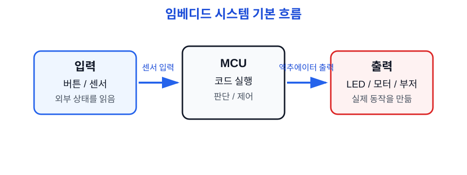
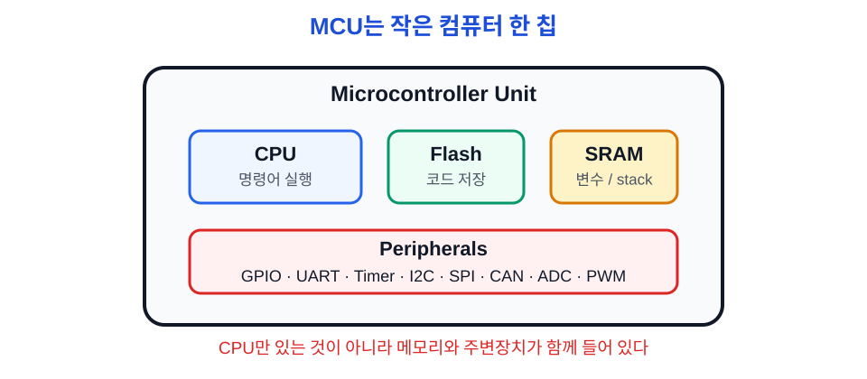
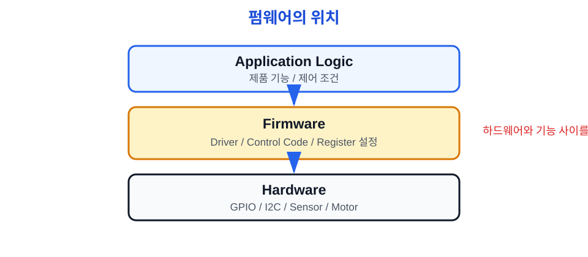
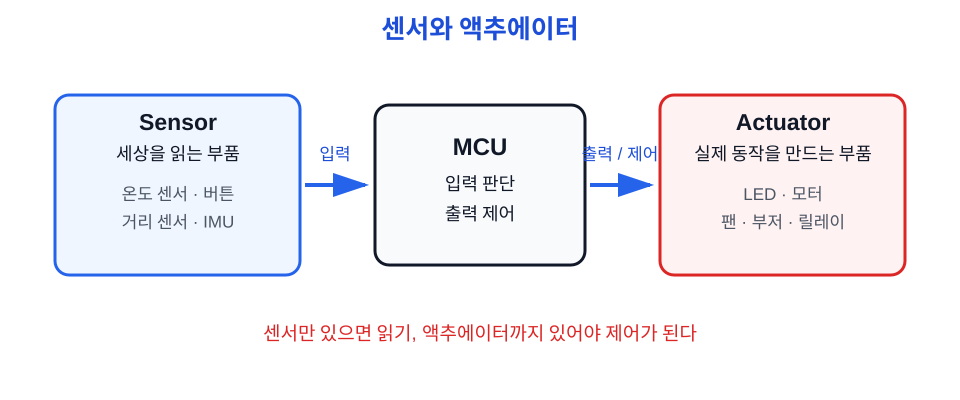
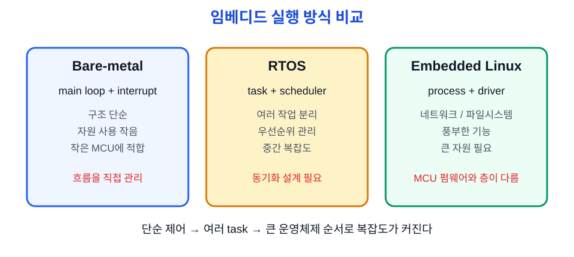
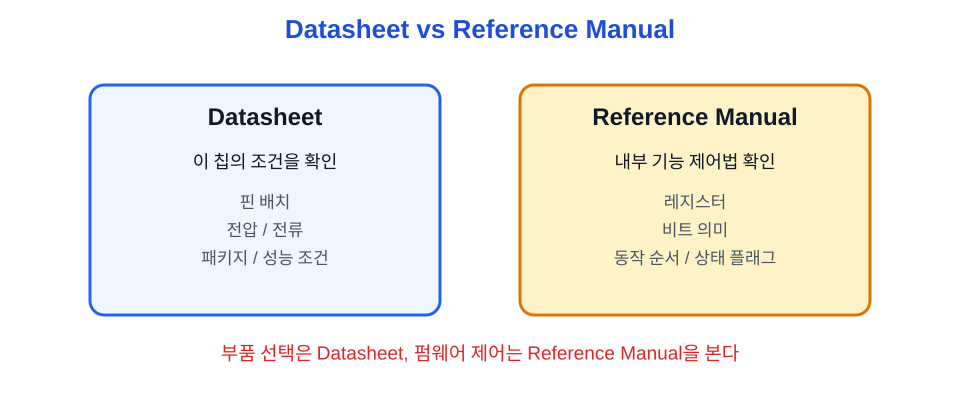

# Ch.02 임베디드 기초

용도: A4 세로 반 접기 2열 손필기

규칙:

- 1열 32줄 기준
- 내용이 길면 다음 페이지로 넘김
- 들여쓰기 없음
- 파랑: 제목, 번호, 핵심 키워드
- 검정: 설명, 예시, cf
- 빨강: 면접 주의, 헷갈리는 점
- 손그림과 이미지 링크는 관련 개념 바로 아래에 배치

## 1페이지: 임베디드 시스템의 기본 구조

주제: 임베디드 기초 
1. 임베디드 시스템 
a. 특정 목적을 위해 기계나 제품 안에 들어간 컴퓨터 시스템 
b. PC처럼 범용으로 쓰기보다 정해진 기능을 안정적으로 수행 
c. 하드웨어와 소프트웨어가 강하게 묶여 있음 
- 예: 세탁기 제어, 자동차 ECU, 의료기기, 로봇, 센서 장비 
※ 일반 앱보다 하드웨어 상태와 제약을 더 많이 봄 
 
그림: 임베디드 기본 흐름 
센서 입력 → MCU 판단 → 액추에이터 출력 
버튼/센서 → 코드 실행 → LED/모터/부저 
※ 입력-처리-출력 흐름으로 이해 
 

2. MCU(Microcontroller Unit) 
a. CPU, 메모리, 주변장치가 한 칩 안에 들어간 작은 컴퓨터 
b. GPIO, UART, Timer, I2C, SPI, CAN 같은 기능을 내장 
cf) peripheral = MCU 안의 주변장치 기능 
- STM32F103, ATmega, ESP32 등이 예시 
※ MCU는 하드웨어 제어에 특화된 작은 컴퓨터 
 
그림: MCU 안쪽 
+----------------------+ 
| CPU                  | 
| Flash / SRAM         | 
| GPIO UART Timer I2C  | 
| SPI CAN ADC PWM      | 
+----------------------+ 
※ CPU만 있는 게 아니라 주변장치도 같이 있음 
 
이미지: MCU 구조 
 
※ CPU, memory, peripherals가 한 칩에 있다는 점 확인 

3. CPU / MCU / SoC 
a. CPU: 명령어를 실행하는 계산 중심 장치 
b. MCU: CPU + 메모리 + 주변장치가 한 칩에 있는 제어용 칩 
c. SoC: 더 큰 시스템을 한 칩에 통합한 구조 
- SoC는 GPU, Wi-Fi, 가속기 같은 복잡한 기능도 포함 가능 
cf) Raspberry Pi 같은 보드는 SoC 기반에 가까움 
※ 면접에서는 MCU와 CPU를 같은 말처럼 쓰지 않기 
 
한 문장 
MCU는 센서 입력과 장치 출력을 직접 다루는 제어용 작은 컴퓨터다. 

## 2페이지: 입력과 출력 제어 구조

4. 펌웨어 
a. 하드웨어 가까이에서 동작을 제어하는 소프트웨어 
b. MCU Flash에 올라가 전원이 켜질 때 실행됨 
c. 핀, 레지스터, 통신, 타이머 등을 제어 
- 예: 버튼을 읽고 LED를 켜는 코드 
- 예: 센서값을 읽어 모터를 제어하는 코드 
※ 펌웨어는 하드웨어 동작을 책임지는 코드 
 
그림: 펌웨어 위치 
하드웨어  ←  펌웨어  ←  응용 로직 
GPIO/I2C      드라이버      제품 기능 
※ 펌웨어는 하드웨어와 기능 사이에 있음 
 

5. 센서 
a. 외부 상태를 전기 신호나 데이터로 바꾸는 입력 장치 
b. 온도, 빛, 움직임, 거리, 압력 등을 측정 
- 예: 온도 센서, 조도 센서, MPU6050 IMU 
cf) IMU = 가속도/자이로 등 움직임을 측정하는 센서 
※ 센서는 MCU가 세상을 읽는 입구 
 
6. 액추에이터 
a. 전기 신호를 실제 동작으로 바꾸는 출력 장치 
b. 빛, 소리, 움직임, 열 같은 결과를 만듦 
- 예: LED, 모터, 부저, 릴레이 
cf) 부저 = 전기 신호를 소리로 바꾸는 부품 
※ 액추에이터는 MCU가 세상에 영향을 주는 출구 

그림: 센서와 액추에이터 
[센서] --입력--> [MCU] --출력--> [액추에이터] 
온도              판단 코드          팬/모터 
버튼              조건 확인          LED/부저 
※ 입력과 출력이 동시에 있어야 제어가 됨 
 
 
※ 센서=입력, 액추에이터=출력 관계 확인 

## 3페이지: 임베디드 실행 방식

7. Bare-metal 
a. 운영체제 없이 MCU 위에서 코드가 직접 도는 방식 
b. main loop와 interrupt 중심으로 동작 
c. 구조가 단순하고 자원 사용이 작음 
- 예: while(1)에서 버튼 읽고 LED 제어 
※ 처음 임베디드를 배울 때 동작 원리 이해에 좋음 
 
그림: Bare-metal 
main loop 
↓ 
GPIO / UART / Timer 
↓ 
Hardware 

8. RTOS(Real-Time Operating System) 
a. 여러 task를 정해진 규칙으로 스케줄링 
b. queue, semaphore, mutex 같은 동기화 도구 제공 
cf) task = RTOS에서 나눠 실행하는 작업 단위 
- 예: 센서 task, 통신 task, 제어 task 분리 
※ 지금은 이름과 역할만 알기 
 
9. Embedded Linux 
a. 임베디드 장치에서 쓰는 Linux 기반 운영체제 
b. 네트워크, 파일시스템, 프로세스, 드라이버 구조가 큼 
c. MCU보다 자원이 큰 보드에서 많이 사용 
- 예: 라즈베리파이, 산업용 게이트웨이, HMI 장비 
cf) HMI = Human-Machine Interface, 사람이 기계 상태를 보고 조작하는 화면/패널 
- 예: 공장 설비 터치패널, 로봇 상태 표시 화면, 장비 설정 UI 
cf) 같은 층이 아님 = MCU 펌웨어는 하드웨어를 직접 제어하는 코드이고, Embedded Linux는 OS 위에서 앱/드라이버/프로세스가 도는 구조 
- MCU 펌웨어: 코드 → 레지스터/핀 직접 제어 
- Embedded Linux: 앱 → Linux kernel/driver → 하드웨어 제어 
※ MCU 펌웨어와 같은 층이 아님 

비교: Bare-metal vs RTOS vs Embedded Linux 
Bare-metal: 단순, 직접 제어, 작은 MCU 
RTOS: 여러 작업, 실시간성, 중간 복잡도 
Embedded Linux: 풍부한 기능, 큰 자원, 복잡한 시스템 
cf) Bare-metal부터 잡기 = OS 도움 없이 MCU가 핀/레지스터/인터럽트를 직접 제어하는 흐름부터 이해하기 
- 이 기본 흐름을 알아야 RTOS나 Linux가 무엇을 대신 관리해주는지 보임 
※ 지금은 Bare-metal부터 잡기 
 
이미지: 임베디드 실행 방식 
 
※ 세 방식의 차이와 자원 규모 확인 

## 4페이지: 하드웨어 문서 읽기

10. 데이터시트 
a. 특정 칩의 전기적/물리적 특성을 보는 문서 
b. 핀 배치, 전압, 전류, 클럭, 패키지 정보가 있음 
c. 회로 연결이나 부품 선택 때 많이 봄 
- 예: 이 핀이 5V tolerant인지 확인 
※ 핀과 전기 조건 확인용 
 
11. 레퍼런스 매뉴얼 
a. MCU 내부 주변장치 동작 방식을 설명하는 문서 
b. 레지스터, 비트, 동작 순서, 상태 플래그가 나옴 
c. 펌웨어에서 주변장치를 제어할 때 봄 
- 예: UART BRR, I2C SR1/SR2, GPIO ODR/BSRR 
※ 코드 작성과 디버깅 때 필요 

비교: Datasheet vs Reference Manual 
Datasheet: 이 칩의 핀/전기/성능 조건 
Reference Manual: 내부 기능을 어떻게 제어하는지 
cf) Datasheet는 하드웨어 관점, RM은 펌웨어 관점 
※ 둘 중 하나만 보면 부족함 
 
이미지/참고: Datasheet vs Reference Manual 
 
※ 두 문서의 역할 차이 확인 

## 면접 30초 답변

임베디드 기초 설명 
임베디드 시스템은 특정 목적을 위해 제품이나 장비 안에 들어가는 컴퓨터 시스템입니다. 
MCU는 CPU, 메모리, GPIO/UART/Timer 같은 주변장치를 한 칩에 담은 제어용 작은 컴퓨터입니다. 
펌웨어는 MCU 위에서 센서 입력을 읽고 액추에이터 출력을 제어하는 하드웨어 가까운 소프트웨어입니다. 
그래서 임베디드는 코드뿐 아니라 핀, 전압, 타이밍, 데이터시트까지 함께 봐야 합니다. 

## 지금 깊이 조절

지금 꼭 이해 
- 임베디드 시스템 
- MCU 
- 펌웨어 
- 센서와 액추에이터 
- 임베디드 실행 방식 차이 
 
지금은 이름만 
- SoC 
- task / semaphore / mutex 
- vector table 
- device driver 
 
나중에 깊게 
- RTOS 스케줄링 
- Linux 커널/드라이버 
- 데이터시트 전기 특성 계산 
- 레지스터 비트 상세 
※ 지금은 전체 지도를 먼저 잡는다 
