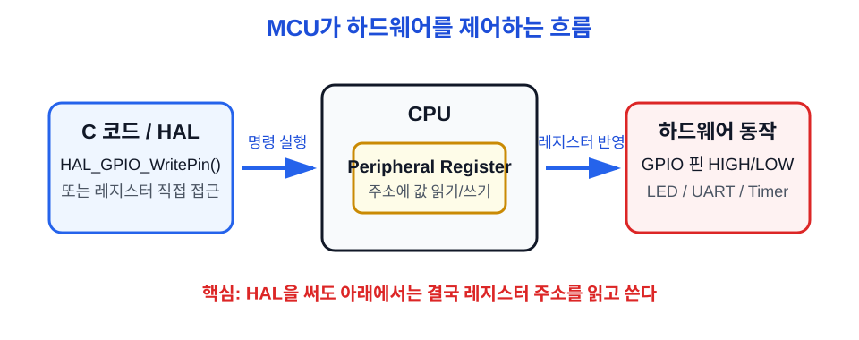
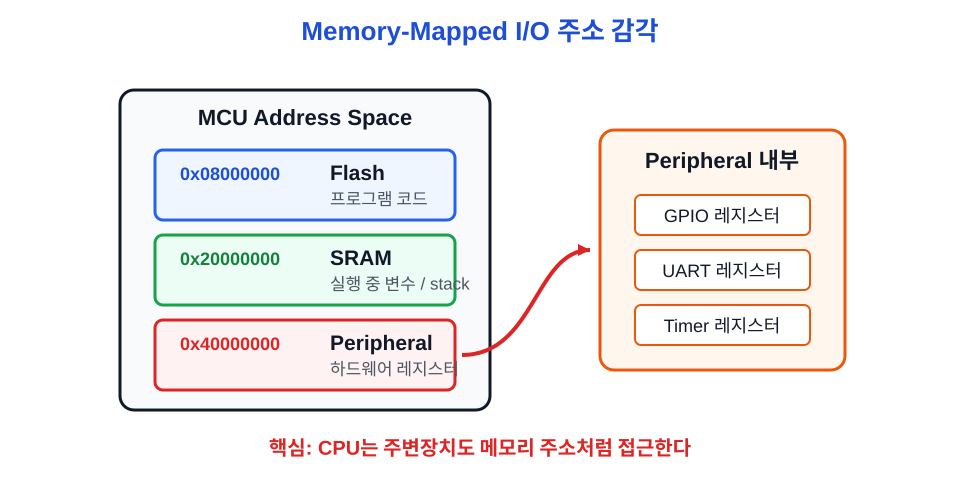
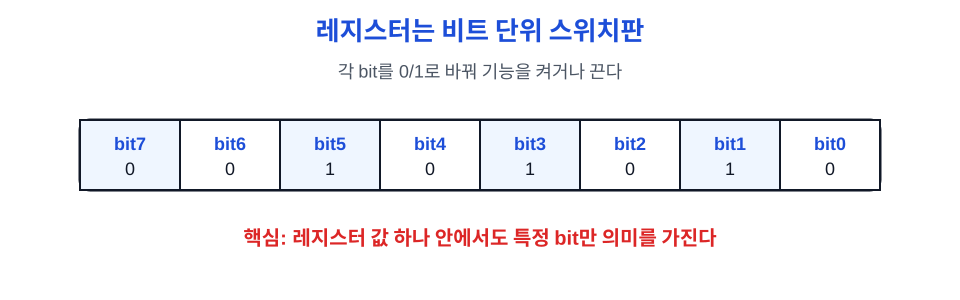
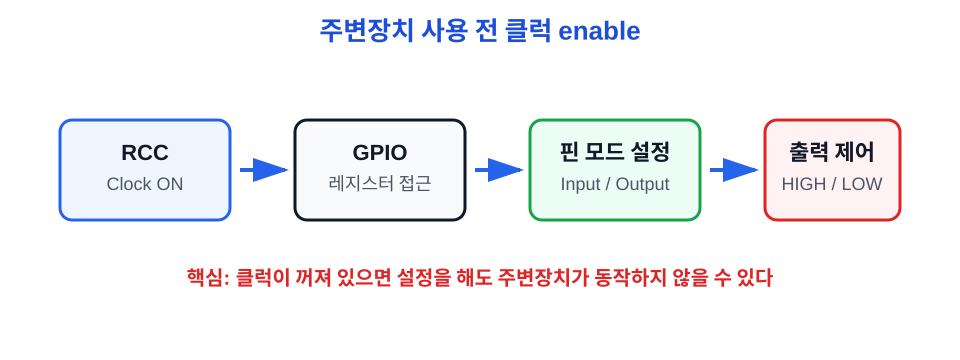
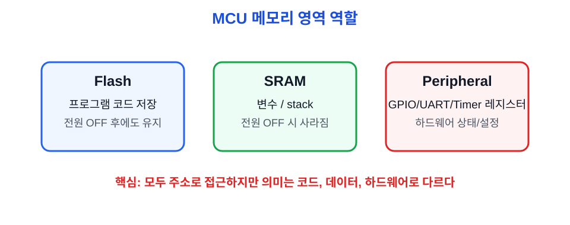
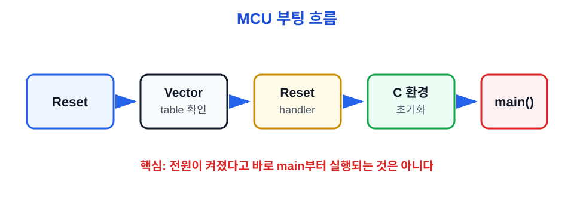
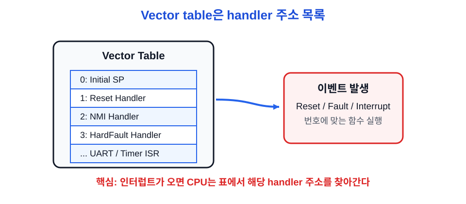

# Ch.03 MCU 기본 동작

용도: A4 세로 반 접기 2열 손필기

규칙:

- 1열 32줄 기준
- 내용이 길면 다음 페이지로 넘김
- 들여쓰기 없음
- 파랑: 제목, 번호, 핵심 키워드
- 검정: 설명, 예시, cf
- 빨강: 면접 주의, 헷갈리는 점
- 손그림과 이미지 링크는 관련 개념 바로 아래에 배치

## 1페이지: MCU는 어떻게 하드웨어를 제어하나

주제: MCU 기본 동작 
1. MCU 동작의 핵심 
a. CPU가 명령어를 실행함 
b. 메모리 주소를 읽고 쓰며 동작함 
c. 주변장치도 주소로 접근할 수 있음 
- 예: GPIO 레지스터 주소에 값을 쓰면 핀 상태가 바뀜 
※ MCU 제어는 결국 주소에 값을 읽고 쓰는 일 
 
그림: MCU 제어 흐름 
C 코드 → 주소 접근 → 레지스터 값 변경 → 핀/통신 동작 
HAL 함수 → 내부에서 레지스터 접근 → 하드웨어 제어 
※ HAL도 결국 아래에서는 레지스터를 만짐 
 
 
2. MMIO(Memory-Mapped I/O) 
a. 주변장치 레지스터가 메모리 주소 공간에 배치되는 구조 
b. CPU는 주변장치를 메모리처럼 읽고 쓸 수 있음 
c. GPIO, UART, Timer 같은 기능이 주소 영역을 가짐 
cf) I/O = Input/Output, 외부와 주고받는 입출력 
※ MMIO는 임베디드 레지스터 제어의 핵심 구조 
 
그림: Memory-Mapped I/O 
주소 0x08000000 → Flash 
주소 0x20000000 → SRAM 
주소 0x40000000 → Peripheral 
Peripheral 안에 GPIO/UART/Timer 레지스터 
※ 주소가 다르면 가리키는 대상도 다름 
 
 
표: MMIO 주소 예시 
<table style="border-collapse:collapse; width:720px; color:#111827">
<tr><th style="border:1px solid #d1d5db; padding:6px; color:#1d4ed8">주소 예시</th><th style="border:1px solid #d1d5db; padding:6px; color:#1d4ed8">영역</th><th style="border:1px solid #d1d5db; padding:6px; color:#1d4ed8">의미</th></tr>
<tr><td style="border:1px solid #d1d5db; padding:6px">0x08000000</td><td style="border:1px solid #d1d5db; padding:6px">Flash</td><td style="border:1px solid #d1d5db; padding:6px">프로그램 코드 저장</td></tr>
<tr><td style="border:1px solid #d1d5db; padding:6px">0x20000000</td><td style="border:1px solid #d1d5db; padding:6px">SRAM</td><td style="border:1px solid #d1d5db; padding:6px">실행 중 변수 저장</td></tr>
<tr><td style="border:1px solid #d1d5db; padding:6px">0x40000000</td><td style="border:1px solid #d1d5db; padding:6px">Peripheral</td><td style="border:1px solid #d1d5db; padding:6px">GPIO/UART/Timer 레지스터</td></tr>
</table>
※ Peripheral 주소는 일반 변수 저장 공간이 아니라 하드웨어 제어 창구 
 
이미지: ARM Cortex-M memory map 
Arm Cortex-M3 Technical Reference Manual 
<a style="color:#111827" href="https://developer.arm.com/documentation/ddi0337/e/Memory-Map/About-the-memory-map">https://developer.arm.com/documentation/ddi0337/e/Memory-Map/About-the-memory-map</a> 
※ Flash / SRAM / Peripheral 주소 구역 확인 

## 2페이지: 주변장치 제어 방식

3. 레지스터 
a. 하드웨어 설정값이나 상태값을 담는 작은 저장 공간 
b. 특정 비트를 1 또는 0으로 바꿔 기능을 켜고 끔 
c. 입력 상태, 출력 상태, 통신 상태도 레지스터로 확인 
- 예: GPIO ODR, BSRR, IDR 
cf) bit = 0 또는 1 하나의 정보 단위 
※ 레지스터는 하드웨어와 대화하는 스위치판 
 
그림: 레지스터 비트 
[bit7][bit6][bit5][bit4][bit3][bit2][bit1][bit0] 
0 또는 1 값을 넣어 기능 설정 
레지스터 값 하나는 여러 bit가 모인 값임 
그중 특정 bit만 특정 기능과 연결될 수 있음 
- 예: bit5=1이면 GPIO 5번 핀 출력 ON 
- 예: bit3=1이면 UART 수신 완료 상태 
그래서 값을 통째로 외우기보다 어떤 bit가 어떤 의미인지 봐야 함 
※ 레지스터 값 전체보다 필요한 bit를 골라 읽고/바꾸는 감각이 중요 
※ 지금은 비트 이름보다 구조 감각이 먼저 
 
 
4. 레지스터 직접 제어 vs HAL 
1) 레지스터 직접 제어 
a. 주소와 비트를 직접 보고 값을 설정 
b. 동작 원리를 이해하기 좋음 
c. 실수하면 설정 누락이나 비트 오류가 생기기 쉬움 
2) HAL 
a. 제조사가 제공하는 하드웨어 제어 함수 묶음 
b. 코드 작성이 빠르고 실수를 줄이기 쉬움 
c. 내부 동작을 모르면 디버깅 때 막힐 수 있음 
※ 면접에서는 HAL을 써도 레지스터 개념은 알아야 함 
 
표: 직접 제어 vs HAL 
<table style="border-collapse:collapse; width:720px; color:#111827">
<tr><th style="border:1px solid #d1d5db; padding:6px; color:#1d4ed8">구분</th><th style="border:1px solid #d1d5db; padding:6px; color:#1d4ed8">장점</th><th style="border:1px solid #d1d5db; padding:6px; color:#1d4ed8">주의점</th></tr>
<tr><td style="border:1px solid #d1d5db; padding:6px">레지스터 직접 제어</td><td style="border:1px solid #d1d5db; padding:6px">동작 원리 이해가 좋음</td><td style="border:1px solid #d1d5db; padding:6px">주소/비트 실수 위험</td></tr>
<tr><td style="border:1px solid #d1d5db; padding:6px">HAL</td><td style="border:1px solid #d1d5db; padding:6px">빠르고 실수 줄이기 쉬움</td><td style="border:1px solid #d1d5db; padding:6px">내부 원리 모르면 디버깅이 막힘</td></tr>
</table>
※ HAL 사용 경험만 말하지 말고, 내부는 레지스터 제어라고 연결 
 
5. 클럭 
a. MCU와 주변장치가 동작하기 위한 기준 박자 
b. CPU, GPIO, UART, Timer는 클럭을 받아야 동작 
c. 주변장치별로 클럭을 켜고 끌 수 있음 
MCU 안의 모든 기능을 항상 켜두지 않고, 필요한 주변장치만 클럭을 공급함 
GPIO, UART, Timer는 각각 따로 동작 허가 스위치가 있다고 보면 됨 
- 예: GPIOA를 쓰려면 RCC에서 GPIOA clock enable 
- 예: UART를 쓰려면 UART peripheral clock enable 
클럭이 꺼져 있으면 레지스터 값을 설정해도 회로가 실제로 동작하지 않을 수 있음 
이렇게 필요한 것만 켜서 전력 낭비를 줄이고 초기화를 명확하게 함 
cf) RCC = Reset and Clock Control, STM32에서 클럭 제어 담당 
※ 클럭이 꺼진 주변장치는 설정해도 동작하지 않을 수 있음 
 
그림: 클럭 enable 
RCC에서 GPIO 클럭 ON 
→ GPIO 레지스터 접근 가능 
→ 핀 모드 설정 
→ 출력 HIGH/LOW 제어 
※ GPIO 쓰기 전에 GPIO 클럭부터 켠다 
 
 
이미지/참고: STM32 Reference Manual 
ST RM0008 Reference Manual 
<a style="color:#111827" href="https://www.st.com/resource/en/reference_manual/rm0008-stm32f101xx-stm32f102xx-stm32f103xx-stm32f105xx-and-stm32f107xx-advanced-armbased-32bit-mcus-stmicroelectronics.pdf">https://www.st.com/resource/en/reference_manual/rm0008-stm32f101xx-stm32f102xx-stm32f103xx-stm32f105xx-and-stm32f107xx-advanced-armbased-32bit-mcus-stmicroelectronics.pdf</a> 
※ RCC, GPIO, memory map 목차 위치만 확인 

## 3페이지: MCU 메모리 구조

6. 메모리 맵 
a. MCU 주소 공간을 용도별로 나눈 지도 
b. 코드, 변수, 주변장치가 서로 다른 주소 영역에 있음 
c. 데이터시트나 레퍼런스 매뉴얼에서 확인함 
cf) map = 어디에 무엇이 있는지 알려주는 주소 지도 
※ 주소를 보면 Flash/SRAM/Peripheral 중 어디인지 감을 잡아야 함 
 
7. Flash 
a. 프로그램 코드가 저장되는 비휘발성 메모리 
b. 전원이 꺼져도 내용이 유지됨 
c. 펌웨어를 빌드하고 다운로드하면 Flash에 들어감 
cf) 비휘발성 = 전원이 꺼져도 지워지지 않음 
※ 코드가 저장되는 곳 
 
8. SRAM 
a. 실행 중 변수와 stack이 주로 쓰는 메모리 
b. 전원이 꺼지면 내용이 사라짐 
c. MCU는 SRAM이 작아서 메모리 사용을 조심해야 함 
cf) stack = 함수 호출과 지역변수에 쓰이는 메모리 영역 
※ 실행 중 임시 데이터가 있는 곳 
 
9. Peripheral 영역 
a. GPIO, UART, Timer 같은 주변장치 레지스터 주소 영역 
b. 여기에 값을 쓰면 하드웨어 설정이 바뀜 
c. 여기를 읽으면 하드웨어 상태를 알 수 있음 
- 예: 버튼 입력 상태, UART 수신 상태 
※ Peripheral은 일반 변수 저장 공간이 아님 
 
그림: 메모리 영역 감각 
Flash: 코드 저장 
SRAM: 실행 중 변수 
Peripheral: 하드웨어 레지스터 
※ 같은 주소 접근이라도 대상의 의미가 다름 
 
 
표: Flash / SRAM / Peripheral 비교 
<table style="border-collapse:collapse; width:720px; color:#111827">
<tr><th style="border:1px solid #d1d5db; padding:6px; color:#1d4ed8">영역</th><th style="border:1px solid #d1d5db; padding:6px; color:#1d4ed8">역할</th><th style="border:1px solid #d1d5db; padding:6px; color:#1d4ed8">전원 OFF</th><th style="border:1px solid #d1d5db; padding:6px; color:#1d4ed8">주의점</th></tr>
<tr><td style="border:1px solid #d1d5db; padding:6px">Flash</td><td style="border:1px solid #d1d5db; padding:6px">코드 저장</td><td style="border:1px solid #d1d5db; padding:6px">유지</td><td style="border:1px solid #d1d5db; padding:6px">펌웨어가 들어감</td></tr>
<tr><td style="border:1px solid #d1d5db; padding:6px">SRAM</td><td style="border:1px solid #d1d5db; padding:6px">변수/stack</td><td style="border:1px solid #d1d5db; padding:6px">사라짐</td><td style="border:1px solid #d1d5db; padding:6px">용량 작아서 절약 필요</td></tr>
<tr><td style="border:1px solid #d1d5db; padding:6px">Peripheral</td><td style="border:1px solid #d1d5db; padding:6px">레지스터</td><td style="border:1px solid #d1d5db; padding:6px">상태 초기화</td><td style="border:1px solid #d1d5db; padding:6px">일반 데이터 저장 공간 아님</td></tr>
</table>
※ 같은 주소 접근처럼 보여도 Flash/SRAM/Peripheral의 의미는 완전히 다름 

## 4페이지: MCU 부팅 구조

10. 전원이 켜지면 일어나는 일 
a. MCU가 reset 상태에서 시작함 
b. vector table에서 초기 stack pointer와 reset handler 주소를 읽음 
c. reset handler가 C 실행 환경을 준비함 
d. 마지막에 main() 함수로 진입함 
Reset Handler = 리셋 직후 처음 실행되는 초기화 함수 
main()이 실행될 수 있도록 실행 준비를 해주는 역할 
- 전역변수 초기값을 Flash에서 SRAM으로 복사 
- 초기값 없는 전역변수(.bss)를 0으로 초기화 
- 시스템 클럭 같은 기본 설정 수행 
- 준비가 끝나면 main()을 호출 
cf) handler = 특정 이벤트가 발생했을 때 실행되는 함수 
※ MCU는 전원이 켜지면 곧바로 main부터 시작하는 게 아님 
※ Reset Handler는 main() 전에 판을 깔아주는 시작 함수 
 
그림: 부팅 흐름 
Reset 
→ Vector table 확인 
→ Reset handler 실행 
→ C 환경 초기화 
→ main() 
※ startup code가 main 전에 준비 작업을 함 
 
 
11. Vector table 
a. 예외와 인터럽트가 발생했을 때 실행할 함수 주소 목록 
b. Reset handler, HardFault handler, UART ISR 등이 들어감 
c. CPU는 이벤트 번호에 맞는 handler 주소를 찾아 실행함 
cf) exception = reset, fault, interrupt 같은 특별 이벤트 
※ Interrupt를 이해하려면 vector table 이름은 알고 가기 
 
 
이미지/참고: ARM Vector table 
Arm Developer - Vector table 
<a style="color:#111827" href="https://developer.arm.com/documentation/107565/0101/Use-case-examples/Generic-Information/What-is-inside-a-program-image-/Vector-table">https://developer.arm.com/documentation/107565/0101/Use-case-examples/Generic-Information/What-is-inside-a-program-image-/Vector-table</a> 
※ vector table이 handler 주소 목록이라는 점 확인 

## 면접 30초 답변

MCU 기본 동작 설명 
MCU는 CPU가 메모리 주소를 읽고 쓰면서 동작하고, 주변장치 레지스터도 주소 공간에 배치되어 메모리처럼 접근할 수 있습니다. 
이 구조를 Memory-Mapped I/O라고 하며, GPIO나 UART 같은 주변장치의 레지스터 값을 바꾸면 실제 하드웨어 동작이 바뀝니다. 
주변장치를 사용하려면 먼저 RCC 같은 클럭 제어를 통해 해당 peripheral clock을 켜야 하고, 이후 레지스터나 HAL 함수를 통해 설정합니다. 
즉 HAL을 쓰더라도 내부적으로는 레지스터와 클럭, 메모리 맵 개념이 바탕이 됩니다. 

## 지금 깊이 조절

지금 꼭 이해 
- MMIO 
- 레지스터 
- HAL도 내부에서는 레지스터 제어 
- 주변장치 사용 전 클럭 enable 
- MCU 메모리 영역 차이 
 
지금은 이름만 
- startup code 
- vector table 
- reset handler 
- linker script 
 
나중에 깊게 
- 실제 주소값 계산 
- linker script 상세 
- startup assembly 코드 
- clock tree 계산 
※ 지금은 주소-레지스터-클럭의 큰 흐름을 먼저 잡는다 

## Q. 꼬리질문

Q. 면접에서 이어질 수 있는 질문 
- MMIO가 무엇인가? 
- 레지스터와 일반 변수는 무엇이 다른가? 
- HAL을 쓰는데 레지스터를 왜 알아야 하나? 
- GPIO를 쓰기 전에 클럭을 켜야 하는 이유는? 
- Flash와 SRAM은 어떻게 다른가? 
- MCU는 전원이 켜지면 바로 main부터 실행되는가? 
