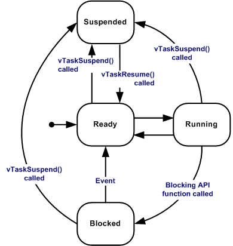

# Ch.04 RTOS 기초

용도: A4 세로 반 접기 2열 손필기

규칙:

- 1열 32줄 기준
- 내용이 길면 다음 페이지로 넘김
- 들여쓰기 없음
- 파랑: 제목, 번호, 핵심 키워드
- 검정: 설명, 예시, cf
- 빨강: 면접 주의, 헷갈리는 점
- 손그림과 이미지 링크는 관련 개념 바로 아래에 배치

## 1페이지: RTOS가 왜 필요한가

주제: RTOS 기초 
1. RTOS(Real-Time Operating System) 
a. 여러 작업을 task로 나눠 실행하게 도와주는 운영체제 
b. scheduler가 어떤 task를 실행할지 결정함 
c. queue, semaphore, mutex 같은 통신/동기화 도구를 제공함 
- 예: 센서 읽기, 통신 송신, 로그 출력을 task로 분리 
※ RTOS를 쓴다고 자동으로 실시간성이 보장되는 것은 아님 
RTOS는 task를 나누고 scheduler가 실행 순서를 정하게 해줌 
하지만 deadline 안에 반드시 끝나는지는 별도로 설계해야 함 
- 중요한 task의 priority가 낮으면 늦게 실행될 수 있음 
- ISR이나 높은 priority task가 오래 CPU를 잡으면 밀릴 수 있음 
- mutex, queue, semaphore 대기 때문에 막힐 수 있음 
- task 실행 시간이 deadline보다 길면 RTOS여도 실패함 
※ 실시간성 = RTOS 사용 여부가 아니라 시간 제약을 만족하도록 설계/검증한 결과 
 
2. Bare-metal과 RTOS 차이 
a. Bare-metal: main loop와 interrupt 중심으로 직접 흐름 관리 
b. RTOS: task 단위로 작업을 나누고 scheduler가 실행 순서 관리 
c. 기능이 많아질수록 RTOS가 구조를 나누기 쉬움 
cf) 단순 LED, 버튼 제어는 bare-metal이 더 단순할 수 있음 
※ RTOS는 편한 라이브러리가 아니라 실행 구조를 바꾸는 선택 
 
그림: Bare-metal vs RTOS 
Bare-metal: while(1) 안에서 센서/통신/로그 순서대로 처리 
RTOS: SensorTask / CommTask / LogTask로 분리 
Scheduler가 우선순위와 상태를 보고 실행 
※ task 분리는 좋지만 stack/context switch 비용이 생김 
 
3. Task 
a. RTOS에서 독립적으로 실행되는 작업 단위 
b. 각 task는 자기 stack과 우선순위를 가짐 
c. delay, queue, semaphore 대기 때문에 실행이 멈출 수 있음 
- 예: SensorTask는 10ms마다 센서 값을 읽음 
※ task를 많이 만들면 stack 메모리 사용도 늘어남 

## 2페이지: Scheduler와 task 상태

4. Scheduler 
a. 실행 가능한 task 중 어떤 task를 CPU에 올릴지 정함 
b. 보통 priority가 높은 ready task가 먼저 실행됨 
c. tick interrupt나 이벤트 발생 때 task 전환이 일어날 수 있음 
Tick interrupt = RTOS가 일정 주기로 받는 시간 알림 
delay 시간 감소, timeout 확인, task 전환 판단에 사용 
- 예: vTaskDelay(10)은 tick 10번 뒤 Ready 
※ tick은 RTOS의 주기적 시간 기준 
cf) priority = 작업의 중요도/우선순위 
※ 우선순위를 잘못 잡으면 중요한 작업이 늦어질 수 있음 
 
5. Task 상태 
a. Running: 지금 CPU에서 실행 중 
b. Ready: 실행 가능하지만 순서를 기다림 
c. Blocked: delay, queue, semaphore 같은 이벤트를 기다림 
d. Suspended: 스케줄 대상에서 제외됨 
Ready task = 바로 실행 가능하지만 아직 CPU를 못 받은 task 
priority가 높아도 Blocked 상태면 실행 대상이 아님 
※ blocked는 멈춘 것이 아니라 조건을 기다리는 상태 
 
그림: Task 상태 전이도 
Ready → Running: scheduler가 CPU에 올림 
Running → Ready: 더 높은 priority task 등장 또는 time slice 종료 
Running → Blocked: delay, queue, semaphore 대기 시작 
Blocked → Ready: 시간 만료 또는 이벤트 발생 
Ready/Blocked → Suspended: task를 명시적으로 중지 
Suspended → Ready: task를 다시 resume 
※ 상태 전이도는 task가 왜 실행/대기/재실행되는지 설명하는 그림 
 
출처: Wikimedia Commons, File: Task state.png 
라이선스: GNU GPL v2 or later 
 
6. Queue 
a. task 사이에 데이터를 전달하는 통로 
b. 보내는 쪽은 데이터를 넣고, 받는 쪽은 데이터를 꺼냄 
c. ISR에서 task로 이벤트나 데이터를 넘길 때도 자주 사용 
- 예: UART 수신 ISR → Queue → ParserTask 
※ 데이터 자체를 보내면 queue, 단순 깨우기면 semaphore/notification 고려 

## 3페이지: Semaphore와 Mutex

7. Semaphore 
a. 이벤트 발생이나 자원 개수를 알려주는 동기화 도구 
b. task가 semaphore를 기다리다가 신호가 오면 깨어날 수 있음 
c. binary semaphore는 0 또는 1 상태로 이벤트 신호에 많이 씀 
- 예: 버튼 interrupt 발생 → semaphore give → ButtonTask wake 
※ binary semaphore는 mutex와 모양이 비슷해도 목적이 다름 
 
8. Counting Semaphore 
a. 여러 개의 같은 자원 개수를 count로 관리함 
b. count가 남아 있으면 task가 자원을 사용할 수 있음 
c. buffer slot, resource pool 같은 곳에 사용 가능 
cf) count = 사용 가능한 개수 
※ 공유 변수 보호용이면 counting semaphore보다 mutex를 먼저 생각 
 
9. Mutex(Mutual Exclusion) 
a. 공유 자원을 한 번에 하나의 task만 쓰게 보호하는 lock 
b. lock을 잡은 task가 작업 후 unlock해야 다른 task가 사용 가능 
c. UART 출력, I2C 버스, 공유 변수 보호에 사용 
cf) mutual exclusion = 상호 배제, 동시에 못 들어가게 막는 것 
※ mutex는 owner 개념이 있어서 잡은 task가 풀어야 함 
 
그림: Mutex로 공유 자원 보호 
Task A lock → UART 사용 → unlock 
Task B는 unlock 전까지 대기 
※ lock 구간은 짧게 유지해야 지연이 줄어듦 

## 4페이지: 면접 핵심 비교

10. Mutex vs Binary Semaphore 
a. Binary semaphore: 이벤트 신호에 적합 
b. Mutex: 공유 자원 보호에 적합 
c. Mutex는 owner 개념과 priority inheritance가 있음 
d. Binary semaphore는 보통 priority inheritance가 없음 
※ 0/1이라 같다고 말하면 면접에서 위험함 
 
11. Priority Inversion 
a. 낮은 priority task가 mutex를 잡고 있음 
b. 높은 priority task가 같은 mutex를 기다림 
c. 중간 priority task가 CPU를 써서 낮은 task가 mutex를 못 놓음 
d. 결과적으로 높은 priority task가 오래 밀림 
※ priority inheritance는 이 문제를 줄이기 위한 장치 
 
12. ISR에서 주의 
a. ISR에서는 오래 걸리는 작업과 blocking을 피함 
b. ISR에서 mutex를 잡고 기다리는 구조는 부적절함 
c. ISR은 queue/semaphore/notification으로 task를 깨우고 빠져나옴 
cf) FromISR 계열 API는 interrupt context용 API 
※ ISR은 직접 처리보다 task에 넘기는 구조를 우선 생각 

## 면접 30초 답변

RTOS 기초 설명 
RTOS는 여러 기능을 task로 나누고 scheduler가 priority와 상태를 보고 실행 순서를 관리하게 해주는 운영체제입니다. 
다만 실시간성은 RTOS 사용만으로 보장되지 않고, priority, task 실행 시간, interrupt 지연, 공유 자원 대기 시간을 설계하고 검증해야 합니다. 
Task는 running, ready, blocked 같은 상태를 오가며, queue는 task 사이에 데이터를 전달할 때 사용합니다. 
Semaphore는 이벤트 신호나 자원 개수를 표현하는 데 쓰고, mutex는 UART나 I2C 같은 공유 자원을 한 번에 하나의 task만 쓰게 보호할 때 사용합니다. 
특히 mutex는 owner와 priority inheritance가 있고, binary semaphore는 주로 signaling 용도라 둘을 같은 것으로 보면 안 됩니다. 

## 지금 깊이 조절

지금 꼭 이해 
- RTOS는 task와 scheduler 구조 
- ready / running / blocked 차이 
- queue는 데이터 전달 
- semaphore는 이벤트 신호 또는 자원 개수 
- mutex는 공유 자원 보호 
- tick interrupt는 RTOS의 주기적 시간 기준 
 
지금은 이름만 
- direct task notification 
- context switch 
- stack overflow hook 
 
나중에 깊게 
- FreeRTOS API 코드 
- ISR-safe API 
- priority inversion 실험 
- stack size 계산과 디버깅 
※ 지금은 용도 구분과 면접용 한 줄 설명을 먼저 잡는다 

## Q. 꼬리질문

Q. 면접에서 이어질 수 있는 질문 
- RTOS를 쓰면 bare-metal보다 항상 좋은가? 
- task 상태에는 무엇이 있는가? 
- queue와 semaphore는 언제 다르게 쓰는가? 
- mutex와 binary semaphore는 어떻게 다른가? 
- priority inversion은 무엇이고 어떻게 줄이는가? 
- ISR에서 mutex를 쓰면 왜 위험한가? 
