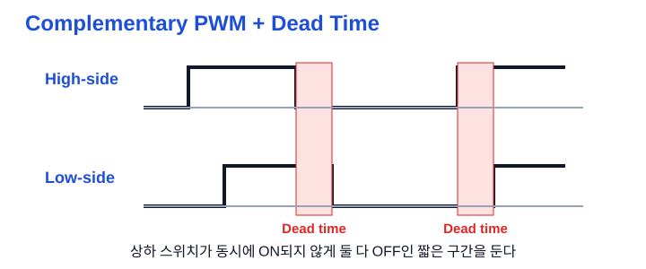

# Ch.05 Timer / PWM ver2 — 시간 이벤트에서 주기 제어까지

용도: A4 세로 반 접기 2열 손필기

이 노트의 목표는 `PSC`, `ARR`, `CCR`의 이름을 외우는 데 있지 않다. Timer가 하드웨어에서 시간을 만들고, 그 시간이 interrupt/event로 application에 전달되며, PWM에서는 CPU 개입 없이 핀 출력이 만들어지는 **하나의 흐름**을 설명하는 데 있다.

규칙:

- 1열 32줄 기준. 페이지가 길면 다음 종이로 넘긴다.
- 파랑: 제목, 구조, 핵심 키워드
- 검정: 동작 설명, 예시, 코드 흐름
- 빨강: 실수하기 쉬운 점, 면접 포인트
- `IMU → CAN` 예시는 현재 포트폴리오에 연결하기 위한 설계 흐름이다. 실제 STM32F103 clock/레지스터 값은 보드와 reference manual 기준으로 확정한다.

## 1페이지: Timer는 CPU가 기다리지 않게 시간을 만든다

주제: Timer / PWM의 전체 지도 
CPU가 시간을 직접 세면 delay loop 안에서 같은 조건만 계속 확인하게 됨 
Timer는 peripheral hardware가 clock을 세고, 시간이 되면 event를 만듦 
CPU는 그 사이 다른 일을 하거나 sleep할 수 있음 
※ Timer는 delay 함수가 아니라 system에 시간 기준을 제공하는 hardware 
 
1. Polling과 Timer interrupt 
a. busy-wait polling: CPU가 timeout이 됐는지 반복 확인 
b. Timer interrupt: hardware가 시간 만료를 감지해 CPU에 알림 
c. 예: 100ms마다 센서를 읽거나, 1초마다 LED를 toggle 
d. interrupt는 버튼, UART 수신, ADC 완료에도 같은 원리로 사용 
※ 긴 delay를 ISR 안으로 옮기면 polling 문제가 ISR 안에서 다시 생김 
 
2. Timer와 Counter 
a. Timer: 내부 clock을 기준으로 시간/주기를 만듦 
b. Counter: 외부 pin 신호가 들어온 횟수를 셈 
c. STM32의 한 Timer peripheral이 두 기능을 지원할 수 있음 
※ 같은 모듈이어도 무엇을 clock source로 삼는지가 구분 기준 
 
3. 하드웨어 시간 흐름 
Timer clock → PSC → CNT → ARR → Update Event 
a. Timer clock: peripheral에 공급되는 기준 clock 
b. PSC(Prescaler): clock을 나눠 CNT가 세는 속도를 낮춤 
c. CNT(Counter): 분주된 clock마다 0, 1, 2...로 변하는 현재 값 
d. ARR(Auto-Reload Register): CNT가 어디까지 셀지 정하는 끝값 
e. ARR 도달 뒤 reload하고, Update Event를 만들 수 있음 
※ Timer 계산은 반드시 clock → PSC → CNT → ARR 순서로 생각 
 
4. 0부터 세므로 +1 
a. PSC register가 N이면 실제 분주비는 N+1 
b. ARR register가 M이면 한 주기 count 수는 M+1 
c. 주기 T = (PSC+1) × (ARR+1) / timer_clk 
d. 주파수 f = timer_clk / ((PSC+1) × (ARR+1)) 
※ PSC 또는 ARR 하나만으로 주기가 정해진다고 말하면 부족함 
 
그림: Timer count flow 
 

## 2페이지: ARR 도달은 어떻게 CPU의 일이 되는가

5. Update Event와 interrupt request 
a. CNT가 ARR에 도달하면 update event가 발생 
b. SR의 UIF(Update Interrupt Flag)가 event 발생 사실을 기록 
c. DIER의 UIE를 켜면 update event가 interrupt request가 될 수 있음 
d. NVIC가 해당 IRQ를 허용하면 CPU가 handler로 들어감 
※ Event 발생, interrupt enable, CPU가 ISR 실행은 서로 다른 단계 
 
6. Timer interrupt 설정 흐름 
a. RCC에서 Timer peripheral clock enable 
b. PSC와 ARR 설정 
c. EGR.UG로 PSC/ARR 설정값을 즉시 load 
d. DIER.UIE로 Update interrupt enable 
e. NVIC_EnableIRQ()로 CPU 쪽 IRQ 허용 
f. 필요하면 CPU 전역 interrupt mask(PRIMASK)도 허용 
g. CR1.CEN으로 counter 시작 
※ peripheral clock, UIE, NVIC 중 하나라도 빠지면 handler는 실행되지 않음 
 
7. CPU가 interrupt를 받는 순간 
a. Timer 사건은 main code의 순서와 무관하게 발생하므로 비동기적 
b. CPU는 실행 중인 instruction의 중간을 자르지 않고 경계에서 request를 수락 
c. 현재 실행 흐름을 멈추고 vector table이 가리키는 ISR로 진입 
d. ISR이 return하면 선점했던 main code 지점으로 복귀 
※ interrupt의 발생 시점은 비동기적이지만 CPU 수락은 instruction 경계에서 이뤄짐 
 
8. Cortex-M이 복귀할 수 있는 이유 
a. exception entry hardware가 R0~R3, R12, LR, PC, xPSR을 stack에 자동 저장 
b. compiler는 일반 C 함수 규약(AAPCS)에 따라 필요한 R4~R11을 관리 
c. handler 끝의 BX LR은 EXC_RETURN 값에 따라 hardware exception return이 됨 
d. 저장한 register와 PC를 복원해 중단된 instruction 다음으로 돌아감 
※ ISR도 일반 C 함수처럼 보이지만, 진입/복귀의 핵심 상태 저장은 hardware가 맡음 
 
9. FPU와 interrupt 비용 
a. FPU가 없으면 기본 exception frame은 8 words 
b. FPU frame을 쓰면 저장할 상태가 늘어 stack 사용량과 entry/exit latency가 커짐 
c. 실시간 응답과 stack size를 계산할 때 ISR body만 보면 안 됨 
※ 신입 면접에서는 “hardware가 context를 저장·복원한다”까지 명확히 말하면 충분 

## 3페이지: ISR은 알리고, main은 처리한다

10. Foreground / Background architecture 
a. background = main()의 while(1), 일반 application logic 수행 
b. foreground = Timer, GPIO, UART 등의 ISR, background를 선점 
c. 이 구조를 super loop 또는 main + ISRs라고 부름 
d. 작은 MCU system에서 RTOS 없이 쓰기 좋은 기본 구조 
※ 빈 while(1)은 interrupt를 만드는 곳이 아니라 ISR 사이에 main context가 머무는 곳 
 
11. ISR의 역할: 짧은 일만 
a. SR.UIF를 확인하고 clear해서 다음 event를 받을 준비 
b. LED toggle, timestamp 기록, flag/event 설정처럼 빠른 일만 수행 
c. 긴 delay, printf, I2C polling, 복잡한 CAN 처리 등은 background로 넘김 
d. 긴 ISR은 main을 오래 멈추고 다른 interrupt 응답도 늦출 수 있음 
※ “interrupt니까 빨리 처리한다”가 아니라 “짧게 설계해서 빠르게 끝난다” 
 
12. ISR과 main의 공유 데이터 
a. ISR이 바꾸고 main이 읽는 flag/counter에는 volatile이 필요할 수 있음 
b. volatile은 compiler가 memory read/write를 생략하지 않게 할 뿐 
c. volatile은 atomicity나 race condition 해결책이 아님 
d. 여러 단계의 read-modify-write, multi-byte 값은 짧은 critical section 등으로 보호 
※ flag를 읽고 지우는 사이에도 ISR은 들어올 수 있으므로 event 유실 조건을 설계해야 함 
 
13. Timer ISR의 최소 형태 
Timer Update Event → UIF set → NVIC → TIMx_IRQHandler() 
ISR: UIF clear → sample_due flag 또는 event counter 기록 → return 
main: sample_due를 안전하게 가져옴 → 실제 sensor/CAN 작업 수행 
※ flag 하나면 여러 주기가 겹칠 때 event를 합칠 수 있음. 누락이 문제면 counter/queue를 검토 
 
손그림: 전경과 배경의 역할 분리 
main loop: [다른 일] → [sample event 확인] → [센서/CAN 처리] → 반복 
Timer ISR:                ↑ 100ms마다 짧게 선점: UIF clear + event 기록 

## 4페이지: 100ms Timer를 IMU → CAN 흐름에 붙이기

14. 포트폴리오 적용: 주기 제어의 목적 
현재 IMU-CAN 프로젝트는 MPU6050 값과 CAN message를 100ms 주기로 다루는 계획 
Timer를 쓰면 “100ms가 지났는가?”를 CPU가 계속 묻지 않아도 됨 
중요한 것은 100ms delay를 넣는 일이 아니라 100ms time event를 만드는 일 
※ 센서 읽기와 CAN 송신은 timer hardware가 아니라 application의 후속 처리 
 
15. 권장 흐름: Timer는 event만 전달 
1. Timer가 100ms에 Update Event 발생 
2. ISR이 UIF를 clear하고 sample event를 기록 
3. main loop가 event를 가져와 MPU6050 register를 읽음 
4. 읽은 accel/gyro 값을 CAN payload로 만듦 
5. CAN mailbox/queue에 송신 요청을 넣고 UART log로 검증 
6. main loop는 즉시 다음 event를 받을 수 있게 돌아감 
※ I2C transaction 전체를 ISR에서 돌리면 ISR이 길어져 구조의 장점이 사라짐 
 
16. Blocking과 non-blocking의 차이 
blocking: sensor 읽기 → 100ms delay → CAN 송신 → 다시 delay 
문제: delay 동안 UART 수신, 버튼, 오류 event를 늦게 처리할 수 있음 
non-blocking: Timer가 “100ms 지남” event를 전달하고 main은 매 loop 빠르게 진행 
장점: 다른 event도 확인 가능. 다음 행동은 state/event data로 보관 
※ non-blocking은 아무것도 안 하는 것이 아니라, 기다림을 미래 event로 분리하는 것 
 
17. Event-driven과 Run-to-Completion 
a. event producer: Timer, GPIO, UART, ADC 같은 hardware 
b. event consumer: main loop, event queue 또는 RTOS task 
c. 한 event 처리는 가능한 한 끝까지 처리하고 빨리 return 
d. 오래 기다려야 하면 handler 안에서 sleep/delay하지 말고 timer event를 예약 
e. event가 많아지면 queue와 state machine으로 context를 명시 
※ event handler에서 block하면 그동안 들어온 다른 event의 처리도 밀림 
 
18. 100ms 계산은 보드 clock에서 다시 시작 
목표: T = 0.1 s = (PSC+1) × (ARR+1) / timer_clk 
a. 먼저 실제 timer_clk를 clock tree와 APB 설정에서 확인 
b. 원하는 counter tick(예: 10kHz)을 만들 PSC를 정함 
c. 10kHz라면 100ms 동안 1000 counts이므로 ARR+1 = 1000 
d. 실제 register에는 0부터 센다는 +1 규칙을 반영 
※ STM32F767의 216MHz 예시 숫자를 STM32F103에 그대로 복사하면 안 됨 

## 5페이지: PWM은 Timer가 CPU 대신 출력 파형을 만드는 길

19. PWM의 출발점 
PWM(Pulse Width Modulation)은 digital HIGH/LOW를 빠르게 반복하는 방식 
한 주기 중 HIGH 시간의 비율을 duty cycle이라 함 
LED 밝기, 모터 속도, 부저, 전력 제어에서 평균 출력/에너지 전달을 조절 
※ PWM은 DAC가 만드는 연속 아날로그 전압이 아니라 빠른 digital switching 
 
20. ARR은 주기, CCR은 비교 시점 
a. ARR: PWM 전체 주기와 주파수의 기준 
b. CCR(Capture/Compare Register): CNT와 비교할 값 
c. PWM에서는 CCR이 active 구간의 길이, 즉 duty를 결정 
d. PWM mode와 polarity에 따라 HIGH/LOW의 해석은 반대가 될 수 있음 
※ 주파수는 timer clock/PSC/ARR, duty는 CCR이라고 분리해서 말하기 
 
21. 한 주기 손그림 
ARR = 9, CCR = 4인 up-count 예시 
CNT:  0 1 2 3 4 5 6 7 8 9 → reload 
PWM:  HIGH HIGH HIGH HIGH | LOW LOW LOW LOW LOW LOW 
duty ≈ CCR / (ARR+1), 정확한 active 구간은 mode/polarity 설정을 함께 확인 
※ CCR을 바꾸면 duty가 바뀌고, ARR 또는 PSC를 바꾸면 주파수도 바뀔 수 있음 
 
그림: ARR과 CCR 
 
 
22. PWM과 Timer interrupt의 결정적 차이 
Timer interrupt: ARR 도달 사건을 CPU가 ISR에서 처리 
PWM: CNT와 CCR 비교 결과를 Timer hardware가 output pin에 바로 반영 
PWM 출력 자체는 매 HIGH/LOW 전환마다 CPU가 ISR을 실행할 필요 없음 
따라서 높은 주파수 PWM도 CPU를 pin toggle loop에 묶지 않고 만들 수 있음 
※ “Timer를 쓴다”가 항상 “ISR을 쓴다”는 뜻은 아님 
 
23. 다채널 PWM 
a. 하나의 CNT를 공유하면서 CCR1, CCR2, CCR3...에 서로 다른 duty를 설정 
b. 같은 PWM 주기 안에서 여러 출력을 만들 수 있음 
c. 모터 제어처럼 여러 상을 제어할 때 이 구조가 필요 
※ counter는 공유하고 channel별 duty는 CCR마다 다르게 설정 가능 

## 6페이지: Hardware Timer와 RTOS Software Timer를 섞지 않기

24. Hardware Timer 
a. MCU 안의 실제 Timer peripheral과 PSC/CNT/ARR/CCR register를 사용 
b. 정확한 주기 interrupt, input capture, PWM처럼 hardware timing에 적합 
c. hardware가 PWM output을 직접 만들 수 있음 
※ 현재 이 노트의 중심은 Hardware Timer 
 
25. FreeRTOS Software Timer 
a. RTOS tick을 기준으로 timeout 또는 주기 callback을 실행하는 OS 기능 
b. timer service task가 timer list와 command queue를 관리 
c. one-shot: 한 번 만료 뒤 정지. auto-reload: 만료 뒤 자동 반복 
d. 단순 timeout마다 별도 task를 만들지 않아도 되는 장점 
※ software timer는 hardware PWM을 만드는 기능이 아니며 tick보다 정밀할 수 없음 
 
26. ISR과 software-timer callback 비교 
ISR: hardware interrupt context. 매우 짧고 block 금지 
software callback: timer service task context. ISR은 아니지만 짧고 non-blocking 유지 
callback이 delay/긴 계산에 묶이면 다른 timer callback과 command 처리까지 늦음 
긴 일은 callback/ISR에서 queue, notification, event로 별도 task에 넘김 
※ “task context니까 마음대로 block해도 된다”는 software timer callback의 흔한 실수 
 
27. 선택 기준 
a. PWM, 정밀한 microsecond timing, peripheral event → Hardware Timer 
b. RTOS 위의 단순 timeout/주기 callback 여러 개 → Software Timer 
c. 이미 있는 task 안에서 간단한 주기 확인 → tick count와 timestamp 비교 
d. 길고 독립적인 반복 업무 → 전용 task + vTaskDelay() 검토 
※ “Timer가 필요하다” 다음에는 필요한 정밀도와 실행 문맥을 물어야 함 

## 7페이지: 동작 중 변경과 모터 제어의 안전선

28. ARPE(Auto-Reload Preload Enable) 
a. PWM 동작 중 ARR 변경을 즉시 반영할지, 다음 update에 반영할지 정함 
b. ARPE=0이면 현재 주기 중간에 ARR이 바뀌어 짧은 pulse(glitch)가 생길 수 있음 
c. ARPE=1이면 shadow/preload 값을 다음 Update Event에서 반영 
d. 주기 경계에서 바꾸면 파형 전환이 더 예측 가능 
※ PWM parameter를 runtime에 바꿀 때는 “언제 적용되는가”가 값만큼 중요 
 
그림: ARPE와 글리치 
 
 
29. Up-count와 Center-aligned 
a. up-count: 0 → ARR → 0으로 reload하며 반복 
b. center-aligned: 0 → ARR → 0으로 올라갔다 내려오며 반복 
c. center-aligned는 모터 제어 PWM에서 자주 언급됨 
※ 지금은 파형의 이동 방향과 이름을 구분하고, register 상세는 나중에 
 
30. 상보 PWM과 Dead Time 
a. inverter 한 상의 위/아래 switch는 동시에 ON되면 전원과 GND가 직결될 수 있음 
b. complementary PWM은 한쪽이 ON일 때 반대쪽이 OFF가 되도록 반전 출력을 만듦 
c. 실제 switch는 꺼짐/켜짐에 시간이 걸리므로 상보 출력만으로 충분하지 않음 
d. dead time은 둘 다 OFF인 짧은 틈을 넣어 동시 ON(arm-short)을 막음 
※ BLDC/PMSM에서는 “파형 생성”보다 “동시 ON 방지”가 더 중요한 안전 조건 
 
그림: Complementary PWM과 Dead Time 
 
 
31. 지금 깊이 조절 
지금 꼭 이해: Timer clock, PSC, CNT, ARR, CCR, Update Event, UIF clear, ISR 짧게 
프로젝트 연결: 100ms event → main에서 IMU read → CAN send 
지금은 이름만: ARPE, center-aligned, complementary PWM, dead time, Software Timer daemon 
나중에 깊게: APB timer clock 예외, PWM mode 1/2, capture input, RCR, dead-time 계산 
※ 면접 1차 목표는 “Timer가 하드웨어 시간 event와 PWM을 만드는 이유”를 흐름으로 말하기 

## 면접 30초 답변

Timer / PWM을 흐름으로 설명 
Timer는 peripheral clock을 PSC로 분주해 CNT를 세고, ARR에 도달하면 Update Event를 만드는 하드웨어입니다. 
Update interrupt를 켜면 NVIC를 통해 ISR이 실행되고, ISR에서는 flag clear와 event 기록처럼 짧은 일만 한 뒤 센서 읽기나 CAN 송신 같은 긴 처리는 main loop로 넘깁니다. 
PWM에서는 같은 CNT와 CCR을 비교해 Timer hardware가 pin의 HIGH/LOW 시간을 직접 바꾸므로, 주파수는 PSC와 ARR로 정하고 duty는 CCR로 조절할 수 있습니다. 
※ RTOS software timer는 tick 기반 callback이고, PWM/정밀 timing용 hardware timer와 구분해야 합니다. 

## Q. 꼬리질문

Q. Timer가 delay loop보다 나은 이유는? 
A. hardware가 시간을 세는 동안 CPU는 다른 작업이나 sleep을 할 수 있고, event 시점에만 ISR로 대응할 수 있기 때문 
 
Q. Timer ISR에 I2C 센서 읽기를 바로 넣지 않는 이유는? 
A. transaction이 길어지면 ISR이 main과 다른 interrupt를 오래 막는다. ISR은 event만 전달하고 main/task가 긴 처리를 맡는 편이 안전 
 
Q. PWM은 왜 CPU가 매번 pin을 toggle하지 않아도 되는가? 
A. Timer hardware가 CNT와 CCR의 비교 결과를 output channel에 직접 반영하기 때문 
 
Q. volatile이면 ISR과 main의 공유 변수는 안전한가? 
A. 아니다. volatile은 compiler 최적화를 막을 뿐이며, read-modify-write와 여러 byte 접근은 critical section/atomic 설계를 따로 검토해야 함 
 
Q. Hardware Timer와 Software Timer는 어떻게 고르는가? 
A. PWM이나 정밀 peripheral timing은 hardware timer, RTOS 위의 단순 timeout/callback은 tick 기반 software timer가 적합 

## 참고 자료

Timer / PWM 원본 
- [STM32 Timer/Counter와 PWM](../../10_주제별/stm32/timer/1_타이머카운터와_PWM.md) 
- [기존 손필기 v1](./필기노트_05_Timer_PWM.md) 
 
이번에 통합한 강의노트 
- [16강 인터럽트의 개념과 동작 원리](../../10_주제별/cs/임베디드수업/16_인터럽트의_개념과_동작원리.md) 
- [18강 ARM Cortex-M 인터럽트 진입과 복귀](../../10_주제별/cs/임베디드수업/18_ARM_Cortex_M_인터럽트_진입과_복귀.md) 
- [21강 전경-배경 아키텍처와 슈퍼루프](../../10_주제별/cs/임베디드수업/21_전경_배경_아키텍처_슈퍼루프.md) 
- [33강 이벤트 주도 프로그래밍](../../10_주제별/cs/임베디드수업/33_이벤트_주도_프로그래밍_GUI_이벤트루프와_비차단.md) 
- [FreeRTOS Software Timer](../../10_주제별/cs/RTOS/8_Software_Timer.md) 
 
프로젝트 연결 
- [IMU-CAN 드라이버 시스템](../../../10_Experience/10_Projects/IMU_CAN_드라이버_시스템.md) 
 
원본 강의 
- [STM32 입문 강의 몰아보기 | ARM, GPIO, ADC, UART (YouTube)](https://www.youtube.com/watch?v=XOsyrZGZtR8) 
- [Interrupts Part 1 (YouTube)](https://www.youtube.com/watch?v=jP1JymlHUtc) 
- [Interrupts Part 3: Cortex-M (YouTube)](https://www.youtube.com/watch?v=O0Z1D6p7J5A) 
- [Foreground-Background Architecture (YouTube)](https://www.youtube.com/watch?v=AoLLKbvEY8Q) 
- [Event-Driven Programming Part 1 (YouTube)](https://www.youtube.com/watch?v=rfb2JI1GGIc) 
- [FreeRTOS Software Timer (YouTube)](https://www.youtube.com/watch?v=b1f1Iex0Tso) 
