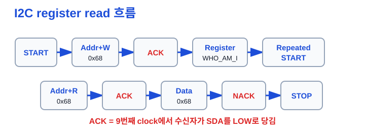
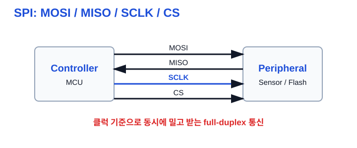

I. I2C / SPI / CAN 통신 선택과 검증 
1. 통신 프로토콜을 비교하는 기준 
1) 왜 비교해야 하나 
① MCU는 센서, 모듈, 다른 제어기와 데이터를 주고받아야 함 
② 통신마다 선 수, 속도, 거리, 신뢰성, 장치 선택 방식이 다름 
③ 면접에서는 정의보다 언제 무엇을 고르는지가 자주 나옴 
※ I2C / SPI / CAN은 암기보다 선택 기준으로 비교 
 
2) 동기식과 비교 항목 
① I2C와 SPI는 별도 clock 신호를 기준으로 데이터를 주고받는 동기식 통신 
cf) 동기식 = 송신·수신이 같은 clock edge와 timing을 기준으로 동작 
② UART는 clock 선 없이 baud rate를 약속하는 비동기식 통신 
③ 선 수, 장치 선택 방식, 속도, 신뢰성, 노드 수를 함께 비교 
a. 장치 선택: I2C는 주소, SPI는 CS 핀, CAN은 메시지 ID 
b. 신뢰성: 오류 검출·재전송이 중요한지 확인 
※ 프로토콜 선택은 배선 / 속도 / 노드 수 / 신뢰성의 trade-off 
 
그림: I2C / SPI / CAN 선택 기준 
I2C는 배선 적음, SPI는 고속, CAN은 견고함 
※ “무엇이 더 좋다”가 아니라 상황별 선택 
 
 
2. I2C(Inter-Integrated Circuit) 
1) 기본 구조 
① SDA와 SCL 두 선으로 여러 장치를 연결하는 주소 기반 버스 통신 
cf) SDA = data 선, SCL = clock 선 
② Controller가 통신을 시작하고 각 target 장치는 주소로 선택됨 
cf) target = controller의 요청에 응답하는 장치. 과거 문서의 slave와 같은 역할 
③ 예: MPU6050은 AD0=GND일 때 7-bit address 0x68 
※ I2C는 선 2개로 여러 장치를 연결할 수 있는 주소 기반 통신 
 
2) Open-drain과 pull-up 
① I2C 장치는 HIGH를 직접 밀지 않고 LOW만 당김 
cf) open-drain = 출력 transistor가 LOW로 당기거나 회로를 놓는 방식 
② HIGH 상태는 SDA/SCL의 pull-up 저항이 만들어 줌 
cf) pull-up = 신호선을 전원에 저항으로 연결해 기본값을 HIGH로 만드는 회로 
③ 프로젝트에서는 SDA/SCL 각각 4.7 kΩ을 3.3 V에 연결 
a. STM32F103은 PB6=SCL, PB7=SDA를 AF Open-Drain으로 사용 
※ pull-up이 없으면 SDA/SCL이 HIGH로 올라가지 않아 통신 실패 가능 
 
그림: I2C bus 
Controller와 여러 target이 SDA/SCL을 공유 
※ 모든 장치가 LOW를 당길 수 있어 ACK와 arbitration이 가능 
 
 
3) START / STOP과 ACK / NACK 
① START는 통신 시작, STOP은 통신 종료를 알리는 버스 상태 조건 
② register read에서는 STOP 없이 읽기로 전환하는 repeated START를 자주 사용 
cf) repeated START = 쓰기 방향에서 register를 지정한 뒤 읽기 방향으로 전환 
③ ACK는 수신자가 데이터를 받았다는 응답 
a. 데이터 8비트 뒤 9번째 clock에서 수신자가 SDA를 LOW로 당기면 ACK 
b. LOW로 당기지 않으면 NACK, 마지막 1-byte read는 NACK 후 STOP 가능 
※ START/STOP은 데이터 비트가 아니며, ACK는 9번째 clock에서 확인 
 
4) MPU6050 WHO_AM_I로 read 검증 
① WHO_AM_I register 주소는 0x75, 기대 응답값은 0x68 
② 흐름: START → addr+W → register → repeated START → addr+R → data → NACK → STOP 
③ UART log로 응답값을, logic analyzer로 파형을 확인 
※ WHO_AM_I는 센서 연결과 I2C read 흐름을 함께 검증하는 첫 테스트 
 
그림: I2C register read 
주소를 쓰고 register를 지정한 뒤 repeated START로 읽기 전환 
※ ACK/NACK 위치와 STOP 시점을 같이 본다 
 
 
5) STM32 I2C 구현·실패 포인트 
① ADDR flag clear는 SR1 → SR2 순서로 read 
② 1-byte read에서는 ACK=0과 STOP 설정 시점이 중요 
③ NACK, timeout, bus busy 같은 실패 경로를 테스트 
※ HAL 없이 직접 구현할 때는 flag 순서와 timeout 정책이 핵심 
 
3. SPI(Serial Peripheral Interface) 
1) 기본 구조와 선 역할 
① Controller가 clock을 내보내며 데이터를 주고받는 동기식 통신 
② MOSI, MISO, SCLK, CS 선을 사용 
a. MOSI: Controller → Peripheral 데이터 
b. MISO: Peripheral → Controller 데이터 
c. SCLK: Controller가 제공하는 clock 
d. CS: 통신할 장치를 선택하는 chip select 
cf) full-duplex = MOSI와 MISO가 분리되어 동시에 송수신 가능한 구조 
③ 보통 짧은 거리에서 센서, Flash 같은 장치와 빠르게 통신 
※ SPI는 주소보다 CS 핀으로 장치를 선택하며, 장치가 늘면 CS도 보통 추가 
 
그림: SPI bus 
MOSI와 MISO가 분리되어 동시에 송수신 가능 
※ full-duplex여도 실제 의미 있는 데이터 방향은 장치마다 다름 
 
 
2) CPOL / CPHA 
① CPOL은 clock idle 상태의 극성 
② CPHA는 어느 clock edge에서 데이터를 sample할지 정함 
③ 설정이 맞지 않으면 데이터가 한 비트 밀려 보일 수 있음 
※ SPI 디버깅은 CPOL/CPHA, word length, CS timing부터 확인 
 
4. CAN(Controller Area Network) 
1) 기본 구조 
① 여러 node가 같은 버스에서 메시지를 주고받는 통신 
② 자동차·산업 환경처럼 노이즈와 신뢰성이 중요한 곳에 사용 
③ 오류 검출, 재전송, error state 개념이 중요 
※ CAN은 단순 센서선보다 네트워크 통신에 가깝게 생각 
 
2) CAN_H / CAN_L과 termination 
① CAN은 CAN_H와 CAN_L 차동 신호선을 사용 
cf) 차동 신호 = 두 선의 전압 차이를 이용해 공통 노이즈 영향을 줄이는 방식 
② MCU의 CAN TX/RX는 transceiver를 거쳐 CAN bus에 연결 
cf) transceiver = MCU의 TX/RX 논리 신호와 CAN_H/CAN_L 물리 신호를 변환하는 칩 
a. 프로젝트에서는 TJA1050 transceiver 사용 
b. BluePill은 PB8=CAN RX, PB9=CAN TX로 remap 사용 
③ CAN bus 양 끝에는 120 Ω 종단 저항을 둠 
cf) termination = 신호 반사를 줄여 배선 끝의 신호 품질을 지키는 저항 
※ MCU 핀을 CAN_H/CAN_L에 직접 연결하지 않으며, 종단 없이는 통신 실패 가능 
 
그림: CAN bus 
여러 node가 같은 CAN_H/CAN_L 버스를 공유 
※ 양 끝 120 Ω 종단과 ID 우선순위가 핵심 
 
 
3) CAN ID, DLC, arbitration 
① CAN ID는 단순 주소가 아니라 메시지 식별자이며 우선순위에도 관여 
② 낮은 ID가 bitwise arbitration에서 유리 
cf) arbitration = 여러 node가 동시에 송신하려 할 때 우선순위를 정하는 과정 
③ DLC는 frame의 data length, payload는 실제 전달 데이터 
a. 긴급하거나 제어에 중요한 메시지에는 낮은 ID를 줄 수 있음 
b. 송신 검증은 ID, DLC, payload, 주기를 함께 확인 
c. 메시지가 늦으면 ID 우선순위, bus load, 오류 재전송부터 의심 
※ CAN trace는 ID만 보지 말고 payload와 주기까지 확인 
 
5. 상황별 선택 
1) I2C 
① 선을 아끼고 여러 저속 센서를 주소로 붙일 때 
2) SPI 
① 짧은 거리에서 빠른 센서·Flash 통신이 필요할 때 
3) CAN 
① 여러 제어 node가 견고하게 메시지를 주고받아야 할 때 
※ 면접에서는 “무엇을 썼다”에서 끝내지 말고 선택 이유까지 말한다 
 
6. 핵심 3줄 
1) I2C는 SDA/SCL 두 선과 주소를 쓰며, open-drain 구조라 pull-up이 필요하다. 
2) SPI는 MOSI/MISO/SCLK/CS로 짧은 거리에서 빠르게 통신하고, CPOL/CPHA가 맞아야 한다. 
3) CAN은 차동 버스에서 ID 우선순위와 오류 처리를 쓰며, transceiver와 양 끝 120 Ω 종단이 필요하다. 
 
Q. I2C는 왜 pull-up이 필요한가? 
A. 장치가 LOW만 당기는 open-drain 구조이므로, 아무도 당기지 않을 때 HIGH를 만들 저항이 필요하다. 
Q. SPI 값이 한 비트 밀리면 무엇을 확인하는가? 
A. CPOL/CPHA, word length, CS timing과 logic analyzer의 sample edge를 먼저 확인한다. 
Q. CAN ID는 주소인가, 우선순위인가? 
A. 메시지 식별자이며, arbitration에서는 낮은 ID가 우선권을 가져 우선순위 역할도 한다. 
Q. CAN 송신 실패 시 무엇을 확인하는가? 
A. 120 Ω 종단, transceiver 전원·배선, bus-off/error state, ID·bit timing을 순서대로 확인한다. 
 
7. 30초 면접 답변 
I2C는 SDA와 SCL 두 선으로 여러 장치를 주소 기반으로 연결하는 동기식 버스입니다. Open-drain 구조라 pull-up이 필요하고 ACK는 9번째 clock에서 확인합니다. 
SPI는 MOSI, MISO, SCLK, CS를 사용해 장치를 선택하며 짧은 거리에서 빠르게 통신합니다. CAN은 CAN_H/CAN_L 차동 버스에서 여러 node가 메시지 ID 기반으로 통신하고 낮은 ID가 arbitration에 유리합니다. 
선택 기준은 배선 수, 속도, 노드 수, 신뢰성입니다. 저속 다중 센서는 I2C, 고속 보드 내부 통신은 SPI, 차량·산업 다중 node 통신은 CAN을 우선 검토합니다. 
 
8. 지금 깊이 조절 
지금 꼭 이해 
- I2C: SDA/SCL 2선, 주소, open-drain, pull-up, 9번째 clock ACK 
- SPI: MOSI/MISO/SCLK/CS, CPOL/CPHA 
- CAN: 메시지 ID, transceiver, 120 Ω 종단 
 
지금은 이름만 
- I2C arbitration, TRISE, SPI DMA alignment, CAN filter, error passive / bus-off 
 
나중에 깊게 
- STM32 I2C SR1/SR2 flag sequence, MPU6050 burst read, CAN bit timing·sample point·bus load 
※ 지금은 통신별 “선, 선택 방식, 실패 포인트”를 먼저 잡는다 
 
9. 참고 자료 
- embeded_TIL/README.md 
- embeded_TIL/30_프로젝트/docs/datasheet-notes.md 
- embeded_TIL/10_주제별/hardware/wiring-notes.md, pinmap.md 
- STM32F103 RM0008, NXP I2C-bus Specification UM10204, Bosch CAN 2.0A 
※ 이 필기노트는 로컬 TIL/면접준비 문서를 손필기용으로 압축한 것 
