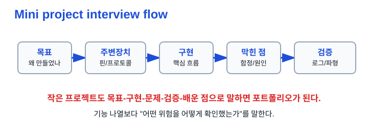
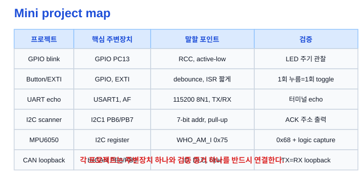
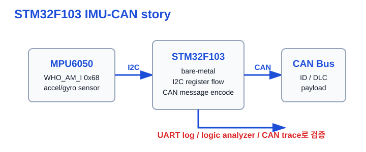
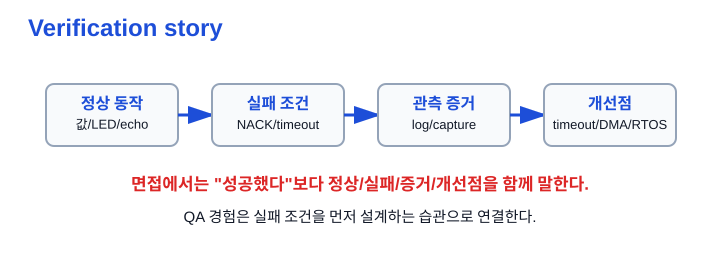

# Ch.08 미니 프로젝트 설명

용도: A4 세로 반 접기 2열 손필기

규칙:

- 1열 32줄 기준
- 내용이 길면 다음 페이지로 넘김
- 들여쓰기 없음
- 파랑: 제목, 번호, 핵심 키워드
- 검정: 설명, 예시, cf
- 빨강: 면접 주의, 헷갈리는 점
- 손그림과 이미지 링크는 관련 개념 바로 아래에 배치

## 1페이지: 작은 프로젝트를 면접 답변으로 바꾸기

주제: 미니 프로젝트 설명 
1. 미니 프로젝트 설명의 목표 
a. 작은 실습도 구조, 문제, 해결, 검증으로 말할 수 있게 함 
b. 단순 기능 나열이 아니라 왜 만들었는지 설명함 
c. 사용한 주변장치와 검증 방법을 연결함 
※ "해봤습니다"보다 "무엇을 확인했습니다"가 강함 
 
2. 답변 기본 구조 
a. 목표: 무엇을 만들었고 왜 만들었나 
b. 사용한 주변장치: GPIO, UART, I2C, CAN 등 
c. 구현 흐름: 초기화, 설정, main loop 또는 ISR 흐름 
d. 막힌 점: 클럭, 핀모드, 풀업, flag 순서, filter 등 
e. 검증 방법: LED, UART log, logic analyzer, CAN trace 
※ 모든 프로젝트를 같은 틀로 말하면 답변이 흔들리지 않음 
 
그림: 프로젝트 답변 흐름 
목표 → 주변장치 → 구현 → 막힌 점 → 검증 
※ 면접관은 결과보다 사고 흐름과 검증 습관을 본다 
 
 
3. 6개 미니 프로젝트 목록 
a. STM32 GPIO LED blink 
b. 버튼 입력 / 버튼 인터럽트 LED toggle 
c. UART echo 
d. I2C scanner 
e. MPU6050 WHO_AM_I 
f. CAN loopback 
※ 6개를 각각 외우기보다 공통 구조로 말하기 

## 2페이지: GPIO / Button / UART 프로젝트

4. STM32 GPIO LED blink 
목표: BluePill 내장 LED를 주기적으로 깜빡이며 GPIO 출력 흐름을 익힘 
주변장치: GPIOC PC13, SysTick/HAL_Delay 
막힌 점: GPIO 클럭 enable 누락, PC13 active-low 해석 
검증: LED가 500ms 주기로 켜졌다 꺼지는지 관찰 
※ 한 문장: GPIO는 클럭 enable 후 핀 모드와 출력 값을 설정해야 실제 핀이 바뀐다는 것을 확인했습니다. 
 
5. 버튼 입력 + LED toggle 
목표: 버튼 입력을 읽고 눌림 시점에만 LED를 토글함 
주변장치: GPIO 입력 PA0, GPIO 출력 PC13, 내부 pulldown 
막힌 점: 채터링 때문에 한 번 눌러도 여러 번 토글될 수 있음 
검증: LOW→HIGH rising edge에서만 한 번 토글되는지 확인 
※ 한 문장: 입력은 현재값만 읽는 게 아니라 edge와 debounce를 함께 처리해야 안정적입니다. 
 
6. 버튼 인터럽트 LED toggle 
목표: 폴링 대신 EXTI로 버튼 이벤트에 반응함 
주변장치: EXTI line, NVIC, GPIO PA0/PC13 
막힌 점: ISR에서 HAL_Delay나 printf 같은 무거운 작업은 부적절함 
검증: ISR에서는 tick 기반 debounce만 하고 LED toggle이 한 번만 일어나는지 확인 
※ 한 문장: 인터럽트는 이벤트 반응에는 좋지만 ISR은 짧게 끝내야 합니다. 
 
7. UART echo 
목표: PC에서 보낸 바이트를 STM32가 그대로 되돌려 보냄 
주변장치: USART1 PA9(TX), PA10(RX), USB-TTL, GPIO AF 
막힌 점: 115200 8N1, GND 공통, TX/RX 교차, AF_PP 설정 
검증: CoolTerm/PuTTY/screen에서 입력 문자가 echo되는지 확인 
※ 한 문장: UART는 양쪽 설정과 배선이 맞아야 하며 로그/디버깅의 기본 통로가 됩니다. 

## 3페이지: I2C / MPU6050 / CAN 프로젝트

8. I2C scanner 
목표: I2C1 버스에서 ACK로 응답하는 device address를 찾음 
주변장치: I2C1 PB6(SCL), PB7(SDA), UART 출력 
막힌 점: I2C는 open-drain이라 외부 4.7kΩ pull-up이 필요함 
검증: 0x01~0x7F scan 후 0x68, 0x3C 같은 응답 주소가 출력되는지 확인 
※ 한 문장: I2C scanner로 주소, ACK, pull-up의 의미를 실제 버스에서 확인했습니다. 
 
9. MPU6050 WHO_AM_I 
목표: HAL 없이 I2C 레지스터 직접 제어로 WHO_AM_I를 읽음 
주변장치: I2C1, MPU6050 address 0x68, register 0x75, UART log 
막힌 점: ADDR flag는 SR1 → SR2 순서로 읽어 clear해야 함 
막힌 점: 1-byte read에서는 ACK=0, STOP 세팅 타이밍이 중요함 
검증: UART에 WHO_AM_I=0x68 출력, 가능하면 SDA/SCL logic capture 확인 
※ 한 문장: HAL이 숨기는 START, ADDR, ACK/NACK, RXNE 상태 흐름을 레지스터 수준에서 확인했습니다. 
 
10. CAN loopback 
목표: CAN1 loopback 모드로 내가 보낸 메시지를 내가 수신함 
주변장치: bxCAN, PB9(TX), PB8(RX), AFIO remap, USART log 
막힌 점: filter를 설정하지 않으면 수신이 안 될 수 있음 
막힌 점: BluePill에서는 PA11/PA12 USB 충돌 때문에 PB8/PB9 remap 고려 
검증: 송신한 standard ID, DLC, payload가 RX FIFO로 돌아오는지 확인 
※ 한 문장: CAN loopback으로 외부 bus 없이 ID, DLC, filter, mailbox/FIFO 흐름을 먼저 검증했습니다. 
 
그림: 6개 프로젝트 맵 
각 프로젝트를 주변장치, 말할 포인트, 검증 방법으로 연결 
※ 프로젝트마다 검증 증거 하나를 붙인다 
 

## 4페이지: 포트폴리오형 설명으로 통합하기

11. STM32F103 IMU-CAN Driver 한 줄 설명 
STM32F103에서 MPU6050 IMU 센서를 I2C 레지스터 직접 제어로 읽고, CAN 메시지로 주기 전송하는 bare-metal 펌웨어입니다. 
학습 목표는 HAL 없이 상태 플래그 흐름을 이해하고, UART 로그와 계측 결과로 검증하는 것입니다. 
※ 포트폴리오 설명은 "무엇을 만들었나 + 왜 그렇게 했나 + 어떻게 검증했나"로 말하기 
 
그림: IMU-CAN 구조 
MPU6050 → I2C → STM32F103 → CAN → 외부 노드 
UART log와 logic analyzer/CAN trace로 확인 
※ 작은 실습들이 하나의 포트폴리오 구조로 연결됨 
 
 
12. 검증 스토리 
a. 정상 동작: WHO_AM_I=0x68, UART echo, LED toggle, CAN loopback 
b. 실패 조건: NACK, timeout, bus busy, pull-up 누락, filter 누락 
c. 관측 증거: UART log, logic analyzer, CAN trace, LED 상태 
d. 개선점: timeout 정책, interrupt/DMA, RTOS task 분리, 회귀 테스트 
※ QA 경험은 실패 조건과 검증 증거를 먼저 생각하는 강점으로 연결 
 
 
13. 모르는 질문 대응 
a. 정확한 비트 이름을 모르면 레퍼런스 매뉴얼에서 확인한다고 말함 
b. 상태 플래그와 clear 조건을 먼저 확인함 
c. 실제 파형과 UART log로 코드 흐름을 검증함 
※ 모르는 것을 아는 척하지 말고 확인 방법을 말하기 

## 면접 30초 답변

미니 프로젝트 설명 
저는 STM32F103 BluePill로 GPIO blink, 버튼 입력/인터럽트, UART echo, I2C scanner, MPU6050 WHO_AM_I read, CAN loopback을 단계적으로 실습했습니다. 
각 실습은 단순히 동작시키는 데서 끝내지 않고, 어떤 주변장치를 쓰는지, 어떤 설정 함정이 있는지, 어떤 방법으로 검증했는지를 정리했습니다. 
예를 들어 I2C에서는 open-drain과 pull-up, 7-bit address, ACK/NACK를 확인했고, MPU6050 WHO_AM_I에서는 HAL 없이 START, ADDR, SR1/SR2 clear, RXNE 흐름을 따라 0x68 응답을 확인했습니다. 
CAN loopback에서는 외부 버스 없이 ID, DLC, filter, mailbox/FIFO 흐름을 먼저 검증했습니다. 
이 과정을 통해 임베디드에서는 "돌아간다"보다 로그, 파형, 실패 조건까지 포함해 검증하는 습관이 중요하다는 점을 익혔습니다. 

## 지금 깊이 조절

지금 꼭 이해 
- 프로젝트 답변은 목표-주변장치-막힌 점-검증 방법 구조 
- GPIO blink는 RCC와 active-low 
- 버튼은 edge와 debounce 
- EXTI는 ISR을 짧게 
- UART echo는 115200 8N1과 TX/RX 교차 
- I2C는 pull-up, 주소, ACK 
- CAN은 ID, DLC, filter, loopback 
 
지금은 이름만 
- CAN-FD 
- DBC 
- ISO-TP 
- UDS 
- DMA UART 
 
나중에 깊게 
- MPU6050 accel 6-byte burst read 
- CAN normal mode + transceiver + termination 
- RTOS task 분리 
- 포트폴리오 README 검증 캡처 채우기 
※ 지금은 작은 프로젝트를 면접 언어로 바꾸는 것이 목표 

## Q. 꼬리질문

Q. 면접에서 이어질 수 있는 질문 
- GPIO blink에서 클럭 enable이 왜 필요한가? 
- 버튼 입력에서 debounce를 왜 넣었는가? 
- ISR에서 HAL_Delay를 쓰면 왜 위험한가? 
- UART echo에서 TX/RX와 GND를 어떻게 연결했는가? 
- I2C scanner에서 7-bit 주소와 shifted 주소는 어떻게 다른가? 
- MPU6050 WHO_AM_I가 0xFF로 나오면 무엇을 의심할 것인가? 
- CAN loopback에서 filter를 설정하지 않으면 무슨 일이 생기는가? 
- 이 프로젝트에서 검증 증거는 무엇인가? 

## 참고 자료

원본 소스 
_drafts/embedded_til/01_gpio_blink/README.md 
_drafts/embedded_til/02_button_input/README.md 
_drafts/embedded_til/03_uart_echo/README.md 
_drafts/embedded_til/05_external_interrupt/README.md 
_drafts/embedded_til/08_i2c_scan/README.md 
_drafts/embedded_til/16_i2c_register_mpu6050/README.md 
_drafts/embedded_til/14_can_loopback/README.md 
embeded_TIL/README.md 
20_Applications/.../2026-07-02_임베디드_인턴지원_노트필기_커리큘럼.md 
※ 이 필기노트는 로컬 드래프트/TIL 문서를 손필기용 면접 답변 구조로 압축한 것 
