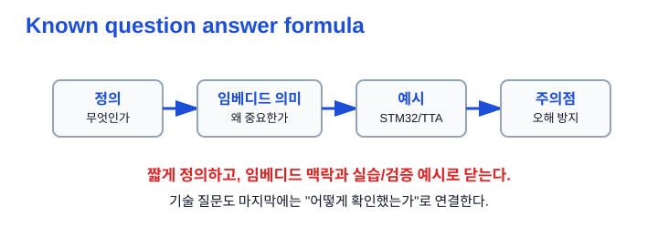
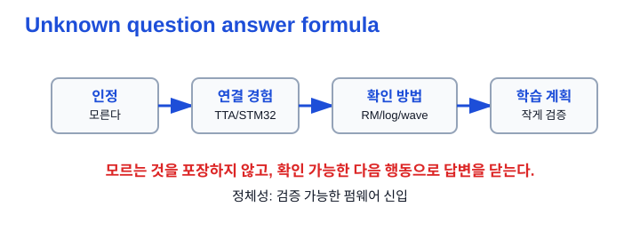
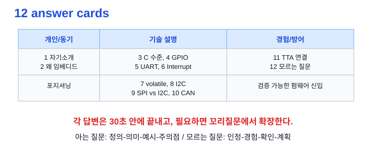

# Ch.09 면접 답변화

용도: A4 세로 반 접기 2열 손필기

규칙:

- 1열 32줄 기준
- 내용이 길면 다음 페이지로 넘김
- 들여쓰기 없음
- 파랑: 제목, 번호, 핵심 키워드
- 검정: 설명, 예시, cf
- 빨강: 면접 주의, 헷갈리는 점
- 손그림과 이미지 링크는 관련 개념 바로 아래에 배치

## 1페이지: 답변 공식과 포지셔닝

주제: 면접 답변화 
1. 최종 포지셔닝 
TTA V&amp;V 검증 습관 + iOS 출시 책임감 + STM32 직접 구현 
= 검증 가능한 펌웨어 신입 
저는 QA에서 개발로 도망가는 사람이 아니라, 검증 습관을 무기로 펌웨어를 만드는 신입입니다. 
※ 모든 답변은 "검증 가능한 펌웨어 신입"으로 돌아오게 한다 
 
2. 아는 질문 답변 공식 
정의 → 임베디드에서 의미 → 예시 → 주의점 
예: volatile은 최적화 억제 키워드입니다. 
임베디드에서는 MMIO 레지스터와 ISR 공유 flag에 중요합니다. 
다만 atomic이나 thread-safe를 보장하지는 않습니다. 
※ 기술 답변은 짧게 정의하고 오해 하나를 막아야 함 
 
 
3. 모르는 질문 답변 공식 
인정 → 연결 경험 → 확인 방법 → 학습 계획 
정확한 비트 이름은 지금 외우고 있지 않습니다. 
다만 TTA에서 로그와 재현 조건으로 문제를 좁힌 경험이 있습니다. 
실무에서는 레퍼런스 매뉴얼, 기존 코드, 로그, 파형을 함께 보고 작은 수정부터 검증하겠습니다. 
※ 모르는 것을 아는 척하지 말고 확인 가능한 행동으로 닫기 
 

## 2페이지: 개인/경험 답변 카드

4. 자기소개 30초 
저는 소프트웨어공학을 전공했고, TTA에서 약 6개월간 소프트웨어 품질 시험을 수행했습니다. 
그곳에서 개발사가 실제로 재현하고 수정에 착수할 수 있는 결함 리포트를 만드는 데 집중했습니다. 
iOS 앱 개발 경험도 있어 코드와 상태 흐름을 직접 읽는 데 익숙합니다. 
현재는 STM32F103으로 GPIO, UART, I2C, CAN을 직접 실습하며 펌웨어 기초를 쌓고 있습니다. 
※ 검증 경험 + 개발 경험 + STM32 학습을 한 문장 흐름으로 연결 
 
5. 왜 임베디드인가 
TTA에서 결함이 실제 환경과 조건에 따라 어떻게 재현되는지 보며, 소프트웨어가 하드웨어와 만나는 지점에 관심이 생겼습니다. 
앱 개발에서는 사용자 이벤트와 상태 관리를 다뤘고, 임베디드에서는 그 이벤트가 GPIO 입력, 인터럽트, 타이머, 통신 수신으로 바뀐다고 이해했습니다. 
그래서 검증 습관을 살려 동작뿐 아니라 실패 조건까지 확인하는 펌웨어 개발자로 성장하고 싶습니다. 
※ "멋있어서"가 아니라 검증 경험과 이벤트/상태 관리 경험으로 연결 
 
6. TTA 경험이 임베디드에 어떻게 도움 되는가 
TTA에서는 결함을 발생 조건, 기대 결과, 실제 결과로 나누어 재현 가능한 리포트로 정리했습니다. 
수정 후에는 같은 조건으로 다시 실행해 회귀 검증하는 흐름도 경험했습니다. 
임베디드에서도 I2C NACK, timeout, bus busy, pull-up 누락처럼 실패 조건을 먼저 테스트 항목으로 만들 수 있습니다. 
※ QA 경험은 "테스트만 했다"가 아니라 실패 조건 설계 능력으로 번역 
 
7. C는 어느 정도 하는가 
대학교에서 C/C++ 기본을 배웠고, 지금은 임베디드 관점으로 다시 정리하고 있습니다. 
특히 포인터, 배열, 비트연산, const, static, volatile을 레지스터 제어와 연결해 보고 있습니다. 
예를 들어 MMIO 레지스터는 주소를 통해 접근하므로 포인터와 volatile 이해가 중요하다고 보고 있습니다. 
※ 실무 고수처럼 말하지 말고, 필요한 C를 임베디드 맥락으로 학습 중이라고 말하기 

## 3페이지: 기술 답변 카드

8. GPIO 설명 
GPIO는 MCU 핀을 입력 또는 출력으로 설정해 외부 회로와 디지털 신호를 주고받는 기본 인터페이스입니다. 
출력은 LED나 릴레이를 제어하고, 입력은 버튼이나 센서 상태를 읽습니다. 
STM32에서는 먼저 RCC로 GPIO clock을 켠 뒤 MODER, pull-up/down, output type 등을 설정해야 합니다. 
※ GPIO는 핀 제어이지만 내부적으로는 레지스터 설정 문제 
 
9. UART 설명 
UART는 TX/RX 두 선으로 데이터를 주고받는 비동기 직렬 통신입니다. 
양쪽이 baud rate, data bit, parity, stop bit 설정을 맞춰야 하며 115200 8N1을 자주 씁니다. 
PC 로그 출력이나 bring-up 초기 디버깅에 유용하고, TX와 RX는 교차 연결하며 GND를 공유해야 합니다. 
※ UART 문제는 baud mismatch, GND, TX/RX 배선부터 확인 
 
10. 인터럽트 설명 
인터럽트는 버튼 입력, UART 수신, 타이머 이벤트처럼 특정 사건이 발생했을 때 CPU가 ISR을 실행하는 방식입니다. 
Polling보다 이벤트에 빠르게 반응할 수 있지만, ISR은 짧게 처리하고 긴 작업은 main loop나 task로 넘겨야 합니다. 
ISR과 main이 공유하는 flag는 volatile을 고려하되, 원자성 문제는 별도로 봐야 합니다. 
※ ISR 안에서 delay, 긴 loop, printf는 피하기 
 
11. volatile 설명 
volatile은 컴파일러가 해당 객체 접근을 최적화로 제거하거나 캐싱하지 않도록 하는 키워드입니다. 
임베디드에서는 하드웨어가 바꾸는 MMIO 레지스터나 ISR과 공유하는 flag에 자주 사용합니다. 
하지만 volatile은 atomicity나 thread-safe를 보장하지 않으므로 동기화 문제는 별도로 처리해야 합니다. 
※ volatile = thread-safe 라고 말하면 위험 

## 4페이지: 통신/방어 답변 카드

12. I2C 설명 
I2C는 SDA와 SCL 두 선으로 여러 장치를 주소 기반으로 연결하는 동기식 버스입니다. 
Open-drain 구조라 SDA/SCL에는 pull-up이 필요하고, ACK는 수신자가 9번째 clock에서 SDA를 LOW로 당기는 방식입니다. 
제 실습에서는 MPU6050 0x68의 WHO_AM_I register 0x75를 읽어 0x68 응답을 확인했습니다. 
※ I2C는 주소, pull-up, ACK/NACK를 같이 말하기 
 
13. SPI와 I2C 차이 
SPI는 MOSI, MISO, SCLK, CS를 쓰며 CS로 장치를 선택하는 고속 동기식 통신입니다. 
I2C는 SDA/SCL 두 선만 쓰고 주소로 장치를 선택해 배선을 아끼기 좋습니다. 
짧은 거리에서 빠른 센서나 Flash 통신은 SPI, 여러 저속 센서를 적은 선으로 붙일 때는 I2C를 우선 생각합니다. 
※ 무엇이 무조건 좋다가 아니라 배선, 속도, 장치 수 기준으로 선택 
 
14. CAN 설명 
CAN은 CAN_H/CAN_L 차동 버스에서 여러 노드가 메시지를 주고받는 차량/산업용 통신입니다. 
CAN ID는 단순 주소가 아니라 메시지 식별자이자 arbitration 우선순위에 관여하며, 낮은 ID가 유리합니다. 
검증할 때는 ID, DLC, payload, 주기, termination, transceiver, bus-off 가능성을 함께 봐야 합니다. 
※ CAN은 robust bus와 ID arbitration을 핵심으로 말하기 
 
15. 모르는 기술 질문 대응 
그 부분은 아직 실무 경험이 없어서 정확한 비트 이름까지는 바로 말씀드리기 어렵습니다. 
다만 STM32 학습에서 레퍼런스 매뉴얼의 상태 플래그와 clear 조건을 먼저 확인하고, UART 로그나 로직 분석기로 실제 동작을 맞춰보는 방식으로 접근했습니다. 
업무에서도 기존 코드와 데이터시트, 로그를 함께 보며 작은 단위로 재현하고 검증하겠습니다. 
※ 모르는 질문은 인정하되 검증 가능한 해결 절차로 끝내기 
 

## 면접 30초 답변

최종 자기소개형 답변 
저는 소프트웨어공학을 전공했고, TTA에서 약 6개월간 소프트웨어 품질 시험을 수행하며 재현 가능한 결함 리포트와 회귀 검증 흐름을 경험했습니다. 
iOS 앱 개발 경험도 있어 코드와 상태 흐름을 직접 읽는 데 익숙하고, 현재는 STM32F103으로 GPIO, UART, I2C, CAN을 실습하며 펌웨어 기초를 쌓고 있습니다. 
특히 I2C 센서 드라이버와 CAN 통신을 학습하면서 단순 동작 성공보다 NACK, timeout, bus busy 같은 실패 조건과 검증 증거를 함께 보는 습관을 만들고 있습니다. 
저는 검증 습관을 가진 펌웨어 신입으로, 모르는 부분은 레퍼런스 매뉴얼과 로그, 계측 결과로 확인하며 작게 검증해 나가겠습니다. 

## 지금 깊이 조절

지금 꼭 암기 
- 최종 포지셔닝: 검증 가능한 펌웨어 신입 
- 아는 질문 공식: 정의 → 의미 → 예시 → 주의점 
- 모르는 질문 공식: 인정 → 경험 → 확인 → 계획 
- volatile은 thread-safe가 아님 
- I2C는 pull-up/ACK, CAN은 ID/arbitration 
 
지금은 말로만 자연스럽게 
- 자기소개 
- 왜 임베디드인가 
- TTA 경험 연결 
- 모르는 질문 대응 
 
나중에 보강 
- C언어 심화: 포인터, 배열, 구조체 패딩, 함수 포인터 
- CAN normal mode 실물 bus 검증 
- MPU6050 burst read와 데이터 변환 
※ 완벽한 암기보다 30초 안에 정확히 멈추는 연습이 우선 

## Q. 꼬리질문

Q. 면접에서 이어질 수 있는 질문 
- 검증 경험이 개발 직무에 어떤 도움이 되는가? 
- 펌웨어 실무 경험이 부족한 점은 어떻게 보완하고 있는가? 
- volatile이 thread-safe가 아닌 이유는? 
- I2C에서 ACK는 누가 언제 보내는가? 
- SPI와 I2C 중 무엇을 고를 것인가? 
- CAN ID를 어떻게 설계할 것인가? 
- 모르는 레지스터 질문을 받으면 어떻게 확인할 것인가? 

## 참고 자료

원본 소스 
2026-07-02_임베디드_인턴지원_노트필기_커리큘럼.md 
2026-07-02_임베디드_면접_멘탈세이프_학습전략.md 
2026-05-27_임베디드_SW_신입_기술질문_은행_v3.md 
필기노트_01~08 
Q01_자기소개.md, Q04_프로젝트_설명.md 
※ 이 필기노트는 앞선 노트 내용을 면접장 30초 답변으로 압축한 것 
