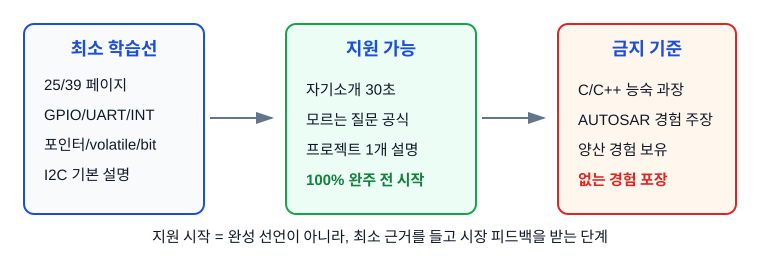
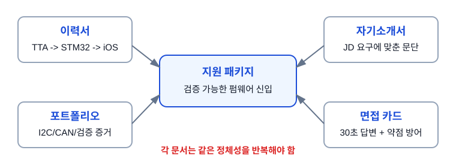
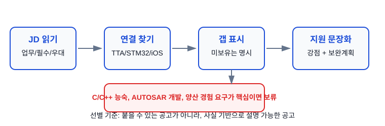
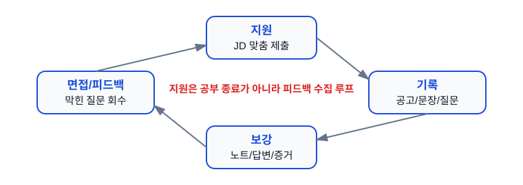

# Ch.10 지원 시작

용도: A4 세로 반 접기 2열 손필기

규칙:

- 1열 32줄 기준
- 내용이 길면 다음 페이지로 넘김
- 들여쓰기 없음
- 파랑: 제목, 번호, 핵심 키워드
- 검정: 설명, 예시, cf
- 빨강: 면접 주의, 헷갈리는 점
- 손그림과 이미지 링크는 관련 개념 바로 아래에 배치

## 1페이지: 지원 시작 기준

주제: 지원 시작 
1. 지원 시작의 의미 
지원 시작은 임베디드 공부가 끝났다는 선언이 아님 
최소 근거를 갖춘 상태에서 시장 피드백을 받기 시작하는 단계 
완벽해질 때까지 기다리면 지원 타이밍이 계속 밀림 
목표는 합격만이 아니라 어떤 질문에서 막히는지 알아내는 것 
※ 지원 = 학습 종료가 아니라 학습 방향을 검증하는 행동 
 
2. 최소 지원선 
39페이지 중 최소 25페이지 완료 
GPIO / UART / Interrupt 파트 설명 가능 
C 핵심 중 포인터, volatile, 비트연산 설명 가능 
I2C 기본 설명 가능 
자기소개 30초 가능 
모르는 질문 대응 공식 암기 
※ 100% 완주 전에도 지원 가능함 
 
 
3. 최종 포지셔닝 
TTA V&amp;V 검증 습관 + iOS 출시 책임감 + STM32 직접 구현 
= 검증 가능한 펌웨어 신입 
TTA는 요구사항, 결함, 재검증, 회귀, 산출물 경험으로 말함 
STM32는 GPIO, UART, I2C, CAN을 직접 만져본 학습 근거로 말함 
iOS는 상태관리, 릴리즈, 성능 점검의 보조 근거로 말함 
※ QA 출신 방어가 아니라 검증 습관을 가진 개발 지향 지원자 

## 2페이지: 지원 패키지 구성

4. 지원 패키지 4종 
이력서: TTA → STM32 → iOS 순서로 읽히게 구성 
자기소개서: 회사 JD 요구와 내 근거를 1:1로 연결 
포트폴리오: STM32F103 IMU-CAN Driver와 SIL Simulator를 증거로 제시 
면접 카드: 30초 자기소개, 기술 답변, 약점 방어 문장 
※ 네 문서의 정체성이 서로 다르면 면접에서 흔들림 
 
 
5. 이력서 상단 원칙 
첫인상은 iOS 개발자가 아니라 임베디드/전장 SW 지원자로 잡음 
상단 문구는 개발과 검증을 함께 이해하는 지원자로 둠 
TTA 수치: 6개월, GS인증 4건, V&amp;V 14건, 결함 리포트 180건 이상, TC ID 58개 
수치는 자신 있게 쓰되, 자동차 양산 경험처럼 확장하지 않음 
※ 있는 것은 강하게, 없는 것은 분명하게 
 
6. 포트폴리오 설명 기준 
STM32F103 + MPU6050 + I2C + CAN + UART 로그 구조로 설명 
HAL 없이 레지스터 직접 제어를 학습 목적으로 선택했다고 말함 
I2C WHO_AM_I, ACK/NACK, bus busy, timeout 같은 검증 포인트를 말함 
SIL Simulator는 알고리즘을 PC에서 먼저 회귀 검증하는 구조로 설명 
※ 동작했다보다 어떻게 확인했는지를 먼저 말하기 

## 3페이지: JD 선별과 맞춤 전략

7. 지원할 공고 선별 
JD를 업무, 필수요건, 우대요건으로 나누어 읽음 
업무에 테스트/검증/펌웨어/MCU/통신/장비 SW가 있으면 우선 검토 
필수요건이 C/C++ 양산 경력, AUTOSAR 개발 경력, ISO 26262 실무면 보류 가능 
우대요건은 없어도 지원 가능하지만, 필수요건은 과장하면 위험 
※ 붙을 수 있는 공고보다 사실 기반으로 설명 가능한 공고를 고름 
 
 
8. JD 매핑 공식 
요구사항 기반 검증 → TTA 기능 리스트 재구성, TC 작성 
결함 재현 → 결함 리포트 180건 이상, 재현 조건 정리 
회귀 검증 → 업체 패치 후 재검증과 기존 기능 영향 확인 
MCU/통신 관심 → STM32 GPIO, UART, I2C, CAN 학습과 포트폴리오 
상태관리/성능 → iOS 앱 출시, RxSwift/Combine, Instruments 경험 
※ JD 단어 하나에 내 근거 하나를 붙여야 문장이 살아남 
 
9. 금지 표현 
C/C++ 능숙, AUTOSAR 개발 경험, ECU 개발 경험 
양산 경험 보유, ISO 26262 실무 경험, ASPICE 경험 
RTOS/베어메탈 실무 경험, CAN 차량 네트워크 구현 경험 
직접 하지 않은 것은 보유 경험이 아니라 학습/보완 영역으로 둠 
※ 과장은 서류보다 면접에서 더 크게 터짐 

## 4페이지: 지원 후 피드백 루프

10. 지원 후 기록 
지원일, 회사, 직무, JD 핵심 단어, 제출 문장, 포트폴리오 링크를 기록 
면접 질문은 합격/불합격과 상관없이 바로 적음 
막힌 질문은 기술 부족, 경험 부족, 표현 부족으로 분류 
기술 부족은 필기노트 보강, 경험 부족은 사실선 정리, 표현 부족은 답변 카드 수정 
※ 떨어진 공고도 다음 답변을 고치는 데이터가 됨 
 
 
11. 면접 전날 최소 루틴 
30초 자기소개 3번 소리 내어 읽기 
왜 임베디드인가, 왜 이 회사인가, TTA 경험 연결 답변 확인 
GPIO, UART, Interrupt, volatile, I2C, CAN 답변만 다시 보기 
모르는 질문 공식: 인정 → 연결 경험 → 확인 방법 → 학습 계획 
마지막 할 말은 검증 가능한 펌웨어 신입으로 닫기 
※ 전날 새 주제 깊게 파지 말고 이미 만든 답변을 안정화 
 
12. 불합격 후 보강 기준 
기술질문에서 막힘: 해당 개념을 30초 답변 카드로 추가 
프로젝트 질문에서 막힘: 목표, 구조, 막힌 점, 검증 방법을 다시 정리 
경력 질문에서 막힘: TTA 사례를 재현 조건, 기대 결과, 실제 결과로 구체화 
직무 적합성에서 막힘: JD 선별 기준을 조정 
※ 피드백 없이 다음 지원만 반복하면 같은 질문에서 계속 막힘 

## 면접 30초 답변

지원 시작형 답변 
저는 임베디드 전체를 다 끝낸 상태라기보다, 지원 가능한 최소 근거를 갖추고 실무 피드백을 받기 시작하는 단계라고 보고 있습니다. 
TTA에서 요구사항 기반 검증, 결함 재현, 패치 후 재검증과 회귀 검증을 경험했고, 현재는 STM32F103으로 GPIO, UART, I2C, CAN을 직접 실습하며 펌웨어 기초를 쌓고 있습니다. 
없는 경험은 과장하지 않고, 제가 가진 검증 습관과 현재 포트폴리오를 바탕으로 작은 기능의 구현과 확인부터 빠르게 따라가겠습니다. 
저는 검증 가능한 근거를 남기는 펌웨어 신입으로 성장하고 싶습니다. 

## 지금 깊이 조절

지금 바로 실행 
- 지원 가능한 JD 5개 찾기 
- 각 JD 핵심 단어 5개 표시 
- 이력서 상단 문구를 TTA/STM32 중심으로 맞추기 
- 자기소개 30초 녹음해서 어색한 부분 수정 
 
지원 전 확인 
- 없는 경험을 강점처럼 쓰지 않았는가 
- 포트폴리오에서 검증 방법을 설명할 수 있는가 
- 모르는 질문 대응 문장이 준비되어 있는가 
- 공고별로 바꾼 문장이 JD와 연결되는가 
 
나중에 보강 
- C언어 심화 노트 별도 강화 
- CAN normal mode 실물 bus 검증 
- 실패 케이스 로그와 회귀 체크리스트 추가 
※ 지금은 완벽한 포트폴리오보다 설명 가능한 지원 패키지가 우선 

## Q. 꼬리질문

Q. 지원 단계에서 이어질 수 있는 질문 
- 아직 임베디드 실무 경험이 부족한데 왜 지금 지원하는가? 
- TTA 검증 경험이 개발 직무에 어떻게 연결되는가? 
- STM32 포트폴리오에서 본인이 직접 확인한 증거는 무엇인가? 
- C/C++ 실무 경험 부족은 어떻게 보완할 것인가? 
- AUTOSAR 또는 ISO 26262 경험이 없는 점은 어떻게 볼 것인가? 
- 지원한 회사의 JD에서 어떤 부분이 본인 경험과 연결되는가? 
- 불합격하거나 막힌 질문이 나오면 어떻게 보강할 것인가? 

## 참고 자료

원본 소스 
2026-07-02_임베디드_인턴지원_노트필기_커리큘럼.md 
2026-07-02_임베디드_면접_멘탈세이프_학습전략.md 
Group1_임베디드3사_공통지원용_경험매핑_최종안.md 
Group1_전장임베디드_공통_이력서_자기소개서_전략.md 
Group1_공용_전장임베디드_지원재료_설계안.md 
embeded_TIL/README.md 
embeded_TIL/30_프로젝트/sim/README.md 
embeded_TIL/30_프로젝트/docs/architecture.md 
※ 이 필기노트는 공부를 실제 지원 행동으로 전환하기 위한 운영 노트 
