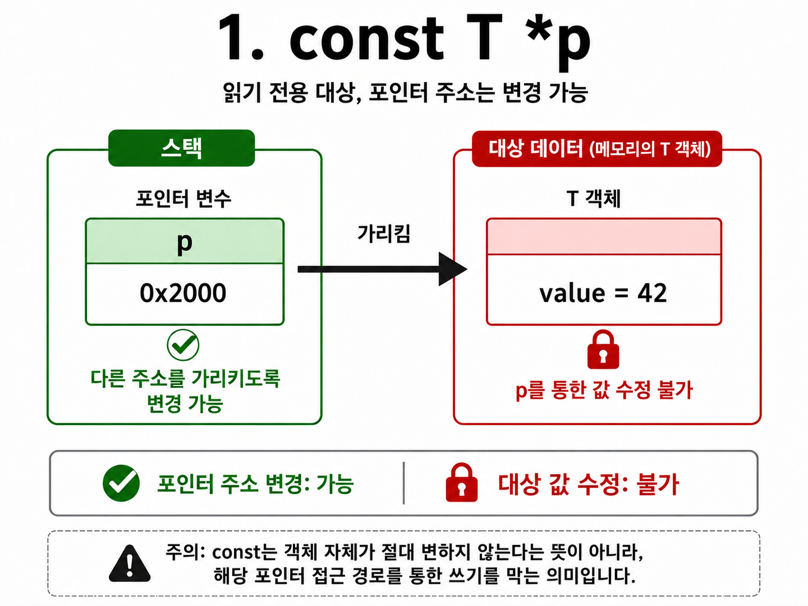
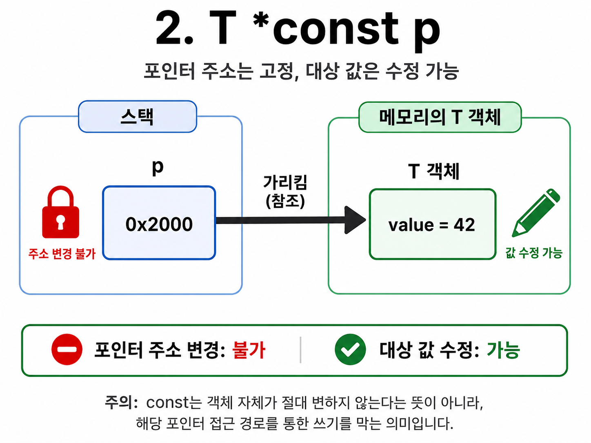
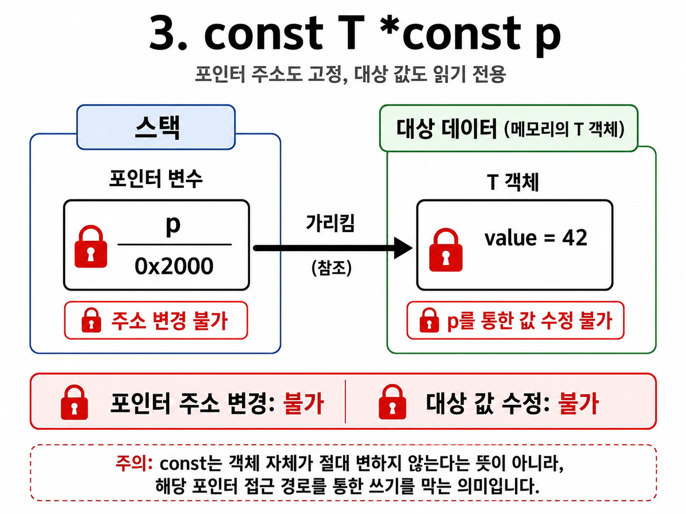
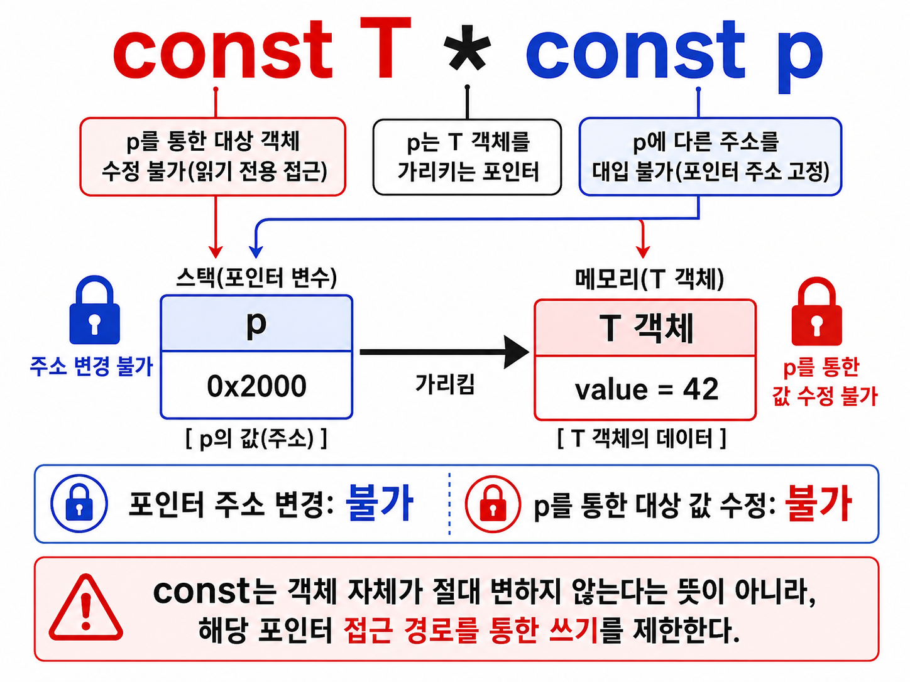

I. C언어 심화 1 — 포인터·메모리·모듈 
 
1. 포인터는 주소를 타입과 함께 다루는 방법 
1) 용어 설명 
① <strong>메모리</strong>(memory): byte 단위 칸들이 이어진 저장 공간 
② <strong>주소</strong>(address): 메모리 칸이 있는 위치를 가리키는 번호 
③ <strong>포인터</strong>(pointer): 어떤 객체의 주소를 저장해 그 위치에 접근하는 변수 
! <strong>주소를 들고 → 타입에 맞게 읽고 → 원본 객체에 접근</strong>한다고 먼저 잡기 
 
2) 메모리와 주소 
① 메모리는 byte 단위 칸의 집합이고 각 칸에 주소가 있음 
a. 타입은 <strong>몇 byte를 읽을지와 bit를 어떻게 해석할지</strong>를 정함 
b. 포인터는 값이 아니라 어떤 객체가 있는 주소를 저장하는 변수 
cf) int*, uint8_t*, struct Packet*는 주소 크기와 별개로 대상 해석이 다름 
→ <strong>struct Packet *p</strong>는 Packet 구조체 한 개가 있는 주소를 저장하며, <strong>*p</strong>는 그 구조체 자체임 
→ <strong>p-&gt;field</strong>로 구조체 멤버에 접근하고, p + 1은 Packet 한 개 크기만큼 이동함 
! <strong>포인터 크기는 대상 크기가 아니라 target의 주소 크기</strong>에 따라 달라짐 
 
3) &와 * 연산자 
① <strong>&amp;value</strong> = value가 저장된 주소 
② <strong>*p</strong> = p가 가리키는 주소의 실제 객체 
a. C는 인자를 값으로 복사해서 전달함 
b. 원본을 바꾸려면 주소를 넘기고 함수 안에서 *p로 접근 
! <strong>유효하지 않은 주소·NULL을 역참조하면 undefined behavior</strong> 
 
ex) 원본 값 바꾸기 
void set_led(uint32_t *state) { *state = 1U; } 
uint32_t led = 0U;  set_led(&led); 
→ led 값 자체가 1U로 바뀜 
 
4) 포인터 연산과 배열 
① <strong>p + 1은 1 byte가 아니라 sizeof(*p)만큼</strong> 다음 객체로 이동 
② <strong>arr[i]는 *(arr + i)</strong>와 같은 뜻 
③ 배열 이름은 대부분 식에서 첫 원소 포인터로 변환(decay)됨 
! <strong>배열과 포인터는 같은 것이 아님</strong>: 배열은 크기·저장 공간을 가진 객체 
 
2. 배열 경계와 함수 호출 규칙 
1) 배열 decay의 예외 
① sizeof arr: 배열 전체 byte 수 
② &arr: 첫 원소 주소가 아니라 배열 전체를 가리키는 주소 
③ 함수 매개변수의 arr는 이미 포인터처럼 다뤄짐 
a. 따라서 함수 안에서 sizeof(arr)로 원래 배열 길이를 구할 수 없음 
! buffer API에는 <strong>포인터와 길이(size_t)를 반드시 함께 전달</strong> 
 
2) const 포인터 읽는 법 
① T를 임의의 타입이라고 할 때, <strong>const T *p</strong>: p가 가리키는 대상은 p를 통해 수정할 수 없고, p는 다른 주소를 가리키도록 바꿀 수 있음 
② <strong>T *const p</strong>: p가 가리키는 주소는 바꿀 수 없고, 대상 값은 p를 통해 수정할 수 있음 
③ <strong>const T *const p</strong>: p가 가리키는 주소도, p를 통한 대상 수정도 모두 불가 
a. <strong>void process(const T *buf, size_t len)</strong>은 함수가 buf를 통해 입력 데이터를 수정하지 않는다는 계약 
! <strong>const는 객체가 절대 안 변한다는 뜻이 아니라 이 접근 경로의 쓰기를 막음</strong> 
<table>
  <tr>
    <td width="33.33%"></td>
    <td width="33.33%"></td>
    <td width="33.33%"></td>
  </tr>
  <tr><td width="33.33%"></td>
  </tr>
</table>
 
3) sizeof의 기준 
① sizeof는 식 또는 타입의 byte 수를 size_t로 반환 
② <strong>sizeof arr / sizeof arr[0]</strong> = 배열 원소 개수 
③ <strong>sizeof p</strong> = 포인터 변수의 크기 
④ <strong>sizeof *p</strong> = p가 가리키는 타입 한 개의 크기 
! <strong>malloc(200) 뒤 sizeof p는 200이 아니라 포인터 크기</strong> 
 
ex) 길이를 같이 전달 
void send(const uint8_t *data, size_t len); 
size_t used = 200U;  send(buf, used); 
할당 용량, 실제 유효 길이, 목적지 용량은 서로 다를 수 있음 
 
4) 함수 포인터와 callback 
① 함수 이름은 대부분 식에서 함수 시작 주소로 사용됨 
② void (*action)(void): 인자 없고 void 반환인 함수를 가리킴 
③ action() 또는 (*action)()으로 간접 호출 
④ <strong>callback</strong>은 호출 시점은 공통으로 두고 동작만 호출자가 넘기는 구조 
a. event handler, driver abstraction, 정렬 비교 함수에 사용 
! 대상 함수와 함수 포인터의 인자·반환 타입이 다르면 cast로 숨기지 말 것 
 
ex) callback 뼈대 
typedef void (*Callback)(void); 
void run_when_ready(Callback cb) { cb(); } 
→ run_when_ready는 언제 실행할지, caller는 무엇을 할지 결정 
 
3. 객체의 수명과 동적 할당 
1) 용어 설명 
① <strong>stack</strong>: 함수 호출과 함께 만들어지고 반환하면 자동으로 사라지는 영역 
② <strong>heap</strong>: malloc으로 요청하고 free 전까지 유지되는 동적 영역 
③ <strong>static storage</strong>: 프로그램 시작부터 종료까지 유지되는 전역/static 객체 영역 
! <strong>누가 만들고 → 언제까지 살며 → 누가 해제하는지</strong>를 함께 확인 
 
2) C 프로그램 메모리 레이아웃 
① .text: 기계어 코드, 보통 Flash/ROM에 저장 
② .data: 초기값 있는 전역/static, 초기값 이미지는 Flash에도 존재 
③ .bss: 초기값 없는 전역/static, 시작 시 0으로 초기화 
④ stack: 지역 변수·함수 호출 정보, 호출/반환에 따라 자동 관리 
⑤ heap: malloc으로 얻는 동적 block, free 전까지 유지 
! MCU는 RAM이 작으므로 stack·전역·heap 사용량을 함께 예측해야 함 
 
그림: 수명으로 구분 
함수 호출 → stack frame 생성 → return → 자동 해제 
malloc → heap block 생성 → free → 해제 
전역/static → 프로그램 시작부터 종료까지 유지 
! 포인터가 사라져도 heap block은 자동 해제되지 않음 
 
3) malloc 사용 원칙 
① 필요한 크기가 실행 중에 결정될 때 사용 
② 반환값이 NULL인지 확인 
③ 소유자와 free 책임을 API 설계에서 명확히 정함 
④ free 뒤 포인터를 다시 쓰지 않고, 가능하면 NULL 대입 
! <strong>leak, double free, use-after-free는 치명적인 메모리 오류</strong> 
 
4) 실시간 시스템에서의 선택 
① 일반 malloc/free는 실행 시간 변동과 heap fragmentation을 만들 수 있음 
② ISR 안에서는 할당하지 않음 
③ 가능하면 정적 버퍼, stack, 고정 블록 pool을 사용 
④ 꼭 동적 할당하면 초기화 단계에 한 번 할당하고 실패 경로도 검증 
! <strong>실시간성은 평균 속도가 아니라 최악 실행 시간의 예측 가능성</strong> 
 
4. static과 선언·정의로 모듈 경계를 만든다 
1) static은 위치에 따라 뜻이 다름 
① <strong>함수 지역 static</strong>: 이름은 함수 안, 객체 수명은 프로그램 전체 
② <strong>파일 범위 static 변수/함수</strong>: 이 .c 파일에서만 보이는 internal linkage 
③ 모듈 내부 state와 helper 함수는 static으로 숨기고 API만 공개 
! 지역 static은 숨은 공유 상태라 ISR/스레드 재진입 안전성을 따로 검토 
 
2) 선언과 정의 
① <strong>선언</strong>: 이름·타입을 알림, extern int ticks; 
② <strong>정의</strong>: 실제 저장 공간/함수 본문 하나를 만듦, int ticks = 0; 
③ 초기화된 extern은 선언이 아니라 정의 
④ 공유 전역은 header에 extern 선언, 한 .c에만 정의 
! header에 전역 변수 정의를 넣으면 <strong>multiple definition 위험</strong> 
 
3) .h / .c / linker 
① 각 .c와 include 결과는 translation unit 
② compiler: .c → .o, linker: 여러 .o와 library를 연결 
③ .h에는 공개 선언·타입·매크로, .c에는 실제 구현 
④ include guard로 같은 header의 중복 포함을 방지 
cf) #include는 텍스트 삽입, link는 object file 결합 
! undefined reference는 구현 object/library가 link에 빠졌는지 먼저 확인 
 
5. 핵심 3줄 
1) <strong>포인터는 주소를 타입과 함께 다루며, 원본 객체에 접근할 때는 유효한 주소와 대상 타입을 함께 확인한다.</strong> 
2) <strong>배열은 포인터로 decay할 수 있지만 크기를 가진 객체이므로, 함수에는 포인터와 길이를 함께 전달한다.</strong> 
3) <strong>임베디드에서는 객체 수명과 최악 실행 시간을 고려해 stack·정적 메모리를 우선하고, 모듈 내부는 static으로 숨긴다.</strong> 
 
Q. 배열과 포인터가 다른 이유는? 
A. 배열은 크기와 저장 공간을 가진 객체이고, 배열 이름은 대부분의 식에서 첫 원소 포인터로 변환될 뿐이다. 
Q. sizeof p와 sizeof *p의 차이는? 
A. sizeof p는 포인터 변수의 주소 크기이고, sizeof *p는 포인터가 가리키는 타입 한 개의 크기다. 
Q. ISR에서 malloc을 피하는 이유는? 
A. malloc/free는 실행 시간 변동과 heap fragmentation을 만들 수 있어 ISR 응답 시간의 예측 가능성을 해친다. 
Q. static 지역 변수는 왜 재진입에 주의해야 하나? 
A. 함수 호출마다 새로 만들어지지 않는 숨은 공유 상태이므로 ISR이나 스레드가 동시에 접근하면 안전성을 따로 검토해야 한다. 
Q. #include만 했는데 undefined reference가 나는 이유는? 
A. #include는 선언을 텍스트로 삽입할 뿐이므로, 실제 구현 object file이나 library가 link에 빠지면 오류가 난다. 
 
6. 30초 면접 답변 
C에서 포인터는 메모리 주소를 타입과 함께 다루는 변수로, 배열 순회나 함수에서 원본 데이터 접근, 그리고 MCU 레지스터 접근의 기반이 됩니다. 
배열은 포인터로 변환될 수 있지만 자체 크기를 가진 객체이므로, 버퍼 API에는 포인터와 길이를 함께 전달해야 합니다. 특히 sizeof 포인터는 동적 메모리 크기가 아니라 주소 크기입니다. 
임베디드에서는 stack과 정적 메모리를 우선하고, 동적 할당은 시간 변동과 단편화를 고려해 제한합니다. 
모듈은 header의 선언과 .c의 단일 정의로 나누고, 내부 상태는 static으로 숨기는 방식이 안전합니다. 
 
7. 지금 깊이 조절 
지금 꼭 이해 
- & / * / 포인터 연산 
- 배열 decay와 buffer 길이 전달 
- stack / heap / data / bss 
- static, extern, .h / .c 역할 
 
지금은 이름만 
- const T *p / T *const p / const T *const p 
- 함수 포인터와 callback 
 
나중에 깊게 
- void*와 이중 포인터 
- flexible array member 
- allocator와 memory pool 설계 
- external inline의 linkage 규칙 
! 지금은 주소·배열 길이·객체 수명·모듈 경계를 먼저 잡는다 
 
8. 참고 자료 
<a style="color:#111827" href="../../10_주제별/c언어/010_포인터.md">포인터</a> 
<a style="color:#111827" href="../../10_주제별/c언어/080_함수포인터와_콜백.md">함수 포인터와 콜백</a> 
<a style="color:#111827" href="../../10_주제별/c언어/100_실시간_시스템에서_malloc_사용_원칙.md">실시간 시스템에서 malloc 사용 원칙</a> 
<a style="color:#111827" href="../../10_주제별/c언어/020_C_프로그램_메모리_레이아웃.md">C 프로그램 메모리 레이아웃</a> 
<a style="color:#111827" href="../../10_주제별/c언어/030_sizeof와_포인터_메모리_크기.md">sizeof와 포인터</a> 
<a style="color:#111827" href="../../10_주제별/c언어/060_const_포인터와_읽기전용_레지스터.md">const 포인터</a> 
<a style="color:#111827" href="../../10_주제별/c언어/C_심화_강의/README.md">C 심화 강의: static·모듈화·extern</a> 
