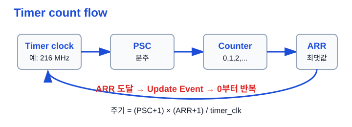
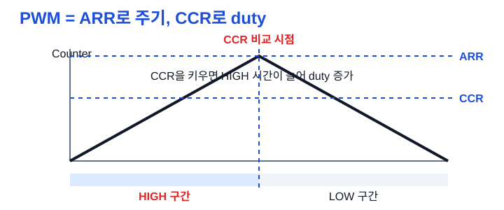
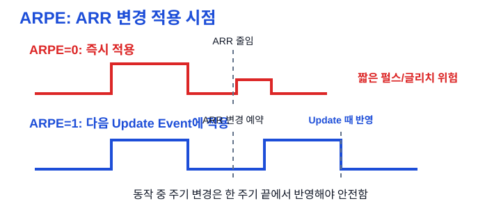

# Ch.05 Timer / PWM

용도: A4 세로 반 접기 2열 손필기

규칙:

- 1열 32줄 기준
- 내용이 길면 다음 페이지로 넘김
- 들여쓰기 없음
- 파랑: 제목, 번호, 핵심 키워드
- 검정: 설명, 예시, cf
- 빨강: 면접 주의, 헷갈리는 점
- 손그림과 이미지 링크는 관련 개념 바로 아래에 배치

## 1페이지: Timer가 시간을 만드는 방식

주제: Timer / PWM 
1. Timer / Counter 
a. Timer는 내부 클럭을 기준으로 시간을 세는 주변장치 
b. Counter는 외부 신호가 들어온 횟수를 세는 기능 
c. STM32에서는 Timer/Counter 기능이 한 모듈에 같이 있음 
- 예: 1초마다 LED 토글, PWM으로 LED 밝기 조절 
※ Timer는 delay 함수가 아니라 하드웨어 시간 기준을 만드는 장치 
 
2. Prescaler(PSC) 
a. Timer 입력 클럭을 나눠 카운터가 세는 속도를 낮춤 
b. 빠른 216MHz를 그대로 쓰면 너무 빨리 카운트됨 
c. 원하는 주기를 만들기 위해 적절한 분주비를 잡음 
cf) prescale = 주파수를 나누는 것 
※ STM32 PSC 레지스터 값은 보통 실제 분주비보다 1 작게 넣음 
 
3. Counter 
a. 분주된 클럭에 맞춰 0, 1, 2, 3... 순서로 증가 
b. 하나 셀 때 걸리는 시간은 timer clock 주기의 역수 
c. 카운터 값은 ARR과 CCR 비교의 기준이 됨 
※ Timer 계산은 클럭 → PSC → Counter 순서로 생각 
 
4. ARR(Auto-Reload Register) 
a. Counter가 어디까지 셀지 정하는 최댓값 
b. ARR에 도달하면 overflow가 나고 다시 0부터 시작 
c. 이때 Update Event가 발생하고 interrupt를 걸 수 있음 
※ Timer interrupt는 ARR 도달 시점과 연결해서 이해 
 
그림: Timer count flow 
Timer clock → PSC → Counter → ARR → Update Event 
※ 주기는 PSC와 ARR이 같이 결정함 
 

## 2페이지: PWM은 ARR과 CCR로 만든다

5. CCR(Capture/Compare Register) 
a. Counter 값과 비교하는 기준값 
b. Counter가 CCR과 같아지는 순간 출력 상태를 바꿀 수 있음 
c. PWM에서는 CCR이 HIGH 구간의 길이를 결정함 
cf) capture는 입력 시점 기록, compare는 출력 비교에 가까움 
※ 주파수는 ARR/PSC, duty는 CCR로 나눠 말하기 
 
6. PWM(Pulse Width Modulation) 
a. 디지털 HIGH/LOW를 빠르게 반복해 평균 출력을 조절 
b. 한 주기 중 HIGH 비율을 duty cycle이라고 함 
c. LED 밝기, 모터 속도, 부저, 전력 제어에 사용 
- duty 25%: HIGH 짧음, 평균 출력 작음 
- duty 75%: HIGH 김, 평균 출력 큼 
※ PWM은 아날로그 출력이 아니라 빠른 디지털 스위칭 
 
그림: ARR과 CCR 
ARR = 전체 주기, CCR = 비교 시점 
CCR을 키우면 HIGH 시간이 길어져 duty 증가 
※ 극성 설정에 따라 HIGH/LOW 해석은 뒤집힐 수 있음 
 
 
7. PWM mode와 극성 
a. PWM mode 1은 Counter와 CCR 비교 결과로 active/inactive 결정 
b. active가 반드시 HIGH라는 뜻은 아님 
c. CCER 레지스터 설정에 따라 active high 또는 active low가 됨 
cf) OC = Output Compare 출력 기준 신호 
※ duty 설명과 실제 핀 전압은 극성 설정까지 같이 봐야 함 
 
8. 다채널 PWM 
a. 하나의 Counter에 CCR1, CCR2, CCR3...을 둘 수 있음 
b. 같은 주기 안에서 여러 PWM 출력을 만들 수 있음 
c. 모터 제어처럼 여러 상을 제어할 때 중요함 
※ Counter는 공유하고 채널별 duty는 CCR별로 다르게 설정 가능 

## 3페이지: 주기 계산과 Timer interrupt

9. 주기 계산 
a. Timer 주기는 timer clock, PSC, ARR로 계산함 
b. 일반식: 주기 = (PSC+1) × (ARR+1) / timer_clk 
c. 주파수 = timer_clk / ((PSC+1) × (ARR+1)) 
cf) 레지스터 값은 0부터 세기 때문에 +1을 조심 
※ 면접에서 PSC와 ARR 중 하나만 말하면 부족함 
 
10. 강의 예시: 1초 LED 토글 
a. Timer clock = 216MHz 
b. PSC = 21600 - 1 → 216MHz / 21600 = 10kHz 
c. 10kHz는 1초에 10000번 count 
d. ARR을 약 10000 count 기준으로 잡아 1초 주기 생성 
계산: 21600 × 10000 / 216000000 = 1초 
※ 실제 레지스터 값은 +1 규칙 때문에 보드/설정 코드 기준으로 재확인 
 
11. Timer interrupt 설정 흐름 
a. init_MCU()로 clock tree 설정 
b. RCC에서 Timer peripheral clock enable 
c. PSC와 ARR 설정 
d. EGR의 UG로 설정값 즉시 로드 
e. DIER의 UIE로 Update Interrupt enable 
f. NVIC_EnableIRQ()로 NVIC에서 인터럽트 허용 
g. CR1의 CEN으로 counter 시작 
※ Timer도 주변장치라 clock enable 없이는 동작하지 않음 
 
12. ISR에서 하는 일 
a. SR의 UIF(Update Interrupt Flag)를 확인 
b. UIF를 clear해서 다음 interrupt를 받을 수 있게 함 
c. LED 토글처럼 짧은 작업만 수행 
- 예: GPIOD-&gt;ODR ^= (1 &lt;&lt; 3) 
※ Interrupt flag를 지우지 않으면 계속 인터럽트가 걸릴 수 있음 

## 4페이지: 글리치, 고급 타이머, 모터 제어

13. ARPE(Auto-Reload Preload Enable) 
a. 동작 중 ARR 변경을 언제 적용할지 정하는 기능 
b. ARPE=0이면 ARR 변경이 즉시 적용됨 
c. ARPE=1이면 다음 Update Event 때 적용됨 
d. 주기 중간에 ARR이 바뀌면 짧은 펄스가 생길 수 있음 
※ PWM 동작 중 주기 변경은 글리치 방지가 중요함 
 
그림: ARPE와 글리치 
ARPE=0: 즉시 적용 → 이상한 짧은 펄스 가능 
ARPE=1: 한 주기 끝 Update Event에서 반영 
※ 동작 중 ARR 변경은 다음 update에 맞추는 것이 안전 
 
 
14. Up count vs Center-aligned 
a. Up count는 0에서 ARR까지 올라간 뒤 0으로 돌아감 
b. Center-aligned는 0→ARR→0으로 올라갔다 내려옴 
c. Center-aligned는 모터 제어 PWM에서 자주 언급됨 
※ 지금은 up count와 center-aligned 이름과 파형 차이를 잡기 
 
15. 상보 출력(Complementary PWM) 
a. 타이머 1, 8 같은 고급 타이머는 반전 PWM 출력을 지원 
b. 한쪽 스위치가 ON이면 반대쪽은 OFF가 되게 제어함 
c. 삼상 인버터의 상하 스위치 제어에 필요함 
※ 상하 스위치가 동시에 ON되면 Arm-short 위험 
 
16. Dead Time 
a. 상보 신호 사이에 둘 다 OFF인 짧은 시간을 넣는 것 
b. 실제 스위치는 켜지고 꺼지는 데 시간이 걸림 
c. 순간적으로 둘 다 ON되는 상황을 막기 위해 필요함 
cf) BLDC/PMSM 인버터 제어에서 중요 
※ 상보 출력만으로 부족하고 dead time까지 봐야 함 
 
 
17. RCR(Repetition Counter Register) 
a. 고급 타이머에서 update event 발생 빈도를 조절하는 레지스터 
b. 지정 횟수만큼 반복한 뒤 update event를 발생시킬 수 있음 
c. Center-aligned 모드에서 update 위치 제어와 연결됨 
※ 신입 면접에서는 이름과 용도만 알아도 충분 

## 면접 30초 답변

Timer / PWM 설명 
타이머는 내부 클럭을 prescaler로 나눈 뒤 counter를 증가시키고, ARR에 도달하면 update event나 interrupt를 발생시키는 주변장치입니다. 
PWM은 이 counter 값과 CCR을 비교해서 한 주기 안의 HIGH/LOW 비율, 즉 duty cycle을 만드는 방식입니다. 
주파수는 timer clock, PSC, ARR로 결정되고 duty는 CCR로 조절합니다. 
STM32에서는 timer clock enable, PSC/ARR 설정, UG 로드, UIE/NVIC 설정, CEN 시작 순서로 timer interrupt를 만들 수 있습니다. 
모터 제어에서는 상보 PWM과 dead time으로 상하 스위치 동시 ON, 즉 Arm-short를 막는 것이 중요합니다. 

## 지금 깊이 조절

지금 꼭 이해 
- Timer는 내부 클럭으로 시간을 셈 
- PSC는 클럭 분주 
- ARR은 주기 
- CCR은 PWM duty 
- Update Event와 Timer interrupt 연결 
- Interrupt flag clear 필요 
 
지금은 이름만 
- CCER polarity 
- Center-aligned mode 
- ARPE 
- RCR 
 
나중에 깊게 
- Timer clock tree와 APB prescaler 예외 
- PWM mode 1/2 레지스터 상세 
- Complementary output 실제 레지스터 
- Dead time 계산 
※ 면접에서는 PSC/ARR/CCR 역할 구분이 먼저 

## Q. 꼬리질문

Q. 면접에서 이어질 수 있는 질문 
- Timer와 Counter는 무엇이 다른가? 
- Prescaler는 왜 필요한가? 
- ARR과 CCR은 각각 무엇을 정하는가? 
- PWM duty cycle은 어떻게 바꾸는가? 
- Timer interrupt를 만들 때 어떤 설정 순서가 필요한가? 
- Interrupt flag를 clear하지 않으면 무슨 문제가 생기는가? 
- ARPE는 왜 필요한가? 
- 모터 제어에서 dead time은 왜 필요한가? 

## 참고 자료

원본 소스 
embeded_TIL/10_학습자료/stm32/timer/1_타이머카운터와_PWM.md 
embeded_TIL/10_학습자료/stm32/기초/3_클럭과_PLL설정.md 
embeded_TIL/10_학습자료/stm32/기초/README.md 
 
원본 강의 
<a style="color:#111827" href="https://www.youtube.com/watch?v=XOsyrZGZtR8">STM32 입문 강의 몰아보기 | ARM, GPIO, ADC, UART (YouTube)</a> 
※ 이 필기노트는 위 TIL 강의 정리본을 손필기용으로 압축한 것 
