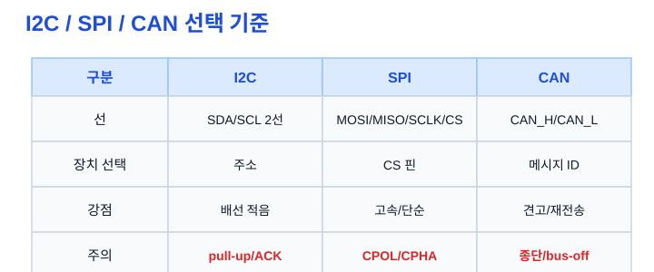
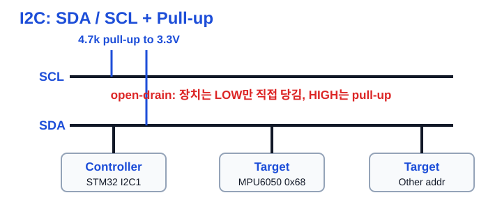
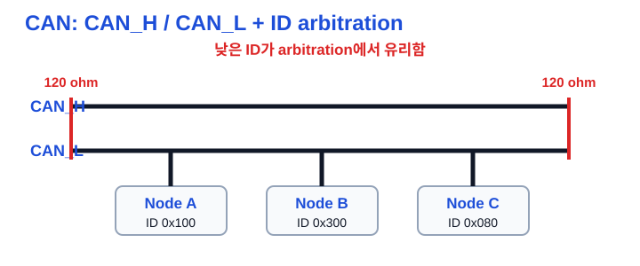

# Ch.06 I2C / SPI / CAN

용도: A4 세로 반 접기 2열 손필기

규칙:

- 1열 32줄 기준
- 내용이 길면 다음 페이지로 넘김
- 들여쓰기 없음
- 파랑: 제목, 번호, 핵심 키워드
- 검정: 설명, 예시, cf
- 빨강: 면접 주의, 헷갈리는 점
- 손그림과 이미지 링크는 관련 개념 바로 아래에 배치

## 1페이지: 통신 프로토콜을 비교하는 기준

주제: I2C / SPI / CAN 
1. 왜 통신 프로토콜을 비교해야 하나 
a. MCU는 센서, 모듈, 다른 제어기와 데이터를 주고받아야 함 
b. 통신마다 선 수, 속도, 거리, 신뢰성, 장치 선택 방식이 다름 
c. 면접에서는 정의보다 언제 무엇을 고르는지가 자주 나옴 
※ I2C/SPI/CAN은 외우기보다 선택 기준으로 비교 
 
2. 동기식 통신 
a. 별도 clock 신호를 기준으로 데이터를 주고받음 
b. I2C와 SPI가 대표적인 동기식 통신 
c. clock edge, timing 설정이 중요함 
※ UART는 clock line 없이 baud를 약속하는 비동기식 
 
3. 비교 기준 
a. 선 수: 배선이 몇 개 필요한가 
b. 장치 선택: 주소인가, CS 핀인가, 메시지 ID인가 
c. 속도: 빠른 데이터 전송이 필요한가 
d. 신뢰성: 오류 검출과 재전송이 중요한가 
e. 노드 수: 한 버스에 여러 장치를 붙일 것인가 
※ 프로토콜 선택은 배선/속도/노드 수/신뢰성의 trade-off 
 
그림: I2C / SPI / CAN 선택 기준 
I2C는 배선 적음, SPI는 고속, CAN은 견고함 
※ "무엇이 더 좋다"가 아니라 상황별 선택 
 

## 2페이지: I2C 기본 구조

4. I2C란 
a. SDA와 SCL 두 선으로 여러 장치를 연결하는 버스 통신 
b. SCL은 clock, SDA는 data 역할 
c. 각 target 장치는 주소를 가지고 선택됨 
- 예: MPU6050은 AD0=GND일 때 7-bit address 0x68 
※ I2C는 선 2개로 여러 장치를 연결할 수 있는 주소 기반 통신 
 
5. Open-drain과 Pull-up 
a. I2C 장치는 보통 HIGH를 직접 밀지 않고 LOW만 당김 
b. HIGH 상태는 SDA/SCL 풀업 저항이 만들어 줌 
c. 프로젝트에서는 SDA/SCL 각각 4.7kΩ을 3.3V에 연결 
cf) STM32F103 PB6=SCL, PB7=SDA를 AF Open-Drain으로 사용 
※ 풀업 없으면 SDA/SCL이 제대로 HIGH로 올라가지 않아 통신 실패 가능 
 
그림: I2C bus 
Controller와 여러 target이 SDA/SCL을 공유 
※ 모든 장치가 LOW를 당길 수 있어 ACK와 arbitration이 가능 
 
 
6. START / STOP 
a. START는 통신 시작 조건 
b. STOP은 통신 종료 조건 
c. register read에서는 repeated START가 자주 사용됨 
cf) repeated START = STOP 없이 방향을 바꾸거나 읽기로 전환 
※ START/STOP은 단순 데이터가 아니라 버스 상태 조건 

## 3페이지: I2C 트랜잭션과 검증

7. ACK / NACK 
a. ACK는 수신자가 데이터를 받았다는 응답 
b. 9번째 clock에서 수신자가 SDA를 LOW로 당기면 ACK 
c. LOW로 당기지 않으면 NACK로 볼 수 있음 
d. 마지막 1-byte read에서는 NACK 후 STOP 흐름이 나올 수 있음 
※ ACK는 데이터 8비트 뒤의 9번째 clock에서 확인 
 
8. MPU6050 WHO_AM_I 읽기 
a. MPU6050의 WHO_AM_I register 주소는 0x75 
b. 기대 응답값은 0x68 
c. 흐름: START → addr+W → register → repeated START → addr+R → data → NACK → STOP 
d. UART 로그로 응답값을 확인하고 로직 분석기로 파형을 확인 
※ WHO_AM_I는 센서 연결과 I2C read 흐름을 검증하기 좋은 첫 테스트 
 
그림: I2C register read 
주소를 쓰고 register를 지정한 뒤 repeated START로 읽기 전환 
※ ACK/NACK 위치와 STOP 시점을 같이 본다 
 
 
9. STM32 I2C 레지스터 함정 
a. ADDR flag clear는 SR1 → SR2 순서로 read해야 함 
b. 1-byte read에서는 ACK=0과 STOP 세팅 시점이 중요함 
c. NACK, timeout, bus busy 같은 실패 경로를 테스트해야 함 
※ HAL 없이 직접 구현할 때는 flag 순서와 timeout 정책이 핵심 

## 4페이지: SPI 기본 구조

10. SPI란 
a. Controller가 clock을 내보내며 데이터를 주고받는 동기식 통신 
b. MOSI, MISO, SCLK, CS 선을 사용 
c. 보통 짧은 거리에서 센서, Flash 같은 장치와 빠르게 통신 
※ SPI는 주소보다 CS 핀으로 장치를 선택한다고 생각 
 
11. SPI 선 역할 
a. MOSI: Controller → Peripheral 데이터 
b. MISO: Peripheral → Controller 데이터 
c. SCLK: Controller가 제공하는 clock 
d. CS: 통신할 장치를 선택하는 chip select 
※ 장치가 늘면 CS 선도 보통 추가로 필요 
 
그림: SPI bus 
MOSI와 MISO가 분리되어 동시에 송수신 가능 
※ full-duplex라고 해도 실제 의미 있는 데이터 방향은 장치마다 다름 
 
 
12. CPOL / CPHA 
a. CPOL은 clock idle 상태의 극성 
b. CPHA는 어느 clock edge에서 데이터를 샘플링할지 정함 
c. 설정이 맞지 않으면 데이터가 한 비트 밀려 보일 수 있음 
※ SPI 디버깅은 CPOL/CPHA, word length, CS timing부터 확인 

## 5페이지: CAN 기본 구조

13. CAN이란 
a. 여러 노드가 같은 버스에서 메시지를 주고받는 통신 
b. 자동차와 산업 환경처럼 노이즈와 신뢰성이 중요한 곳에 쓰임 
c. 오류 검출, 재전송, error state 개념이 중요함 
※ CAN은 단순 센서선보다 네트워크 통신에 가깝게 생각 
 
14. CAN_H / CAN_L 
a. CAN은 차동 신호선 CAN_H와 CAN_L을 사용 
b. MCU의 CAN TX/RX는 transceiver를 거쳐 CAN bus에 연결됨 
c. 프로젝트에서는 TJA1050 transceiver를 사용 
d. BluePill에서는 PB8=CAN RX, PB9=CAN TX로 remap 사용 
※ MCU 핀을 CAN_H/CAN_L에 직접 꽂는 구조가 아니라 transceiver가 필요 
 
15. Termination 120 ohm 
a. CAN bus 양 끝에는 120Ω 종단 저항을 둠 
b. 종단이 없으면 반사와 신호 품질 문제로 통신 실패 가능 
c. 배선 확인 때 CAN_H와 CAN_L 사이 종단을 확인함 
※ CAN 송신 실패 시 종단, transceiver 전원, bus-off를 같이 확인 
 
그림: CAN bus 
여러 node가 같은 CAN_H/CAN_L 버스를 공유 
※ 양 끝 120Ω 종단과 ID 우선순위가 핵심 
 

## 6페이지: CAN ID와 프로토콜 선택

16. CAN ID 
a. CAN ID는 단순 주소가 아니라 메시지 식별자 
b. arbitration에서 우선순위에도 관여함 
c. 낮은 ID가 arbitration에서 유리함 
d. 긴급하거나 제어에 중요한 메시지에 낮은 ID를 줄 수 있음 
※ CAN ID를 그냥 번호표처럼 설명하면 부족함 
 
17. DLC와 payload 
a. DLC는 CAN frame에 들어가는 data length를 나타냄 
b. payload는 실제 전달하려는 데이터 
c. CAN 송신 검증은 ID, DLC, payload, 주기를 함께 확인함 
※ CAN trace를 볼 때 ID만 보지 말고 payload와 주기도 같이 확인 
 
18. Arbitration 
a. 여러 노드가 동시에 보내려 할 때 우선순위를 정하는 과정 
b. CAN은 ID 기반 bitwise arbitration으로 동작함 
c. bus load가 높으면 낮은 우선순위 메시지가 늦어질 수 있음 
※ 메시지가 늦으면 속도보다 ID 우선순위, bus load, 오류 재전송부터 의심 
 
19. I2C / SPI / CAN 선택 
a. I2C: 선을 아끼고 여러 저속 센서를 주소로 붙일 때 
b. SPI: 짧은 거리에서 빠른 센서/Flash 통신이 필요할 때 
c. CAN: 여러 제어 노드가 견고하게 메시지를 주고받아야 할 때 
※ 면접 답변은 "선택 이유"까지 말해야 점수가 높음 

## 면접 30초 답변

I2C / SPI / CAN 비교 설명 
I2C는 SDA와 SCL 두 선으로 여러 장치를 주소 기반으로 연결하는 동기식 버스입니다. 
Open-drain 구조라 SDA/SCL에는 pull-up이 필요하고, ACK는 수신자가 9번째 clock에서 SDA를 LOW로 당기는 방식입니다. 
SPI는 MOSI, MISO, SCLK, CS를 사용하며 clock 기준으로 빠르게 주고받는 동기식 full-duplex 통신이고, 장치는 CS로 선택합니다. 
CAN은 CAN_H/CAN_L 차동 버스에서 여러 노드가 메시지 ID 기반으로 통신하며, 낮은 ID가 arbitration에서 유리하고 오류 검출/재전송이 중요합니다. 
선택 기준은 배선 수, 속도, 노드 수, 신뢰성입니다. 저속 센서는 I2C, 고속 보드 내부 통신은 SPI, 차량/산업용 다중 노드 통신은 CAN을 우선 생각합니다. 

## 지금 깊이 조절

지금 꼭 이해 
- I2C는 SDA/SCL 2선, 주소 기반 
- I2C는 open-drain과 pull-up 필요 
- ACK는 9번째 clock에서 LOW 
- SPI는 MOSI/MISO/SCLK/CS 
- SPI는 CPOL/CPHA 설정 주의 
- CAN ID는 메시지 식별자이자 우선순위 
- CAN은 transceiver와 120Ω 종단 필요 
 
지금은 이름만 
- I2C arbitration 
- I2C TRISE 
- SPI DMA alignment 
- CAN filter 
- CAN error passive / bus-off 
 
나중에 깊게 
- STM32 I2C SR1/SR2 flag sequence 전체 
- MPU6050 burst read 6바이트 
- CAN bit timing과 sample point 
- bus load 계산 
※ 지금은 통신별 "선, 선택 방식, 실패 포인트"를 먼저 잡는다 

## Q. 꼬리질문

Q. 면접에서 이어질 수 있는 질문 
- I2C는 왜 pull-up이 필요한가? 
- ACK와 NACK는 어디서 확인하는가? 
- MPU6050 WHO_AM_I는 왜 읽어보는가? 
- SPI와 I2C 중 센서 연결에 무엇을 고를 것인가? 
- SPI에서 값이 한 비트 밀리면 무엇을 볼 것인가? 
- CAN ID는 주소인가, 우선순위인가? 
- CAN 송신 실패 시 하드웨어에서 무엇을 확인할 것인가? 
- 메시지가 늦으면 CAN에서 무엇을 의심할 것인가? 

## 참고 자료

원본 소스 
embeded_TIL/README.md 
embeded_TIL/30_프로젝트/docs/datasheet-notes.md 
embeded_TIL/10_학습자료/hardware/wiring-notes.md 
embeded_TIL/10_학습자료/hardware/pinmap.md 
embeded_TIL/10_학습자료/stm32/uart/1_UART통신.md 
20_Applications/.../Group1_임베디드펌웨어시스템SW_신입_면접공통예상질문_심층리포트.md 
20_Applications/.../2026-05-27_임베디드_SW_신입_기술질문_은행_v2.md 
 
참고 문서 
STM32F103 RM0008 Reference Manual: I2C, bxCAN, GPIO AF 설정 
NXP I2C-bus Specification UM10204: open-drain, pull-up, ACK 
Bosch CAN 2.0A: frame format, arbitration, error handling 
※ 이 필기노트는 로컬 TIL/면접준비 문서를 손필기용으로 압축한 것 
