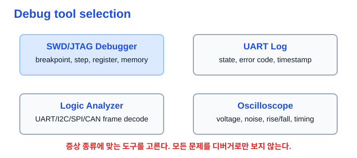
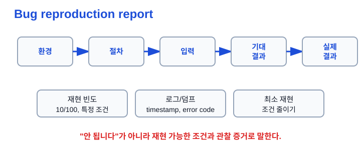
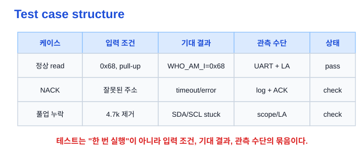
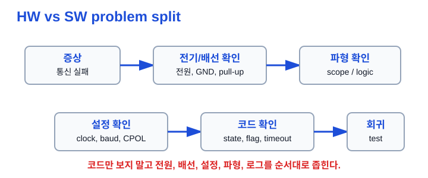

# Ch.07 디버깅 / 검증

용도: A4 세로 반 접기 2열 손필기

규칙:

- 1열 32줄 기준
- 내용이 길면 다음 페이지로 넘김
- 들여쓰기 없음
- 파랑: 제목, 번호, 핵심 키워드
- 검정: 설명, 예시, cf
- 빨강: 면접 주의, 헷갈리는 점
- 손그림과 이미지 링크는 관련 개념 바로 아래에 배치

## 1페이지: 디버깅 도구를 증상에 맞게 고르기

주제: 디버깅 / 검증 
1. 디버깅과 검증의 차이 
a. 디버깅은 문제 원인을 좁혀 수정하는 과정 
b. 검증은 기대한 동작이 실제로 만족되는지 증거로 확인하는 과정 
c. 임베디드는 코드, 레지스터, 전원, 배선, 파형을 함께 봐야 함 
※ "동작했다"보다 "어떻게 확인했는가"가 중요함 
 
2. SWD / JTAG Debugger 
a. breakpoint로 특정 코드 줄에서 멈출 수 있음 
b. step into / step over로 실행 흐름을 따라감 
c. memory, register, stack 상태를 확인할 수 있음 
- 예: CubeIDE SFRS 창에서 GPIO MODER, ODR 확인 
※ 코드 흐름과 레지스터 상태 확인에 강함 
 
3. UART 로그 
a. 보드 동작 중 상태, 에러 코드, 센서값을 문자열로 남김 
b. bring-up 초기에는 가장 싸고 빠른 관찰 수단 
c. timestamp, 상태 전이, 입력값, 오류 원인을 같이 남기면 좋음 
- 예: WHO_AM_I 응답값, 가속도 raw data 출력 
※ 로그를 많이 찍는 것보다 관찰 포인트를 잘 잡는 것이 중요 
 
4. 로직 분석기 / 오실로스코프 
a. 로직 분석기: 디지털 신호와 프로토콜 프레임 확인 
b. UART, I2C, SPI, CAN frame decode에 유용함 
c. 오실로스코프: 전압 레벨, rise/fall, noise, timing 품질 확인 
※ 통신 타이밍/전기 문제는 디버거보다 계측기가 더 직접적 
 
그림: 디버깅 도구 선택 
소프트웨어 상태는 디버거/로그, 신호 품질은 계측기로 확인 
※ 증상에 맞는 도구를 고르는 것이 면접 포인트 
 

## 2페이지: 재현 조건과 버그 리포트

5. 재현성 
a. 같은 조건에서 같은 문제가 다시 나타나는 정도 
b. 재현성이 있어야 원인 분석과 수정 검증이 쉬워짐 
c. 재현율이 낮으면 입력, 타이밍, 전원, 온도, 부하 조건을 나눠 봄 
※ "가끔 안 됨"을 "어떤 조건에서 몇 번 중 몇 번"으로 바꾸기 
 
6. 재현 리포트 구성 
a. 환경 정보: 보드, 펌웨어 버전, 연결 장치, 설정값 
b. 재현 절차: 전원 인가부터 문제 발생까지 순서 
c. 입력 데이터: 명령, 센서 상태, 통신 payload 
d. 기대 결과와 실제 결과 
e. 재현 빈도와 로그/캡처 첨부 
※ 기대 결과와 실제 결과를 분리해야 결함 설명이 선명해짐 
 
그림: 재현 리포트 흐름 
환경 → 절차 → 입력 → 기대 결과 → 실제 결과 → 증거 
※ 가능하면 최소 재현 사례로 조건을 줄인다 
 
 
7. 로그 설계 
a. 사건 중심으로 찍음: 시작, 성공, 실패, 상태 전이 
b. 시간, 문맥, 에러 코드, 주요 값을 같이 남김 
c. 너무 많은 로그는 timing에 영향을 줄 수 있음 
cf) task/ISR 문맥, overrun, timeout 같은 단서가 중요 
※ 로그 flood를 피하고 원인 추적에 필요한 최소 정보를 남김 

## 3페이지: 테스트케이스와 검증 증거

8. 테스트케이스 구조 
a. 테스트 대상: 무엇을 검증할지 정함 
b. 입력 조건: 어떤 상태와 입력으로 실행할지 정함 
c. 기대 결과: 정상이라면 어떤 값/상태가 나와야 하는지 정함 
d. 실제 결과: 관측된 결과를 기록함 
e. 관측 수단: UART 로그, 로직 분석기, 오실로스코프, CAN trace 
※ 테스트케이스는 실행 절차와 판정 기준이 있어야 함 
 
9. I2C 검증 예시 
a. 정상 read: 센서 정상 연결, 4.7kΩ 풀업 → WHO_AM_I=0x68 
b. NACK: 잘못된 주소 0x69 → timeout 후 error 
c. bus busy: START 전 BUSY=1 → timeout 처리 
d. 풀업 누락: SCL/SDA가 LOW에 갇히는지 확인 
※ 정상 케이스뿐 아니라 실패 경로를 먼저 테스트 항목에 넣기 
 
그림: 테스트케이스 구조 
입력 조건, 기대 결과, 실제 결과, 관측 수단을 한 줄로 묶음 
※ "테스트했다"가 아니라 무엇을 어떻게 판정했는지 말하기 
 
 
10. 검증 증거 
a. UART log: WHO_AM_I 응답값, raw data 출력 
b. Logic capture: I2C START, addr, ACK, data, NACK, STOP 
c. CAN trace: ID, DLC, payload, 주기 확인 
d. Oscilloscope: SDA/SCL rise time, 전압 레벨, noise 확인 
※ 포트폴리오에서는 말보다 캡처와 로그가 신뢰도를 만든다 

## 4페이지: 회귀검증과 문제 분리

11. 회귀 검증(Regression Test) 
a. 수정한 버그가 다시 생기지 않는지 확인하는 테스트 
b. 재현 절차를 테스트케이스로 승격시킴 
c. bug-specific test와 인접 기능 test를 같이 추가함 
d. 가능하면 자동 실행 경로에 넣음 
※ 수정 후 로그 한 번 보고 끝내면 회귀 방지가 약함 
 
12. Unit / Integration / System test 
a. Unit: 함수나 작은 모듈을 격리해서 검증 
b. Integration: driver, protocol, task가 함께 맞물리는지 검증 
c. System: 실제 보드와 외부 장치까지 포함한 전체 시나리오 검증 
d. 순수 로직은 host test, 레지스터/타이밍은 on-target test가 적합 
※ 보드에서만 테스트하면 느리고 재현성/자동화가 떨어질 수 있음 
 
13. 하드웨어 문제 vs 소프트웨어 문제 
a. 전원, GND, 배선, pull-up, 종단 저항을 먼저 확인 
b. 클럭, baud, CPOL/CPHA, address 같은 설정을 확인 
c. 로직 분석기/오실로스코프로 실제 신호를 확인 
d. 그 다음 state, flag, timeout, buffer overflow 같은 코드를 좁힘 
※ 임베디드 통신 문제를 코드 문제로만 단정하지 않기 
 
그림: HW/SW 문제 분리 
증상 → 전기/배선 → 파형 → 설정 → 코드 → 회귀 테스트 
※ 전기적 조건과 소프트웨어 상태를 번갈아 확인 
 
 
14. Linux 로그/자원 확인 
a. Linux/Embedded Linux에서는 로그와 자원 상태도 확인 대상 
b. gdb는 stack, register, crash 시점 확인에 유용함 
c. strace는 syscall 흐름과 errno 확인에 유용함 
d. CPU, memory, file descriptor, thread 상태를 함께 볼 수 있음 
※ bare-metal과 Linux는 도구가 다르지만 "증거로 좁힌다"는 원칙은 같음 

## 면접 30초 답변

디버깅 / 검증 설명 
저는 결함을 감으로 판단하기보다 환경, 재현 절차, 입력 조건, 기대 결과, 실제 결과, 재현 빈도와 로그로 나눠 정리합니다. 
임베디드에서는 코드만 보는 것이 아니라 전원, GND, 배선, pull-up, 클럭 설정, 레지스터 상태, 실제 파형을 같이 확인해야 합니다. 
디버거는 코드 흐름과 레지스터 확인에, UART 로그는 상태와 에러 코드 기록에, 로직 분석기는 디지털 프로토콜 프레임에, 오실로스코프는 전압과 타이밍 품질 확인에 사용합니다. 
수정 후에는 재현 절차를 회귀 테스트로 승격하고, 정상 케이스뿐 아니라 NACK, timeout, bus busy 같은 실패 조건도 테스트케이스에 포함합니다. 
즉 "돌아갔다"가 아니라 어떤 조건에서 무엇을 관측해 통과로 판단했는지 말할 수 있어야 합니다. 

## 지금 깊이 조절

지금 꼭 이해 
- 디버깅은 원인 추적, 검증은 증거 확인 
- 재현 절차, 기대 결과, 실제 결과 분리 
- UART 로그는 상태/에러 코드 관찰 
- 로직 분석기는 디지털 프레임 확인 
- 오실로스코프는 전압/노이즈/타이밍 확인 
- 회귀 검증은 고친 버그가 다시 안 생기게 하는 장치 
 
지금은 이름만 
- gdb 
- strace 
- ASan / TSan 
- HIL 
- coverage 
 
나중에 깊게 
- 테스트 자동화 
- mock/fake로 driver unit test 만들기 
- CAN bus load 측정 
- Linux 자원/스레드/파일 디스크립터 추적 
※ 지금은 "재현-관측-판정-회귀" 흐름을 먼저 잡는다 

## Q. 꼬리질문

Q. 면접에서 이어질 수 있는 질문 
- 버그를 재현해오라고 하면 어떤 형식으로 정리할 것인가? 
- 로그를 많이 찍는 것과 잘 찍는 것은 어떻게 다른가? 
- UART가 깨지면 무엇부터 확인할 것인가? 
- I2C ACK 문제는 어떤 도구로 확인할 것인가? 
- 오실로스코프와 로직 분석기는 언제 다르게 쓰는가? 
- 테스트케이스에는 어떤 항목이 들어가야 하는가? 
- 회귀 테스트는 왜 필요한가? 
- 하드웨어 문제와 소프트웨어 문제를 어떻게 나눌 것인가? 

## 참고 자료

원본 소스 
embeded_TIL/30_프로젝트/docs/validation/README.md 
embeded_TIL/10_학습자료/stm32/gpio/1_GPIO출력과_LED제어.md 
20_Applications/.../Group1_임베디드펌웨어시스템SW_신입_면접공통예상질문_심층리포트.md 
20_Applications/.../2026-05-27_임베디드_SW_신입_기술질문_은행_v3.md 
20_Applications/.../2026-07-02_임베디드_인턴지원_노트필기_커리큘럼.md 
 
검증 증거 후보 
uart-log.md, logic-i2c.png, logic-can.png, can-trace.md, failure-cases.md, oscilloscope-sda-scl.png 
※ 이 필기노트는 로컬 TIL/면접준비 문서를 손필기용으로 압축한 것 
