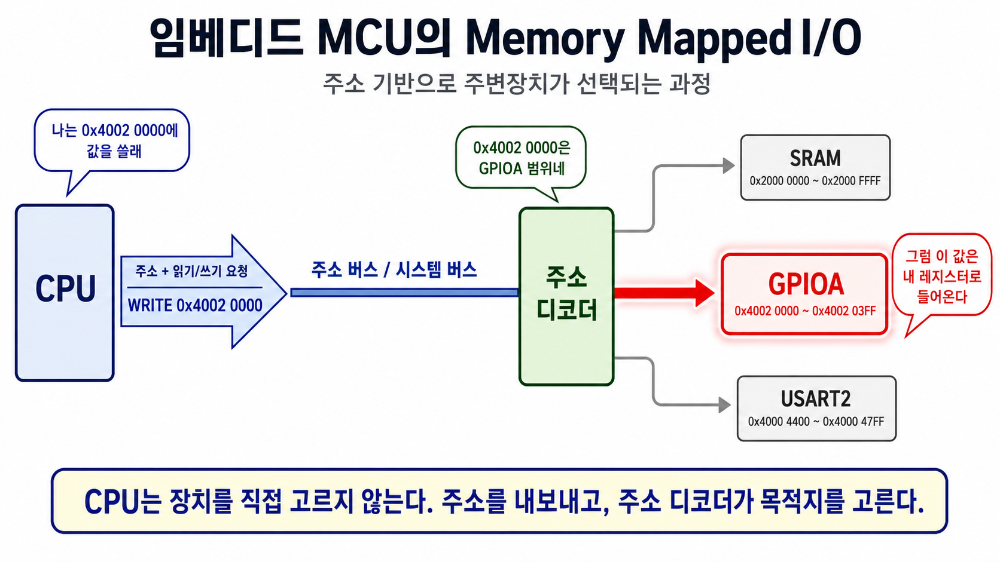
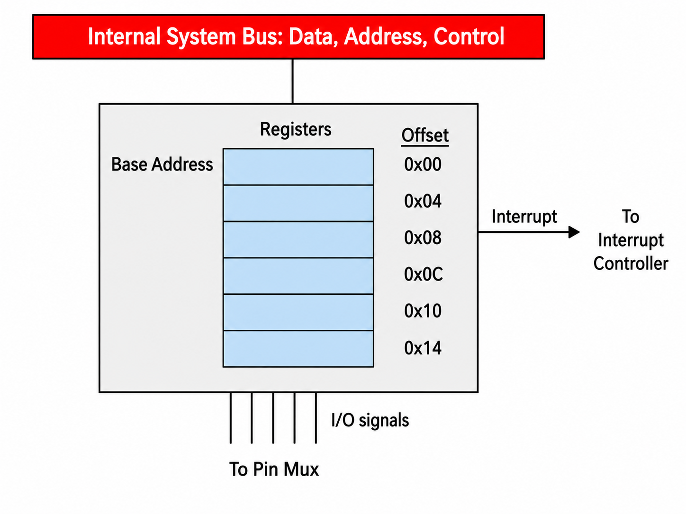
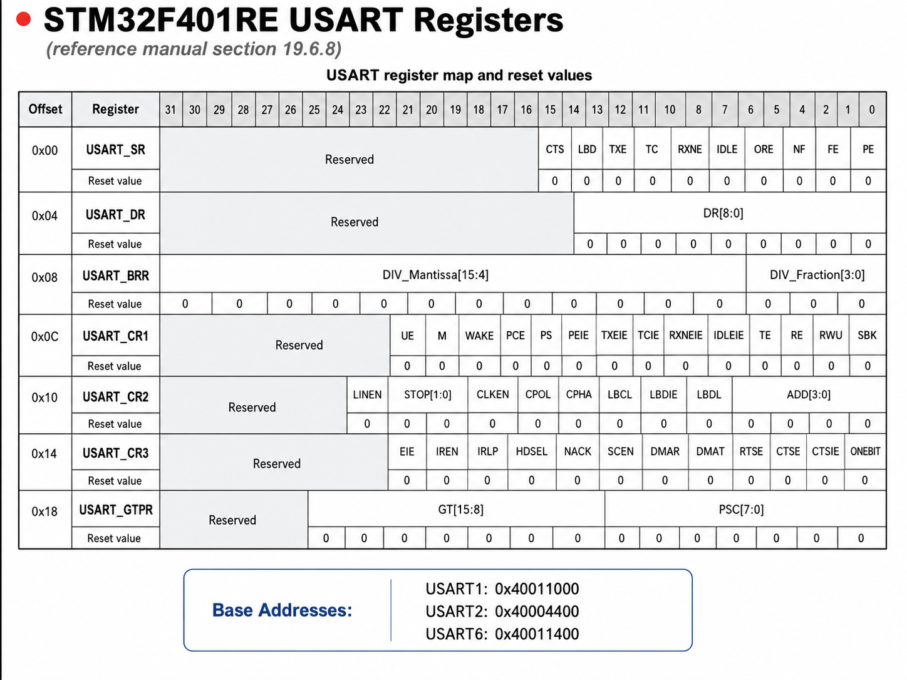
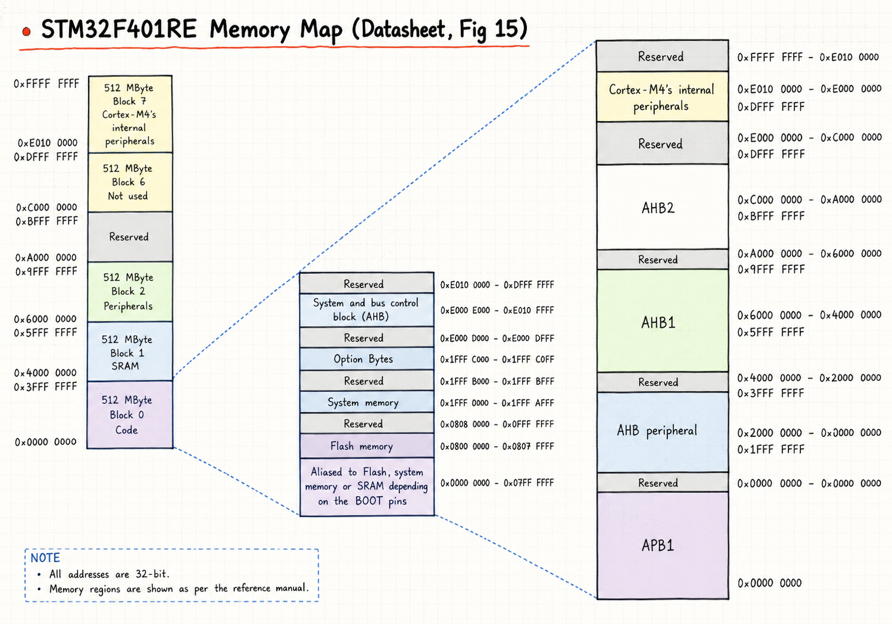
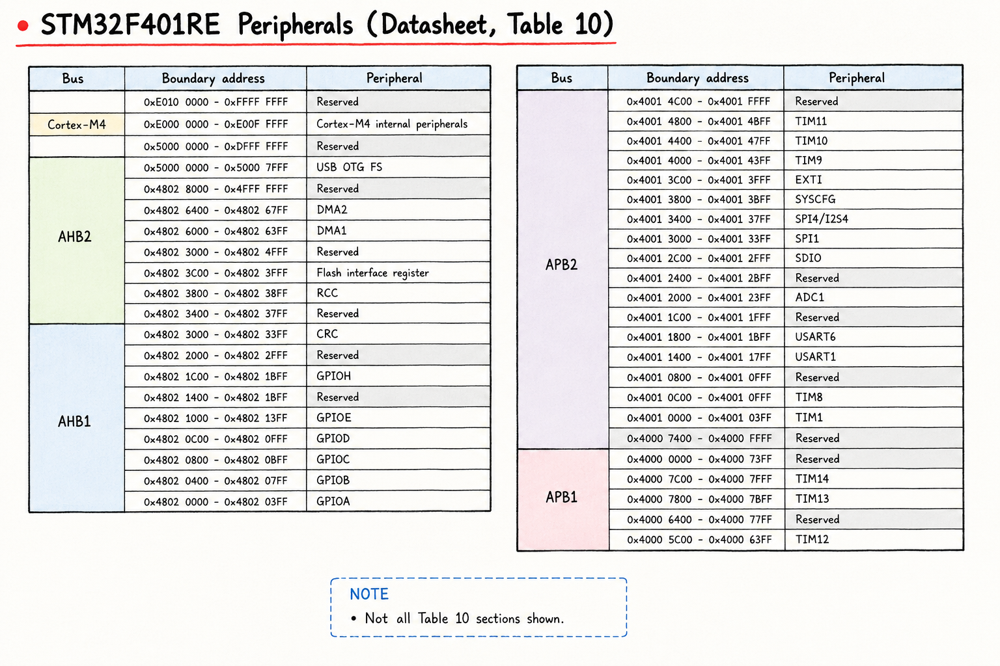

# Lesson 8 — MCU Memory Map & Memory Mapped I/O

**주제:** MCU 메모리 맵 구조와 Memory Mapped I/O 개념. 주변장치 레지스터가 어떻게 메모리 주소로 매핑되어 제어되는지.
**원본 강의:** [Lesson 8. The MCU Memory Map and Memory Mapped I/O (YouTube)](https://www.youtube.com/watch?v=bWMsBXNAOAE)

---

## 1. 메모리 vs I/O — 두 가지 시나리오

컴퓨터 안에서 데이터를 읽고 쓸 때 시나리오는 크게 둘로 나뉜다.

**시나리오 1 — 메모리 (데이터 저장용):**
- 프로그램 실행 중 Flash에서 명령어를 읽거나, RAM에 변수 값을 썼다가 나중에 다시 읽는다.
- 핵심: **이전에 저장한 값을 그대로 다시 가져온다.**

**시나리오 2 — I/O (물리적 동작):**
- LED를 켜고 끄거나, UART로 시리얼 라인에 데이터를 보내고 받는다.
- 핵심: **값을 저장하는 게 아니라 무언가 물리적인 동작을 일으키거나 외부 상태를 읽는다.**
- I/O를 *write*한다는 건 값을 기억시키려는 게 아니라 "동작을 시키는 것"이고, *read*한다는 건 "외부 상태(예: 버튼이 눌렸는지)를 가져오는 것"이다.
- 어떤 I/O는 한쪽만 의미가 있다 — 키보드에 값을 *write*하는 건 말이 안 된다.

---

## 2. 주변장치를 주소 공간에 어떻게 배치할 것인가 — 두 접근법

여기서 제일 중요한 점:

> **개발자가 실행 중에 I/O 주소를 마음대로 정하는 게 아니다.**
> MCU를 설계한 회사가 이미 "GPIO는 이 주소부터", "USART는 이 주소부터"라고 하드웨어에 박아두고, 개발자는 데이터시트/레퍼런스 매뉴얼에서 그 주소표를 보고 쓴다.

여기서 "하드웨어에 박아둔다"는 말은 **MCU 칩 안의 배선/회로가 특정 주소 범위로 온 요청을 특정 장치로 보내도록 고정되어 있다**는 뜻이다.


예를 들어 MCU 내부가 다음처럼 설계되어 있다고 생각하면 된다.

| 주소 범위 | 연결 대상 |
| --- | --- |
| `0x2000 0000` ~ `0x2000 FFFF` | SRAM |
| `0x4002 0000` ~ `0x4002 03FF` | GPIOA |
| `0x4000 4400` ~ `0x4000 47FF` | USART2 |

그러면 CPU가 주소를 내보낼 때마다 내부 회로가 주소 범위를 보고 요청을 나눠 보낸다.

여기서 **주소 디코더(address decoder)** 는 CPU가 내보낸 주소를 보고 "이 요청을 SRAM으로 보낼지, GPIOA로 보낼지, USART2로 보낼지" 결정하는 MCU 내부 하드웨어 회로다. C 코드에서 `address_decoder()` 같은 함수를 호출하는 게 아니라, CPU가 주소와 read/write 요청을 내보내면 칩 내부 회로가 자동으로 주소 범위를 해석해서 알맞은 장치로 연결한다.

```text
CPU: 0x2000 0000에 써라
주소 디코더: 이건 SRAM 범위
결과: SRAM에 값 저장

CPU: 0x4002 0000에 써라
주소 디코더: 이건 GPIOA 범위
결과: GPIOA 레지스터에 값 전달

CPU: 0x4000 4400에 써라
주소 디코더: 이건 USART2 범위
결과: USART2 레지스터에 값 전달
```

코드에서 다음처럼 쓰는 것은 주소를 새로 정하는 게 아니다.

```c
#define GPIOA_BASE  0x40020000U
#define USART2_BASE 0x40004400U
```

이건 "데이터시트에 보니 GPIOA는 `0x4002 0000`, USART2는 `0x4000 4400`부터 시작하므로, 코드에서 그 주소에 이름을 붙이자"는 뜻이다.

건물 주소로 비유하면, 지도에 "병원 = 서울시 200번지"라고 적는다고 병원의 위치가 새로 정해지는 게 아니다. 이미 정해진 위치를 이름으로 기록하는 것뿐이다. MCU에서도 `0x4002 0000 = GPIOA`라는 연결은 칩 내부 회로에 이미 정해져 있고, 개발자는 그 표를 보고 사용하는 것이다.

즉, 원래 표현인 "I/O 주소를 어떻게 지정할 것인가"는 초보자가 보기에는 "내가 코딩할 때 주소를 어떻게 정하지?"처럼 들릴 수 있지만, 실제 의미는 **주변장치를 전체 주소 공간의 어디에 배치할 것인가**에 가깝다.

- **하드웨어 설계자 관점:** 주변장치를 주소 공간의 어디에 배치할 것인가?
- **펌웨어 개발자 관점:** 제조사가 정해둔 주소표를 보고 어느 주소에 read/write할 것인가?

여기서 "주소를 지정한다"는 말은 **CPU가 어떤 주변장치를 어떤 번호의 주소로 부르게 만들 것인가**, 더 쉽게 말하면 **주소 공간 안에 주변장치의 자리를 배정한다**는 뜻이다.

CPU 입장에서는 RAM도, Flash도, GPIO도, UART도 전부 "어떤 주소에 read/write한다"는 형태로 접근할 수 있다. 문제는 특정 주소에 접근했을 때 그 요청을 누가 받아야 하느냐이다.

여기서 오해하면 안 되는 점은, **CPU가 주변장치를 직접 "인식"하는 게 아니라는 것**이다.

CPU는 단순히 다음과 같은 요청만 내보낸다.

```text
주소 A에서 값을 읽어라
주소 B에 값을 써라
```

그 주소가 RAM인지, Flash인지, GPIO인지, UART인지는 CPU 혼자 판단하지 않는다. MCU 내부의 **버스(bus)** 와 **주소 디코더(address decoder)** 가 주소 범위를 보고 요청을 실제 대상으로 연결한다.

즉, 주변장치를 주소 공간에 배치한다는 것은 단순히 "주소 숫자 하나를 고른다"가 아니라, **주소 공간 안의 어느 구간을 실제 메모리에 연결하고, 어느 구간을 주변장치 레지스터에 연결할지 정하는 하드웨어 설계 문제**다.

즉, CPU가 주변장치를 특별한 장치로 알아보는 것이 아니다. **하드웨어가 특정 주소 범위를 특정 장치에 연결해 두었기 때문에**, CPU 입장에서는 주변장치도 그냥 주소로 접근하는 것처럼 보인다.

이 둘을 어떻게 다룰지에 대한 설계 철학이 갈린다.

### 접근법 1: 메모리와 I/O를 완전히 분리

- 메모리 주소 공간과 I/O 주소 공간이 **별도**로 존재한다 (서로 다른 address space).
- 따라서 I/O 전용 어셈블리 명령어가 따로 필요하다 (예: `IN`, `OUT`).
- **예시:** 강사가 커리어 초기에 썼던 **Intel 8085**, 그리고 오늘날의 **x86 CPU**도 여전히 이 방식을 지원한다.

이 방식에서는 같은 숫자 주소라도 "메모리 주소 `0x10`"과 "I/O 포트 주소 `0x10`"이 서로 다른 대상을 가리킬 수 있다. CPU가 어떤 명령어를 썼는지에 따라 접근 대상이 갈린다.

```text
LOAD 0x10   -> 메모리 주소 0x10에서 읽기
IN   0x10   -> I/O 포트 주소 0x10에서 읽기
```

### 접근법 2: Memory Mapped I/O (MMIO)

- 메모리와 I/O를 **똑같이 취급**한다. 둘 다 "데이터 읽기/쓰기 + 주소 지정"이라는 점에서 비슷하니, I/O도 메모리 주소를 갖게 한다.
- 주소 `X`는 실제 RAM, 주소 `Y`는 LED 제어용 — 이런 식으로 동일한 주소 공간 안에 섞어 배치한다.
- 강사 표현: **"powerful abstraction"** — 메모리와 I/O의 세계를 통일해 소프트웨어 설계를 단순하게 만든다.

이 방식에서는 별도의 I/O 명령어가 필요 없다. CPU는 일반 메모리를 다루듯이 `load/store` 명령어로 주소에 접근한다.

```text
STORE 0x2000 0000, 123   -> SRAM의 변수 위치에 123 저장
STORE 0x4002 0014, 1     -> GPIO 출력 레지스터에 1을 써서 핀 상태 변경
```

중요한 점은 `0x4002 0014`에 RAM 셀이 있는 게 아니라는 것이다. 그 주소는 GPIO 하드웨어 내부의 특정 register로 연결되어 있고, 그 주소에 값을 쓰면 하드웨어 회로가 반응한다.

그래서 "주변장치를 주소 공간에 배치한다"는 말은 결국 다음 질문에 답하는 것이다.

- GPIO Port A는 몇 번지부터 시작하게 할 것인가?
- USART2는 몇 번지부터 시작하게 할 것인가?
- 각 peripheral 내부의 status register, data register, control register는 base address에서 몇 바이트 떨어진 곳에 둘 것인가?
- 이 주소 구간을 RAM/Flash와 겹치지 않게 어떻게 배치할 것인가?

> **주의**
> Separate I/O address space를 지원하는 시스템에서도 MMIO를 동시에 쓸 수 있다. 강사가 언급한 **8085 시스템도 실제로는 MMIO를 사용했다.** 둘은 양자택일이 아니다.

---

## 3. Memory Mapped I/O와 "Register" 용어

MMIO를 쓰면 용어가 살짝 혼란스러워진다.
- I/O 장치가 "메모리 주소"를 갖고 "메모리 맵" 안에 들어있다고 말하지만, 실제로는 RAM이 아니다.
- 그것은 타이머·UART 같은 **하드웨어**일 뿐, 단지 프로그래머가 접근하기 편하도록 메모리 주소라는 껍데기를 씌운 것이다.
- 강사 표현: **"but it's okay we know what we mean and we get used to it."**

이 혼란을 줄이려고 I/O 쪽에 **Register**라는 용어를 따로 쓴다.
- 예: UART는 여러 개의 register를 가진다.
- 한 register에 *write*해서 보레이트를 설정하고, 다른 register를 *read*해서 시리얼로 수신된 데이터를 가져온다.

---

## 4. Peripheral 레지스터 구조 — Base Address + Offset

MCU 내부에서 peripheral(타이머·UART 등)이 어떻게 생겼는지.



**구조:**
- Peripheral마다 시작점인 **Base Address**가 정해져 있다.
- 그 안의 각 register는 base에서 일정한 **Offset**만큼 떨어진 곳에 위치한다.
- 특정 register 주소 = `Base Address + Offset`.

**왜 offset이 4의 배수인가:**
- 모든 register가 **32비트 = 4바이트**라고 가정한다.
- 그래서 register 사이 offset이 4바이트씩 증가한다 → `0, 4, 8, 12, ...` 모두 4의 배수.

**왜 C 배열/구조체와 매칭되는가:**
- 강사 표현: **"if you know the c language well you might notice that the set of registers looks like an array or maybe you think of it as a data structure — and you would be right."**
- 그래서 실제 코딩에서 register 묶음을 C **배열** 또는 **구조체**로 모델링한다.
- 다음 강의들에서 더 다룰 예정.

---

## 5. 구체 예시 — USART 레지스터 맵



이 그림은 MCU reference manual에서 가져온 것이고, 이걸 **register map**이라 부른다 — 메모리 맵의 미니 버전이라고 생각하면 된다.

**핵심 관찰:**
- 비트 번호 0 → 31까지 표시 → **32비트 레지스터**임을 의미.
- 32비트 = 4바이트라서 offset 컬럼이 모두 4의 배수.
- 회색 처리된 비트들은 사용하지 않음 (reserved).

**대표 레지스터 두 개:**

### USART_SR (Status Register)
- 약자 SR = Status Register.
- USART 내부에서 지금 무슨 일이 벌어지는지 알려준다 (10비트 사용).
- 비트들이 가리키는 정보:
  - 시리얼 라인에서 수신된 바이트가 읽을 준비 됐는지
  - 전송용 라인에 바이트 쓸 공간이 있는지
  - USART가 어떤 에러를 감지했는지

### USART_DR (Data Register)
- **읽으면:** USART receive 라인에 들어온 문자를 가져온다.
- **쓰면:** USART transmit 라인으로 데이터를 내보낸다.
- "수신 데이터가 있는지", "송신 준비가 됐는지"는 SR로 확인하고 DR을 만진다.

나머지 register들은 USART 설정용 — 보레이트, 문자당 비트 수 등.

### Base Address — MCU에 USART 여러 개

이 register들을 코드로 다루려면 한 가지 더 필요하다: **각 USART의 Base Address**.
- MCU에 USART가 여러 개라서 각각의 base가 다르다.
- 보통 MCU **data sheet** 또는 **reference manual**에서 찾을 수 있다 (강사 표현으로는 이 MCU의 경우 양쪽 다 있음).

> **주의**
> 이 MCU의 USART 번호가 **1, 2, 6**으로 좀 이상하다.
> 강사 표현: **"the numbering of these usarts is sort of odd — one, two, and six."** 같은 family의 다른 MCU들까지 보면 말이 될 수도 있지만, 어쨌든 이 MCU에는 그 세 개가 있다.

---

## 6. STM32 전체 메모리 맵 (4GB)



강사 표현: **"this diagram which comes from the data sheet is a little intimidating so we'll take it a piece at a time."** 압도되지 말고 조각으로 나눠 본다.

### 주소 공간 크기

- MCU는 **32비트 주소**를 쓴다.
- 따라서 메모리 맵 전체 크기 = `2^32` 바이트 = **4 GB**.
- 16진수로 최대 주소 = `0xFFFFFFFF` ("eight Fs").
- 메모리 맵은 `0x00000000`에서 시작해 `0xFFFFFFFF`까지.

### 주요 영역 (두 번째 컬럼 — 확대 부분)

| 영역 | 시작 주소 | 설명 |
| --- | --- | --- |
| **Flash** | `0x0800 0000` | 프로그램 코드 |
| **System Memory** | `0x1FFF F000` | MCU 제조사가 구워놓은 built-in software. 예: 시리얼 링크로 Flash를 프로그래밍할 수 있게 해주는 부트로더. (강사가 써본 SoC 중 절반 정도가 이런 built-in software를 가지고 있었다고 함. 이 강의에서는 다루지 않음.) |
| **SRAM** | `0x2000 0000` | 실행 중 변수 등이 들어가는 실제 메모리 |
| **Peripheral Registers** | `0x4000 0000` 영역 | MMIO 대상인 주변장치 레지스터 (3번째 컬럼 큰 흰색 블록들) |

---

## 7. Reset Vector & 인터럽트 벡터 테이블

메모리 맵에서 가장 특별한 영역.

### Vector라는 용어
- **vector = "어떤 코드의 주소"의 fancy한 이름.** 그 코드를 가리키는 포인터라고 보면 된다.

### Reset Vector
- **MCU가 전원 켜진 직후 가장 먼저 실행할 코드의 주소**를 담는 메모리 위치.
- 이 MCU의 경우 Reset Vector는 **주소 `0x00000004`**에 저장된다 (메모리 맵 거의 바닥).

### Interrupt Vector Table
- Reset Vector 바로 다음에 위치.
- **모든 인터럽트 종류마다 그 인터럽트를 처리할 코드(핸들러)의 주소가 들어있다.**
- 인터럽트가 발생하면 MCU는 해당 슬롯의 주소를 가져와 그 핸들러로 점프한다.

### 주소 `0x0`에 Flash가 보이는 이유 — Aliasing

- 이 MCU에는 "주소 0에 어떤 메모리를 보이게 할지" 결정하는 **advanced feature**가 있다 (강의에서는 다루지 않음).
- **이 강의에서는 단순히 Flash가 주소 0에 나타난다고 가정**한다.
- 그래서 Flash가 두 주소에서 동시에 보인다:
  - `0x00000000` (Reset Vector가 여기 있어서 부팅 시 접근)
  - `0x08000000` (Flash의 "원래" 주소)
- 강사 표현: **"don't worry — this is an easy thing to do in hardware design. The same flash memory is accessed regardless of which address range you are using."** 즉 *같은* Flash가 두 주소 범위 모두에서 동일하게 접근된다 (하드웨어가 alias를 만들어줌).

---

## 8. Peripheral 주소 상세와 Hard Fault 주의



### GPIO Port A 예시
- 시작 주소 `0x4002 0000`.
- 들어있는 register 종류:
  - **핀 매핑용:** 각 핀이 무엇에 연결될지 설정 (alternate function 등)
  - **전기적 설정용:** pull-up / pull-down 저항 삽입 여부
  - **읽기/쓰기용:** 실제 GPIO로 쓸 핀의 값을 0/1로 읽거나 쓰기

**GPIO(General Purpose Input/Output)** 는 한국어로 **범용 입출력**이다. MCU의 핀을 일반적인 디지털 입력/출력 핀으로 쓰게 해주는 가장 기본적인 주변장치다.

GPIO가 하는 일은 크게 세 가지다.

- 핀을 **입력(input)** 으로 쓸지 **출력(output)** 으로 쓸지 정한다.
- 출력 핀에 `0` 또는 `1`을 내보낸다.
- 입력 핀의 현재 상태가 `0`인지 `1`인지 읽는다.

예를 들어 LED와 버튼을 GPIO로 다루면 다음처럼 생각할 수 있다.

```text
출력:
MCU가 핀에 1을 출력 -> LED 켜짐
MCU가 핀에 0을 출력 -> LED 꺼짐

입력:
버튼이 눌림     -> 핀 값이 1
버튼이 안 눌림 -> 핀 값이 0
```

여기서 **핀(pin)** 은 MCU 칩 바깥으로 나와 있는 **금속 연결 다리**를 말한다. MCU 내부의 GPIO, USART, SPI, ADC 같은 회로가 외부 LED, 버튼, 센서, 모터 드라이버와 전기적으로 연결되려면 칩 바깥으로 신호가 나가야 하는데, 그 통로가 핀이다.

```text
MCU 내부 회로
  GPIO / USART / SPI / ADC
        |
        v
  칩 바깥 금속 다리 = 핀
        |
        v
  LED, 버튼, 센서, 모터 드라이버 등
```

예를 들어 보드에서 LED가 `PA5` 핀에 연결되어 있다면, MCU 내부에서 `PA5`를 GPIO 출력으로 설정하고 값을 `1`로 쓰면 LED가 켜질 수 있다.

```text
MCU 핀 PA5 ---- LED
```

**핀 매핑**은 이 물리적인 핀을 MCU 내부의 어떤 기능에 연결할지 정하는 설정이다. 같은 핀 하나가 상황에 따라 여러 기능을 할 수 있다.

```text
PA2를 GPIO로 사용      -> LED 켜기/끄기, 버튼 입력 읽기
PA2를 USART2_TX로 사용 -> 시리얼 데이터 송신
PA2를 TIM2_CH3로 사용  -> 타이머 PWM 출력
```

즉 핀은 **외부 부품과 MCU 내부 회로를 연결하는 물리적 접점**이고, 핀 매핑은 **그 핀을 GPIO로 쓸지, USART로 쓸지, 타이머로 쓸지 고르는 설정**이다.

이어서 DMA, 타이머, SPI 버스, ADC, USART들이 차례로 배치된다.

### 주소 공간이 헤프게 할당되는 이유

USART 예시로 직접 계산:
- USART register는 **7개**, 각 **4바이트** → 실제 사용 = **28 바이트**.
- 그런데 이 표에서는 USART 하나당 **1024 바이트**가 할당돼 있다.
- 즉 1024 − 28 = **996 바이트가 사용되지 않음**.

**왜 이렇게 헤프게?**
- 강사 표현: **"there's plenty of address space — 4 gigabytes — and it is easier in hardware design to allocate larger blocks to peripherals."**
- 4GB 주소 공간이 워낙 넉넉하니, 하드웨어 설계 편의상 큰 블록을 통째로 잘라 주는 게 낫다.

### 할당되지 않은 주소를 건드리면? → Hard Fault

> **예외**
> 헤프게 할당된 영역 안에서 **실제 register가 없는 주소(unassigned address)에 접근하면 위험**하다.
> - 유효한 값을 얻지 못할 뿐 아니라,
> - **Hard Fault Interrupt가 발생해서 시스템이 뻗을 수 있다.**
> - 강사 마지막 경고: **"so be careful."**

---

## 참고 자료

- [Lesson 8. The MCU Memory Map and Memory Mapped I/O (YouTube)](https://www.youtube.com/watch?v=bWMsBXNAOAE)
- STM32F4 Reference Manual (RM0090) — Memory map 챕터, USART 챕터
- STM32F4 데이터시트 — Memory map 및 register boundary addresses 테이블
- Wikipedia — *Address space* (강사가 사전 지식 부족할 경우 추천)

---

## 면접 답변 (30초 분량)

> `/easy-quiz` 실행 시 이 섹션이 정답 카드로 사용됩니다.

- **한 줄 정의:** Memory Mapped I/O는 **주변장치 레지스터를 일반 메모리 주소처럼 매핑**해서, 메모리 접근 명령(load/store)만으로 I/O를 제어하는 방식이다.
- **왜 필요:** 메모리와 I/O를 통일된 주소 공간으로 다루면 전용 I/O 명령어(`IN`/`OUT`)를 따로 익힐 필요 없이 C 포인터·구조체로 직관적으로 하드웨어를 제어할 수 있다. 소프트웨어 설계가 단순해지는 "강력한 추상화"다.
- **동작:** STM32 같은 32비트 MCU는 `2^32` = 4GB 주소 공간을 Flash(`0x0800 0000`), SRAM(`0x2000 0000`), Peripheral(`0x4000 0000` 영역)으로 분할한다. Peripheral은 Base Address + 4의 배수 Offset으로 register를 가리키고, 이 구조가 C 구조체와 일대일로 매칭되어 포인터 캐스팅만으로 다룰 수 있다. Reset Vector는 주소 `0x0000 0004`에, 인터럽트 벡터 테이블은 그 뒤에 위치한다.
- **비교:** Intel 8085·x86이 지원하는 **separate I/O address space** 방식은 메모리와 I/O 주소가 완전히 분리돼 전용 명령어가 필요하다. 단, 그런 시스템에서도 MMIO를 함께 쓸 수 있다 — 양자택일이 아니다.
- **30초 통합 답변:**
  > Memory Mapped I/O는 주변장치 레지스터를 메모리 주소처럼 매핑해서 메모리 접근 명령만으로 I/O를 제어하는 방식입니다. STM32 같은 32비트 MCU는 4GB 주소 공간을 Flash, SRAM, Peripheral 영역으로 나누고, 주변장치는 Base Address에 4바이트 단위 Offset을 더해 레지스터에 접근합니다. 이 구조가 C 구조체와 정확히 매칭되어 포인터 캐스팅으로 직접 제어할 수 있고, 결과적으로 x86처럼 별도 I/O 명령어 없이 직관적인 코딩이 가능합니다. 다만 데이터시트상 한 주변장치에 1024바이트가 할당되어도 실제 사용은 28바이트뿐인 경우가 많고, 비어있는 주소를 건드리면 Hard Fault가 발생할 수 있어 주의해야 합니다.
