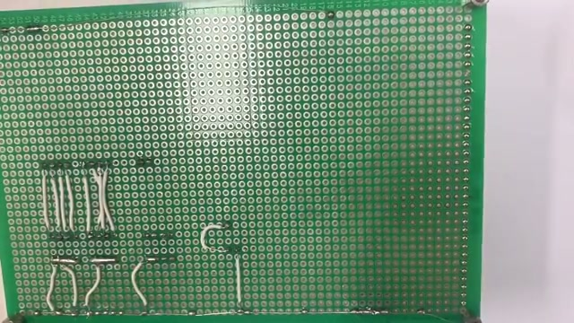
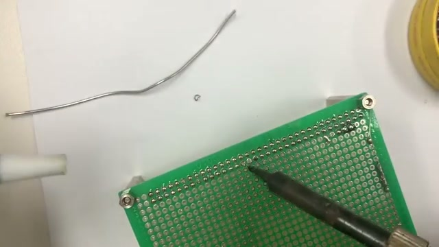
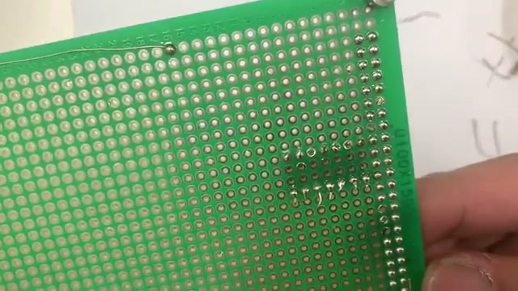

# 납땜 기본 방법과 연습법

**원본 강의:** [납땜 하는 방법 & 납땜 연습법 (YouTube)](https://www.youtube.com/watch?v=TAKn4N3bdKI)

이 강의는 `Universal PCB`(만능기판)의 빈 `Pad`에 `Solder`를 맺히는 연습부터 시작해, 저항을 실장하고 잘못된 `Solder Joint`를 수정하는 과정까지 보여 준다. 핵심은 **열을 먼저 작업부에 전달한 다음 Solder를 공급하고, 마무리할 때는 Solder Wire를 Iron보다 먼저 떼는 것**이다.

---

## 1. 연습 전 준비물과 안전

영상에서 사용한 기본 도구는 다음과 같다.

| 도구 | 용도 |
| --- | --- |
| 온도 조절식 `Soldering Iron` | `Pad`와 부품 `Lead`에 열을 전달한다. |
| `Solder Wire`(실납) | 녹아서 `Pad`와 `Lead`를 전기적·기계적으로 연결한다. |
| `Flux` | 작업부에 Solder가 잘 퍼지고 붙도록 돕는다. |
| `Tip Cleaner` | Iron Tip의 Solder와 오염물을 제거한다. |
| `Wire Stripper`, Nipper | 전선의 피복을 벗기거나 선과 부품 Lead를 자른다. |
| `Solder Sucker` | 녹인 Solder를 흡입해 오류를 수정한다. |
| `Universal PCB` | 빈 Pad 연습과 Through-hole 부품 실장에 사용한다. |

강의자는 온도 조절식 Iron을 약 `380~400 °C`에 맞추어 실습한다. 다만 이 값은 강의자의 장비와 작업 환경에서 사용한 설정이며, 모든 Iron과 Solder에 그대로 적용하는 절대값은 아니다.

> **주의**
> 강의에서 사용한 Iron은 접촉하는 순간 화상을 입을 수 있는 온도다. Iron은 반드시 Stand에 거치하고, 작업 중 Tip과 방금 가열한 부품을 만지지 않는다. 환기를 확보하고 절단한 Lead가 튀지 않도록 보안경을 사용한다.

---

## 2. 워크스페이스 세팅과 Tip 관리

강의자는 기판 밑에 A4 용지를 깔아 떨어진 Solder 조각과 잔여물을 쉽게 정리한다. 작업대에는 Iron, Stand, Solder Wire, Flux, Tip Cleaner를 손이 지나가는 동선과 겹치지 않게 배치한다.

작업 전·중에는 Tip을 Cleaner에 가볍게 닦아 표면을 정리한다. Tip에는 특수 Coating이 있으므로, 힘으로 박박 문질러 깎아내지 않고 **묻은 Solder가 떨어질 정도로만** 정리한다.

---

## 3. 빈 Pad로 Solder의 감각 익히기

처음부터 저항과 같은 부품을 꽂기보다는, 빈 `Universal PCB` 한 줄의 Pad마다 Solder를 맺히며 열과 Solder의 반응을 익힌다.

*빈 Pad마다 Solder를 반복해 맺히면 양과 가열 시간에 따른 모양 차이를 비교할 수 있다. 출처: 원본 강의 06:48.*

기본 순서는 다음과 같다.

1. 필요하면 Pad에 Flux를 소량 바른다.
2. Iron Tip을 Pad에 대어 **Pad를 먼저 가열**한다.
3. 데워진 Pad에 Solder Wire를 살짝 대어 Solder가 흐르고 맺히게 한다.
4. 적절한 양이 공급되면 **Solder Wire를 먼저 떼고**, 그 다음 Iron을 떼어 낸다.
5. Joint가 굳는 동안 기판을 움직이지 않고 모양을 관찰한다.

> Solder를 Iron Tip 위에 먼저 녹여 떨어뜨리는 것이 아니라, Pad 자체를 데운 뒤 Solder가 작업부에서 흐르게 한다.

---

## 4. Solder를 먼저 떼어야 하는 이유

Joint를 마무리할 때 Iron을 먼저 떼면, 남아 있던 Solder Wire가 Joint에 붙은 채 급격히 굳을 수 있다. 그러면 Wire를 당길 때 Joint가 부자연스럽게 늘어나거나 모양이 망가질 수 있다.

따라서 마무리 순서는 다음처럼 외운다.

> **가열 → Solder 공급 → Solder Wire 제거 → Iron 제거**

연습의 목표는 각 Pad에 비슷한 크기의 Solder가 안정적으로 맺히게 하는 것이다. 일정한 결과가 나오지 않는다면 Solder의 양, Pad 가열 시간, 도구를 떼는 순서를 하나씩 조정한다.

---

## 5. 잘못된 Solder Joint의 징후

강의에서는 연습 중 다음과 같은 오류를 확인한다.

- **Solder Bridge:** Solder가 옆 Pad까지 넘어가 두 접점을 연결한 상태다. 원하지 않는 경로를 만들어 `Short`를 일으킬 수 있다.
- **과다한 Solder:** Joint가 필요 이상으로 커지고 인접 Pad와 붙을 위험이 높아진다.
- **뾰족한 모양:** Solder Wire나 Iron을 떼는 순서와 속도가 어긋나면 Joint가 끝까지 늘어나 뾰족해질 수 있다.
- **검게 남는 잔여물:** 너무 오래 가열하면 작업부 주변에 탄 자국이나 잔여물이 남을 수 있다.
- **잘 붙지 않은 Joint:** 납이 빈 Pad를 메우지 못했거나 부품 Lead와 충분히 연결되지 않았다면, 작업부를 다시 가열한 뒤 필요한 Solder를 소량 추가한다.

> **주의**
> 동그란 모양만으로 양호한 Joint라고 단정할 수는 없다. 실제 부품을 실장할 때는 Solder가 Pad와 Lead 모두에 흐르고, 인접 Pad와 연결되지 않았으며, 부품이 기계적으로 고정되었는지를 함께 확인한다.

---

## 6. Solder Sucker로 오류 수정하기

*Solder를 액체 상태로 만든 뒤 Solder Sucker의 Nozzle을 가깝게 대고 흡입한다. 출처: 원본 강의 10:45.*

Solder Bridge를 제거하거나 Pad 구멍을 다시 열어야 할 때는 다음과 같이 작업한다.

1. Solder Sucker의 Plunger를 눌러 미리 장전한다.
2. Iron으로 제거할 Solder를 다시 녹인다.
3. Solder가 액체로 흐를 때 Sucker의 Nozzle을 작업부에 가깝게 대고 Button을 누른다.
4. 한 번에 다 제거되지 않으면 다시 장전하고 반복한다.
5. Pad 구멍이 다시 드러났는지, 인접 Pad의 Joint가 손상되지 않았는지 확인한다.

> **주의**
> Solder가 완전히 녹지 않은 상태에서 Sucker를 억지로 당기거나 부품을 움직이면 Pad와 Trace가 손상될 수 있다.

---

## 7. 저항을 Through-hole에 실장하기

빈 Pad 연습으로 Solder가 맺히는 감을 익혔다면 저항과 같은 Through-hole 부품을 실장한다.

1. 저항의 Lead를 실장 간격에 맞게 굽힌다.
2. 기판의 부품 면에서 Lead를 Through-hole에 넣고, 저항이 기판에 가깝게 붙도록 누른다.
3. 기판을 뒤집은 뒤 두 Lead를 각기 반대 방향으로 살짝 벌려 부품이 빠지지 않게 임시 고정한다.
4. Iron Tip이 Pad와 Lead에 동시에 닿도록 대어 두 부분을 함께 데운다.
5. 데워진 접합부에 Solder를 공급하고, Solder Wire와 Iron 순으로 떼어 낸다.
6. Joint가 굳은 뒤 다른 Lead도 같은 방법으로 작업한다.
7. 실장이 끝나면 남은 Lead를 Nipper로 짧게 절단한다.

*저항을 고정한 Joint과 절단한 Lead의 모습. 출처: 원본 강의 15:14.*

> **주의**
> 부품을 꽂은 상태에서는 Pad만 데우면 안 된다. Pad와 Lead 모두에 열을 전달해야 Solder가 두 표면에 함께 흐르며 안정적인 Joint가 만들어진다.

---

## 8. 초보자용 연습 루틴

한 번의 실습에서 모든 기술을 성공시키려 하기보다 다음처럼 난이도를 높인다.

1. **빈 Pad 한 줄 채우기:** Pad 가열과 Solder 공급의 순서를 익힌다.
2. **크기 균일화:** Joint마다 Solder의 양과 모양이 비슷하게 나오도록 반복한다.
3. **오류 의도적으로 수정하기:** 과다한 Solder를 Solder Sucker로 제거하고 Pad 구멍을 다시 열어 본다.
4. **싼 Through-hole 부품 실장:** 저항의 Lead를 고정하고 인접한 Pad에서 연속으로 작업한다.
5. **마무리 검사:** 누락된 Joint, Solder Bridge, 잘 붙지 않은 부위를 찾고 재작업한다.
6. **물리적 확인:** 부품이 흔들리거나 떨어지지 않는지 부드럽게 확인한다.

빈 Pad 연습은 완성품을 만드는 작업은 아니지만, Solder가 열에 의해 어떻게 흐르고 굳는지를 손으로 익히는 가장 싼 연습법이다. 이 감각을 먼저 익히면 실제 부품 실장에서 Solder의 양과 작업 시간을 조절하기 쉬워진다.

---

## 참고 자료

- [납땜 하는 방법 & 납땜 연습법 (YouTube)](https://www.youtube.com/watch?v=TAKn4N3bdKI)
- [납땜 입문 1편 — 준비 도구와 만능기판](./납땜강좌/1_납땜_준비도구와_만능기판.md)
- [Pin Header 납땜의 필요성과 자르기 방법](./02_핀헤더_납땜의_필요성과_방법.md)
- [Solder Joint과 접촉 저항](./03_납땜_관절과_접촉저항.md)

---

## 면접 답변 (30초 분량)

> `/easy-quiz` 실행 시 이 섹션이 정답 카드로 사용됩니다.

- **한 줄 정의:** Through-hole 납땜은 Pad와 부품 Lead를 함께 가열한 뒤 Solder를 흘려 전기적·기계적 Joint를 만드는 작업이다.
- **왜 필요:** Pad와 Lead를 함께 데우고 적절한 순서로 도구를 떼어야 Solder가 두 표면에 안정적으로 흐르고 부품이 단단히 고정된다.
- **동작:** 작업부를 먼저 가열하고 Solder를 공급한 뒤, Solder Wire를 Iron보다 먼저 떼어 Joint를 마무리한다. Solder Bridge나 과다한 Solder는 다시 녹여 Solder Sucker로 제거한다.
- **비교:** Solder를 Iron Tip에 먼저 녹여 옮기는 방법과 달리, Pad와 Lead를 먼저 데우면 Solder가 작업부 양쪽에 흐르도록 할 수 있다.
- **30초 통합 답변:**
  > Through-hole 납땜은 Pad와 부품 Lead를 함께 가열한 뒤 Solder를 흘려 접합하는 작업입니다. 기본 순서는 작업부 가열, Solder 공급, Solder Wire 제거, Iron 제거입니다. 마무리 후에는 Solder Bridge와 실장 누락을 확인하고, 오류가 있으면 Solder를 다시 녹인 후 Solder Sucker로 제거해 재작업합니다.
