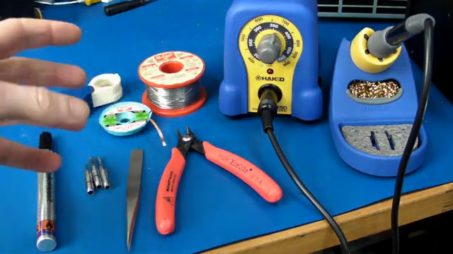
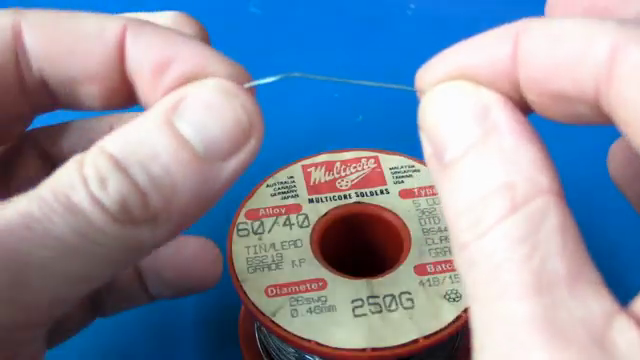
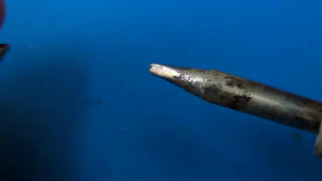
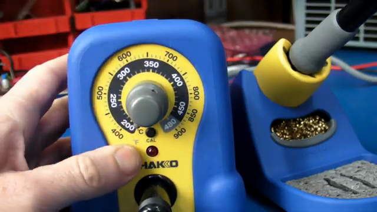

# EEVblog 납땜 강좌 1편 — 도구와 Solder 선택

**원본 강의:** [EEVblog #180 - Soldering Tutorial Part 1 - Tools (YouTube)](https://www.youtube.com/watch?v=J5Sb21qbpEQ)

이 강의는 좋은 Solder Joint를 만들기 위한 도구 선택 기준을 다룬다. 핵심은 장비를 많이 사는 것이 아니라 **온도를 제어하고, 열을 충분히 전달하고, Solder 공급량을 정밀하게 조절할 수 있는 구성**을 갖추는 것이다.

> 좋은 납땜은 오랜 감각 훈련만의 결과가 아니다. 알맞은 도구와 몇 가지 기본 원리를 이해하면 재현 가능한 작업이 된다.

---

## 1. 기본 작업대 구성

*Temperature-controlled Soldering Station, Solder Wire, Solder Wick, Tweezers, Flush Cutter, 여러 Tip의 기본 구성. 출처: 원본 강의 01:02.*

강의에서 권장하는 기본 도구와 용도는 다음과 같다.

| 구분 | 도구 | 선택 기준과 역할 |
| --- | --- | --- |
| 필수 | `Temperature-controlled Soldering Station` | 작업물의 열용량과 Solder 종류에 따라 Tip 온도를 조절한다. |
| 필수 | `Solder Wire` | 가는 직경과 내부 Flux Core를 선택해 공급량과 젖음성을 확보한다. |
| 필수 | `Flush Side Cutter` | 납땜 후 Component Lead를 Joint 가까이에서 평평하게 자른다. |
| 필수 | `Soldering Iron Stand` | 뜨거운 Iron을 안전하게 거치하고 Tip Cleaner를 함께 둔다. |
| 권장 | `Solder Wick` | Joint의 Solder를 흡수해 제거하거나 Rework한다. 폭이 다른 제품을 준비하면 편리하다. |
| 권장 | `Solder Sucker` | 녹인 Solder를 진공으로 빠르게 흡입한다. |
| 권장 | `Flux Pen` 또는 Liquid Flux | Rework와 SMD 작업에서 젖음성과 Solder 흐름을 개선한다. |
| 권장 | 확대 장비 | 작업 중 정렬을 돕고 완료된 Joint의 Bridge와 젖음 상태를 검사한다. |
| SMD 필수 | Fine-tip Tweezers | 작은 Component를 잡고 정렬한다. |
| 선택 | PCB Holder | Board를 고정하거나 각도를 바꾸고 뒤집는 작업을 돕는다. |
| 선택 | Hot-air Rework Station, 두 번째 Iron | 복잡한 SMD Rework나 양쪽을 동시에 가열하는 작업에 사용한다. |

강의는 저가형 고정 온도 Plug-in Iron보다 품질이 검증된 Temperature-controlled Station을 권장한다. 별도 Stand는 작업대에서 위치를 자유롭게 바꿀 수 있고 Wet Sponge와 Metal Tip Cleaner를 함께 사용할 수 있어 편리하다.

> **주의**
> 특정 Brand나 가격은 2011년 촬영 당시의 예시다. 현재 제품을 고를 때는 Brand명보다 온도 회복 성능, 교체 Tip 수급, Stand 안정성, 접지·ESD 요구사항을 확인한다.

---

## 2. 절단·제거·고정 도구의 선택 기준

### Flush Side Cutter

일반 Nipper가 아니라 뒷면이 평평한 `Flush Side Cutter`를 사용하면 Component Lead를 Solder Joint 가까이에서 자를 수 있다. 절단면이 Board 쪽으로 평평하게 접근하는지가 핵심이다.

### Solder Wick과 Solder Sucker

- `Solder Wick`은 가는 구리 편조선이 녹은 Solder를 모세관 작용으로 흡수한다.
- Flux가 포함된 품질 좋은 Wick을 사용하고, 작은 Pad와 큰 Joint에 맞춰 폭을 달리한다.
- `Solder Sucker`는 Through-hole Joint처럼 Solder 양이 많은 곳에서 먼저 큰 덩어리를 제거할 때 유용하다.
- 두 도구는 경쟁 관계가 아니라 작업 상황에 따라 함께 쓰는 보완재다.

### PCB Holder

Alligator Clip 방식부터 Board를 회전·반전할 수 있는 Pan/Tilt 방식까지 다양한 Holder가 있다. 강의자는 Board를 작업대 위에 직접 두는 방식을 선호하지만, 손이 부족하거나 Board를 띄워야 할 때 Holder는 유용하다고 설명한다.

---

## 3. SMD 작업용 시야와 Tweezers

SMD 작업에서는 손기술만큼 **보는 능력**이 중요하다. 확대 장비는 두 가지 용도로 나뉜다.

- `Jeweler's Loupe`: 완성된 Joint를 하나씩 검사하기에는 좋지만 착용한 채 작업하기 어렵다.
- `Illuminated Magnifier`: Board를 비추면서 양손 작업을 할 수 있다.
- `Stereo Microscope`: `0402` Component나 `0.5 mm` Pin Pitch처럼 미세한 작업에 유리하다.

강의가 제시하는 배율 범위는 다음과 같다.

| 작업 | 강의의 권장 배율 |
| --- | --- |
| 일반적인 확대 작업 | 약 `2.5×` 이상 |
| 세밀한 작업 | 약 `4×~6×` |
| 매우 미세한 SMD 작업 | 약 `8×` |
| 강의에서 소개한 고급 Stereo Microscope | `8×~40×` |

Tweezers는 곧은 형태, Non-magnetic Stainless Steel, 충분히 벌어지는 Jaw, 날카롭고 잘 맞물리는 Tip을 우선한다. 한 쌍의 품질 좋은 Straight Tweezers로 대부분의 SMD 배치 작업을 처리할 수 있다는 것이 강의자의 의견이다.

---

## 4. 가장 중요한 선택: 가는 Solder Wire

*강의자가 사용하는 `0.46 mm`, `60/40` Multicore Solder. 출처: 원본 강의 10:37.*

강의가 가장 강하게 강조하는 기준은 **가능한 한 가는 Solder Wire를 사용하는 것**이다. 초보자가 흔히 만드는 오류는 Joint에 Solder를 너무 많이 공급하는 것이다. Wire가 굵으면 짧게 밀어 넣어도 많은 양이 녹지만, 가는 Wire는 공급량을 조금씩 조절할 수 있다.

- 강의자의 주 사용 직경: `0.46 mm`
- 일반 작업 권장: `0.5 mm` 또는 `0.020 inch(20 thou)` 이하
- 큰 Terminal이나 큰 Joint용 보조 Wire: 약 `1 mm`

> Solder Wire의 직경은 Tip 크기와 별개의 변수다. 작은 Component라고 무조건 뾰족한 Tip을 쓰는 것이 아니라, 충분한 열 접촉 면적을 가진 Tip과 공급량을 조절하기 쉬운 가는 Wire를 조합한다.

---

## 5. Solder Alloy: 60/40과 63/37

강의는 입문자가 Lead-free Solder보다 Tin-lead Solder로 먼저 기본기를 익히기를 권한다. Lead-free는 일반적으로 더 높은 작업 온도와 까다로운 젖음 조건을 요구하기 때문이다. 다만 이는 강의자의 교육상 권장이고, 실제 작업에서는 회사 정책·환경 규정·제품 요구사항에 맞는 Alloy를 사용해야 한다.

| 종류 | 조성 | 상태 변화 특성 | 강의의 평가 |
| --- | --- | --- | --- |
| `60/40` | Tin `60%`, Lead `40%` | 액체와 고체 사이에 Plastic Range가 존재한다. | 전통적이고 충분히 사용 가능하다. |
| `63/37` | Tin `63%`, Lead `37%` | Eutectic Alloy로 한 온도에서 액체와 고체 사이를 전환한다. | 새로 구입한다면 더 권장한다. |
| Silver-loaded | Silver를 소량 포함 | Silver가 포함된 Component Termination의 전문 작업에 쓰일 수 있다. | 일반 취미 작업에는 필수가 아니다. |

`60/40`은 냉각 중 Plastic Range를 지나므로 Joint가 굳는 동안 움직이면 품질이 나빠질 수 있다. `63/37`은 Eutectic 조성이라 이 중간 상태가 없고 고체와 액체 사이의 전환이 명확하다.

> **주의**
> Leaded Solder는 작업 후 손을 씻고 음식 섭취 전 오염을 제거해야 한다. Lead-free 사용 의무와 폐기 규정은 국가·조직·제품에 따라 다르므로 강의의 개인 작업 방식만을 규정 판단의 근거로 삼지 않는다.

---

## 6. Flux Core와 추가 Flux

강의는 **Flux가 들어 있는 Multicore Solder Wire**를 선택하라고 강조한다. Flux는 가열 과정에서 산화막을 제거하고 Solder가 Pad와 Lead에 젖어 흐르도록 돕는다.

- `Rosin-based Flux`: 전통적으로 사용되는 Pine Resin 계열 Flux다.
- Water-soluble 계열: 세정성과 잔류물 특성이 다른 대안이다.
- Low-residue Flux: Board에 남는 잔류물과 후속 세정 부담을 줄이도록 설계된다.
- `Flux Pen` 또는 Brush-on Liquid Flux: Solder Wire 내부 Flux만으로 부족한 Rework와 SMD 작업에 추가한다.

Flux 종류마다 세정 필요 여부와 부식성, 전기적 잔류물 특성이 다르다. 실제 제품에서는 Datasheet가 지정한 세정 조건을 따른다.

### Solder Paste

Solder Paste는 미세한 Solder 분말과 Flux의 혼합물이며 고급 SMD 작업에 유용하다. 강의에 따르면 일반 Solder Wire만으로도 대부분의 Hand Soldering이 가능하므로 입문 필수품은 아니다.

- 보관 온도와 유효 기간이 있다.
- 냉장 보관 제품은 사용 전 제조사가 정한 방식으로 실온에 적응시킨다.
- Alloy와 Flux가 함께 들어 있으므로 제품 Datasheet의 보관·교반·사용 조건을 확인한다.

---

## 7. Tip은 뾰족함보다 열 전달 면적이 중요하다

*평평한 접촉면으로 열을 전달하는 Chisel Tip. 출처: 원본 강의 18:43.*

Soldering Station에 기본 제공되는 `Conical Tip`은 끝이 뾰족해 정밀해 보이지만, 접촉 면적이 작아 Component와 Pad에 열을 전달하기 어렵다. 강의는 Through-hole과 일반 SMD 작업에 `Chisel Tip`을 기본으로 권장한다.

| Tip | 특성 | 적합한 상황 |
| --- | --- | --- |
| Fine Conical Tip | 물리적으로 좁은 공간에 들어가기 쉽지만 접촉 면적과 열 전달량이 작다. | 다른 Tip이 들어가지 않는 제한된 위치 |
| Chisel Tip | 평평한 면이 Pad와 Lead에 닿아 열을 효율적으로 전달한다. | Through-hole과 대부분의 SMD 작업 |
| Bent Tip | 장애물을 피해 특정 각도로 접근한다. | 깊거나 접근이 어려운 위치 |
| Well/Hoof Tip | 오목한 부분에 Solder를 머금고 여러 Pin 위를 Drag한다. | Fine-pitch IC의 Drag Soldering |

강의는 일반 용도로 약 `2~2.5 mm` Chisel Tip을 예로 들며, 더 작은 `0.8~1 mm` 제품도 소개한다. 한 개만 고른다면 범용 Chisel Tip을, 여유가 있다면 크기가 다른 Chisel Tip 두 개와 Fine Conical Tip 한 개를 준비한다.

Well/Hoof Tip은 오목한 부분에 Solder를 채운 뒤 IC Pin을 따라 Drag한다. Pad에 필요한 양을 남기고 남는 Solder를 다시 Tip 쪽으로 끌어오는 방식으로 빠른 Fine-pitch 작업을 돕는다.

---

## 8. Tip Cleaner와 Thermal Shock

Stand에는 Wet Sponge와 Metal Wool 방식의 Tip Cleaner가 함께 쓰인다.

- Wet Sponge는 물에 적신 뒤 과도한 물기를 제거하고 사용한다.
- 차가운 Sponge에 뜨거운 Tip을 대면 Tip 온도가 순간적으로 떨어지는 `Thermal Shock`이 발생한다.
- Metal Wool Cleaner는 Tip 온도를 덜 떨어뜨리면서 산화물과 잔류 Solder를 닦는 데 유리하다.
- 어떤 방식을 쓰더라도 Tip을 과도하게 문지르거나 표면 Plating을 긁지 않는다.
- 청소 후에는 Tip 표면에 얇게 Solder를 입히는 `Tinning`으로 산화를 줄인다.

> **주의**
> Tip을 File이나 Sandpaper로 갈면 보호 Plating이 손상될 수 있다. 제조사가 교체형 Bare Copper Tip이라고 명시한 특수한 경우가 아니라면 연마하지 않는다.

---

## 9. Solder 용융점보다 높은 Tip 온도가 필요한 이유

*일반 작업의 기준점으로 제시한 약 `350°C` 설정. 출처: 원본 강의 23:15.*

Tin-lead Solder는 약 `180~190°C` 부근에서 녹지만, Soldering Iron을 그 온도에 맞추면 실제 Joint는 빠르게 가열되지 않는다. Tip이 Pad, Ground Plane, Component Lead에 닿는 순간 열이 작업물로 이동하면서 Tip 온도가 떨어지기 때문이다.

이를 이해하려면 두 개념을 구분해야 한다.

- **설정 온도:** 공기 중에서 Station이 유지하려는 Tip 온도
- **열용량과 열 회복:** 작업물이 열을 빼앗을 때 Heater가 Tip 온도를 얼마나 유지하고 되돌리는지 나타내는 능력

강의가 제시하는 실용적 기준은 다음과 같다.

| 작업 조건 | 강의의 예시 설정 |
| --- | --- |
| 일반 Through-hole·SMD | 약 `350°C` |
| 큰 `TO-220` Tab, Heatsink, 열용량이 큰 Joint | 최대 약 `400°C` |
| 매우 온도에 민감한 Component | `300°C` 미만까지 낮추는 방안 검토 |

온도를 낮추면 항상 더 안전한 것은 아니다. 열 전달이 부족하면 Solder가 젖을 때까지 접촉 시간이 길어져 Component와 Pad에 전달되는 총열량이 오히려 커질 수 있다. **충분한 크기의 Tip, 적절한 온도, 짧은 Dwell Time**을 함께 맞춰야 한다.

> **주의**
> 위 숫자는 강의의 일반 기준이지 모든 Board에 적용되는 고정값이 아니다. Alloy, Tip 형상, Ground Plane, Station의 열 회복 성능, Component Datasheet에 따라 조정한다.

---

## 10. 안전: 눈, Fumes, Lead 오염

### Eye Protection

Rework 중 녹은 Solder나 잘린 Component Lead가 튈 수 있으므로 Safety Goggles를 착용한다. 특히 Spring 방식 Solder Sucker와 Lead 절단 작업에서는 비산 방향을 사람에게 향하지 않게 한다.

### Flux Fumes

강의는 Soldering Fumes의 핵심 위험을 가열된 Flux에서 나오는 연기로 설명한다. 영국 HSE도 Rosin-based Solder Flux Fume을 직업성 천식의 주요 원인 중 하나로 보고, Fume Extraction 사용과 머리를 Plume 밖에 두는 것을 권고한다.

- 국소 배기 장치는 연기가 실제 흡입구로 들어갈 만큼 작업점 가까이에 둔다.
- 단순 Fan은 얼굴에서 연기를 치우는 데 도움을 줄 수 있지만, 오염물질을 실내 다른 곳으로 흩뜨릴 뿐 제거하지는 않는다.
- 환기와 적절한 Fume Extraction을 우선하고, Flux를 과열하지 않는다.

### Lead Hygiene

- Leaded Solder 작업 중 음식·음료를 다루지 않는다.
- 작업 후 손을 비누로 씻고 눈·코·입을 만지기 전에 오염을 제거한다.
- 반복 작업이나 오염 관리가 어려운 경우 적절한 Disposable Gloves를 검토한다.
- Solder 조각과 오염된 소모품은 작업대 밖으로 흩어지지 않게 관리한다.

> **주의**
> “연기에서 Lead가 검출되지 않으니 Fumes가 안전하다”는 뜻이 아니다. Flux Fumes 자체가 호흡기 유해요인이며, Lead는 손과 표면을 통한 섭취 경로를 함께 관리해야 한다.

---

## 11. 입문 장비 선택 Checklist

1. 온도를 직접 조절하고 작업 중 온도를 회복할 수 있는 Soldering Station을 고른다.
2. 안정적인 Stand와 Metal Wool 또는 Wet Sponge Tip Cleaner를 준비한다.
3. 일반 작업용 `0.5 mm` 이하 Flux-cored Solder Wire를 우선 준비한다.
4. Through-hole과 일반 SMD 작업용 Chisel Tip을 기본 Tip으로 고른다.
5. Flush Side Cutter, Solder Wick, Solder Sucker를 준비한다.
6. SMD 작업을 한다면 Non-magnetic Fine-tip Tweezers와 확대 장비를 추가한다.
7. Safety Goggles, 환기, Fume Extraction, 손 세정 절차를 작업대 구성에 포함한다.
8. Alloy·Flux·Component·Board Datasheet의 온도와 세정 조건을 확인한다.

> 도구 선택의 목적은 비싼 작업대를 만드는 것이 아니라, 열과 Solder 양을 예측 가능하게 제어하고 결과를 눈으로 검사할 수 있게 하는 것이다.

---

## 참고 자료

- [EEVblog #180 - Soldering Tutorial Part 1 - Tools (YouTube)](https://www.youtube.com/watch?v=J5Sb21qbpEQ)
- [EEVblog #183 - Soldering Tutorial Part 2 (YouTube)](https://www.youtube.com/watch?v=fYz5nIHH0iY)
- [EEVblog #186 - Soldering Tutorial Part 3 - Surface Mount (YouTube)](https://www.youtube.com/watch?v=b9FC9fAlfQE)
- [Solderer — UK Health and Safety Executive](https://www.hse.gov.uk/asthma/solderers.htm)

---

## 면접 답변 (30초 분량)

> `/easy-quiz` 실행 시 이 섹션이 정답 카드로 사용됩니다.

- **한 줄 정의:** 좋은 Hand Soldering 도구 구성은 온도 제어, 충분한 열 전달, 정밀한 Solder 공급, 작업 결과 검사를 가능하게 하는 장비 조합이다.
- **왜 필요:** 온도 회복이 부족하거나 Solder Wire가 너무 굵고 Tip 접촉 면적이 작으면, 과다 Solder·긴 가열 시간·불완전한 젖음이 발생하기 쉽다.
- **동작:** Temperature-controlled Station과 Chisel Tip으로 Pad와 Lead에 열을 전달하고, `0.5 mm` 이하의 가는 Flux-cored Solder Wire로 양을 조절한다. 완료 후에는 확대 장비로 Joint를 검사하고 Wick이나 Solder Sucker로 수정한다.
- **비교:** Conical Tip은 좁은 곳에 접근하기 쉽지만 열 전달 면적이 작고, Chisel Tip은 평평한 면으로 열을 효율적으로 전달해 대부분의 Through-hole과 SMD 작업에 더 범용적이다.
- **30초 통합 답변:**
  > 좋은 Hand Soldering을 위해서는 온도 제어가 가능한 Station, 열 전달 면적이 충분한 Chisel Tip, 그리고 공급량을 조절하기 쉬운 0.5 mm 이하 Flux-cored Solder Wire가 중요합니다. Tip 온도는 Solder 용융점보다 높게 설정하는데, Joint에 닿을 때 작업물이 열을 빼앗기 때문입니다. 작업 후에는 확대 장비로 젖음과 Bridge를 검사하고 Wick이나 Solder Sucker로 수정하며, Fume Extraction과 손 세정도 작업 절차에 포함합니다.
