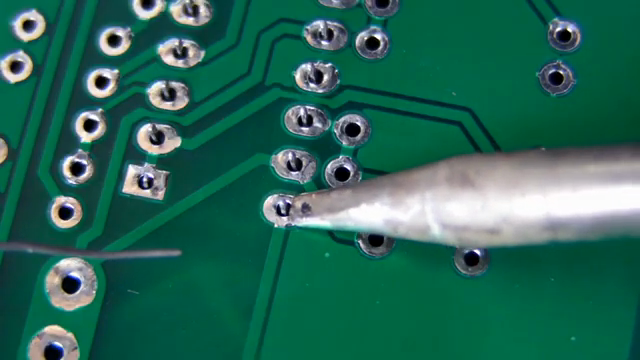
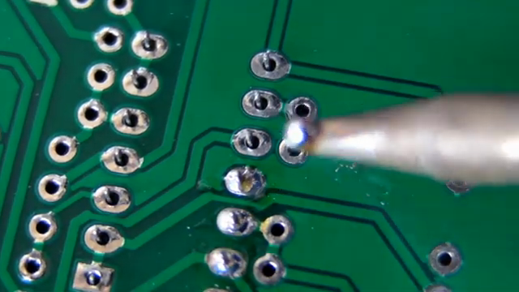
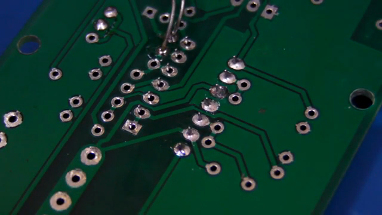
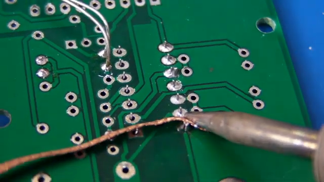
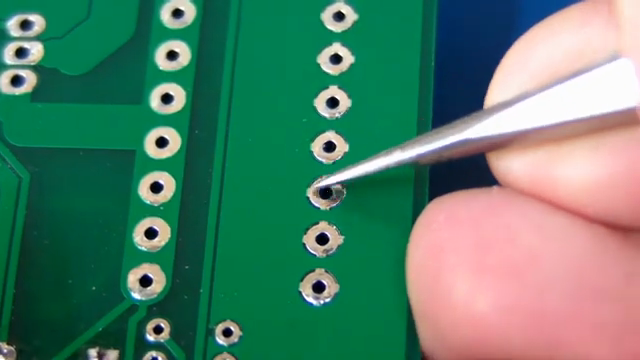
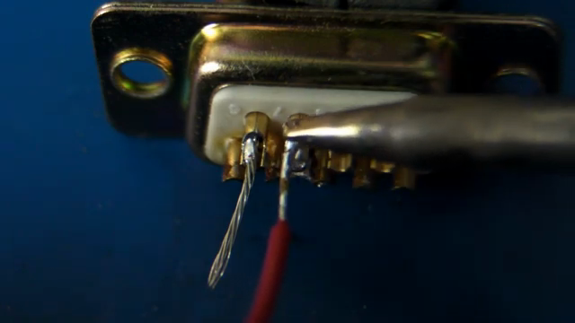
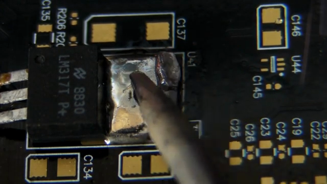

# EEVblog 납땜 강좌 2편 — Through-hole 납땜과 Rework

**원본 강의:** [EEVblog #183 - Soldering Tutorial Part 2 (YouTube)](https://www.youtube.com/watch?v=fYz5nIHH0iY)

이 강의는 `DIP IC`, Resistor, Connector, `TO-220` Tab을 직접 납땜하며 Through-hole Hand Soldering의 기본 원리를 설명한다. 핵심은 **Pad와 Pin을 동시에 가열하고, 반대편에서 Solder를 공급하며, 작업물의 열용량에 맞는 Tip을 사용하는 것**이다.

> Tip은 한쪽에서 열을 전달하고 Solder는 반대쪽에서 들어간다. Solder를 녹이는 주체는 Tip 자체가 아니라 충분히 가열된 Joint여야 한다.

---

## 1. Through-hole 납땜의 다섯 가지 원칙

강의 전체를 관통하는 기본 원칙은 다음과 같다.

1. 품질 좋은 `Temperature-controlled Soldering Iron`을 사용한다.
2. 공급량을 조절할 수 있도록 Joint 크기에 맞는 직경의 Solder Wire를 사용한다.
3. Solder Wire 내부 또는 외부에서 반드시 Flux를 공급한다.
4. Pad와 Pin에 동시에 닿아 열을 충분히 전달할 수 있는 Tip을 사용한다.
5. Tip의 반대편에서 Solder를 Joint에 직접 공급한다.

작은 Through-hole Joint는 준비가 정상이라면 몇 초 안에 끝나야 한다. 오래 가열해야 한다면 무작정 온도를 올리기 전에 다음 항목을 확인한다.

- Pad 또는 Component Lead의 산화
- Flux 부족
- Tip 크기와 접촉 면적 부족
- Solder 종류나 품질 문제
- Ground Plane 등 작업물의 큰 열용량
- Station의 열 회복 성능 부족

---

## 2. DIP IC 삽입과 고정

새 `DIP IC`의 Pin은 바깥쪽으로 약간 벌어져 있어 Socket이나 PCB Hole에 바로 들어가지 않을 수 있다. 강의자는 IC의 한쪽 Pin 열을 평평한 작업면에 대고 몸체를 살짝 굴린 뒤, 반대쪽도 같은 방식으로 조정한다.

- 두 Pin 열이 Board에 수직으로 들어갈 정도까지만 조금씩 굽힌다.
- IC의 Notch와 Pin 1 방향을 PCB Silkscreen과 맞춘다.
- 몸체가 Board에 안정적으로 밀착됐는지 확인한다.
- 납땜 중 빠지지 않도록 대각선 방향의 Pin을 먼저 고정하면 위치를 확인하기 쉽다.

Resistor처럼 긴 Lead를 가진 부품은 Hole 간격에 맞춰 `Lead Forming`을 한다. 강의에서는 손으로 대략적인 간격을 잡지만, 반복 작업이나 Lead에 무리가 갈 수 있는 부품은 Pliers나 Lead Forming Tool을 사용할 수 있다.

> **주의**
> IC 방향을 잘못 삽입한 상태에서도 납땜 자체는 가능하다. 납땜 전에 반드시 Pin 1, Notch, Silkscreen 방향을 확인해야 한다.

---

## 3. 기본 Joint를 만드는 순서

*Chisel Tip의 평평한 면이 Pad와 Pin에 함께 닿아 있다. Solder Wire는 반대편에서 접근한다. 출처: 원본 강의 02:04.*

### 1단계: Tip을 청소하고 Tinning한다

Wet Sponge나 Metal Wool로 산화물과 잔류물을 제거한다. Tip 표면은 얇은 Solder 막이 고르게 남아 열을 전달할 수 있는 상태여야 한다.

### 2단계: Pad와 Pin을 동시에 가열한다

Chisel Tip의 평평한 면을 Pad와 Pin 양쪽에 동시에 댄다. 한쪽만 가열하면 다른 표면에 Solder가 제대로 Wetting되지 않을 수 있다.

### 3단계: 약 1초 동안 예열한다

강의의 작은 Through-hole Joint에서는 약 `1초`를 기준으로 예열한다. 정확한 시간은 Pad 크기, Copper 면적, Component Lead와 Tip의 열용량에 따라 달라진다.

### 4단계: Tip 반대편에 Solder를 공급한다

Solder Wire를 Tip 자체가 아니라 **가열된 Pad와 Pin의 반대편 경계**에 댄다. Joint가 충분히 뜨거우면 Solder가 녹으며 Flux가 표면을 정리하고 Solder가 Joint 전체로 흐른다.

### 5단계: 필요한 양만 공급하고 종료한다

Pin과 Pad를 감싸는 작은 Fillet가 생길 만큼만 공급한다. Solder 공급을 멈춘 뒤 Joint가 움직이지 않게 Iron을 제거하고 응고될 때까지 기다린다.

> 좋은 납땜은 “Tip으로 Solder를 떠서 붙이는 작업”이 아니라, 두 금속 표면을 가열한 뒤 그 표면이 Solder를 받아들이게 만드는 작업이다.

---

## 4. Flux가 필요한 이유

Pad와 Component Lead는 공기 중에서 산화막을 만든다. 이 산화막은 Solder가 금속 표면에 퍼지고 결합하는 `Wetting`을 방해한다. Flux는 가열 과정에서 산화막을 제거해 Solder가 흐를 수 있는 표면을 만든다.

강의에서 사용하는 일반 Through-hole 작업은 Flux-cored Solder Wire 내부의 Flux만으로 충분하다. 그러나 오래 보관해 심하게 산화된 Lead는 다음과 같은 추가 처리가 필요할 수 있다.

- Datasheet와 부품 상태가 허용하면 산화막을 물리적으로 제거한다.
- Joint에 적합한 Liquid Flux나 Flux Pen을 추가한다.
- 새 Solder와 함께 다시 가열해 Wetting 상태를 확인한다.

강의는 20년 이상 보관해 표면이 산화된 Resistor와 상대적으로 깨끗한 Resistor를 비교한다. 산화된 Lead에서는 Solder가 퍼지는 속도가 느리고, Board 반대편까지 충분히 흐르지 않았다.

> **주의**
> Solder를 Tip 위에서 먼저 녹인 뒤 그 덩어리만 Joint로 옮기면, 이동하는 동안 Flux가 먼저 타 버릴 수 있다. 그러면 산화막이 남아 Cold Joint가 생기기 쉽다.

---

## 5. 예외: Tip 위의 작은 Solder를 Thermal Bridge로 사용하기

강의는 “Tip에 Solder를 먼저 묻히지 말라”는 원칙의 예외도 설명한다. Tip에 **소량의 녹은 Solder**를 두면 Tip과 Pad·Pin 사이의 미세한 공기 틈을 채워 접촉 면적을 넓히는 `Thermal Bridge` 역할을 할 수 있다.

1. Tip에 소량의 Solder를 묻힌다.
2. 그 Solder를 접착 재료가 아니라 열 전달 매개체로 사용해 Joint를 빠르게 가열한다.
3. 반대편에서 새 Solder Wire를 공급해 새로운 Flux가 Joint 표면에 도달하게 한다.

> **예외**
> Tip에 묻힌 Solder만으로 Joint를 완성해서는 안 된다. Thermal Bridge는 초기 열 전달을 돕는 보조 수단이고, 실제 Joint에는 Flux가 남아 있는 새 Solder를 공급해야 한다.

---

## 6. 정상 Joint와 Cold Joint 판별

*가운데의 불규칙한 Solder 덩어리는 주변의 매끄러운 Joint와 달리 Wetting과 흐름이 부족하다. 출처: 원본 강의 05:37.*

### 정상 Joint

- Solder가 Pad와 Pin 양쪽에 Wetting되어 있다.
- Pin에서 Pad로 이어지는 매끄러운 Fillet가 보인다.
- Solder 양이 Joint 형상을 가리지 않는다.
- Plated Through-hole에서는 Solder가 Hole을 따라 반대면까지 흐른다.
- Leaded Solder는 일반적으로 밝고 매끄럽게 보인다.

### Cold Joint 또는 불완전한 Joint

- Solder가 표면에 붙지 않고 공처럼 뭉친다.
- 표면이 거칠고 울퉁불퉁하다.
- Pad 또는 Pin 한쪽만 젖어 있다.
- Hole 안쪽과 Board 반대면까지 Solder가 흐르지 않는다.
- Solder가 굳는 동안 부품이 움직여 균열이나 불규칙한 표면이 생긴다.

> **주의**
> 광택만으로 정상 여부를 판단하면 안 된다. 강의에서 사용하는 Leaded Solder는 밝고 반짝이지만 Lead-free Solder는 정상 Joint도 상대적으로 Matte하게 보일 수 있다. Fillet 형상과 Pad·Pin의 Wetting 상태를 함께 본다.

---

## 7. Solder 양과 Fillet

*강의는 최소량, 적정량, 과다량의 Joint를 차례로 만들어 형상을 비교한다. 출처: 원본 강의 13:20.*

적정량의 Solder는 Pin과 Pad 사이에 오목하고 매끄러운 Fillet를 만든다. 너무 적으면 Pad나 Pin 일부가 충분히 젖지 않고, 너무 많으면 큰 Blob이 Joint 형상을 가린다.

| 상태 | 외관 | 문제점 |
| --- | --- | --- |
| 부족 | Fillet가 매우 작거나 Pad·Pin 일부가 드러난다. | 기계적·전기적 연결이 불완전할 수 있다. |
| 적정 | Pin에서 Pad로 매끄럽게 이어지는 작은 Fillet가 보인다. | Wetting 상태와 Joint 형상을 검사할 수 있다. |
| 과다 | 둥근 Blob이 Joint 전체를 덮는다. | Wetting 불량, Bridge, 미납땜 부위를 눈으로 확인하기 어렵다. |

`0.46 mm`처럼 가는 Solder Wire는 한 번에 공급되는 양이 적어 Fillet 크기를 조절하기 쉽다. 큰 Joint가 아니라면 굵은 `1~1.5 mm` Wire는 초보자가 과다 공급하기 쉽다.

---

## 8. 과다 Solder와 Cold Joint Rework

*가열된 Solder Wick이 녹은 Solder를 모세관 작용으로 흡수한다. 출처: 원본 강의 14:33.*

과다 Solder는 `Solder Wick`으로 제거할 수 있다.

1. 제거할 Joint 위에 Wick을 올린다.
2. Wick 위에 Iron을 대어 아래의 Solder까지 함께 녹인다.
3. Solder가 Copper Braid를 따라 올라오면 Iron과 Wick을 함께 들어 올린다.
4. 사용된 Wick 부분을 잘라낸다.
5. Pad와 Pin에 필요한 Solder가 남았는지 검사한다.
6. 필요하면 Flux를 추가하고 정상 방식으로 다시 납땜한다.

Cold Joint도 먼저 Wick으로 기존 Solder를 줄인 다음, Tip으로 Pad와 Pin을 함께 가열하고 반대편에서 새 Solder를 공급해 수정한다.

> **주의**
> Wick을 굳은 상태로 억지로 당기면 Pad가 들릴 수 있다. Iron과 Wick을 제거하기 전에 Solder가 완전히 녹았는지 확인한다.

---

## 9. Component Lead 절단

납땜이 끝난 Through-hole Lead는 평평한 면을 가진 `Flush Side Cutter`로 자른다.

- Cutter를 Joint 표면에 직접 누르지 않고 약간 위에서 절단한다.
- 여러 Lead를 한꺼번에 잡아 비틀거나 자르지 않는다.
- 절단 충격이 Solder Joint에 전달되지 않도록 한 Lead씩 처리한다.
- 잘린 Lead가 튀는 방향을 사람이나 다른 회로에서 멀리한다.

여러 Lead를 동시에 자르려 하면 Joint에 기계적 응력이 전달되어 Crack이 생길 수 있다. Crack Joint는 Cold Joint처럼 간헐적인 전기 불량을 만들 수 있다.

---

## 10. Tip 관리와 Flux Residue 세정

### Tip 관리

작업 후 Wet Sponge에 Tip을 대고 회전시키며 잔류물을 닦는다. Tip 표면의 Plating이 패이거나 벗겨진 `Pitting`이 심하면 Solder가 고르게 묻지 않고 열 전달도 나빠지므로 교체한다.

- 작업 중 주기적으로 Tip을 청소한다.
- 청소 후 얇게 Solder를 입혀 산화를 막는다.
- 작업을 마칠 때도 Tip에 보호용 Solder 막을 남긴다.
- Lead-free Alloy를 사용할 때는 Station 제조사가 해당 Alloy와 호환된다고 지정한 Tip을 사용한다.

> **주의**
> 영상 자막에는 Leaded/Lead-free Tip 설명이 한 차례 뒤바뀌어 인식된 부분이 있다. 핵심은 Alloy와 Tip Plating의 호환성을 제조사 지침으로 확인하는 것이다.

### Flux Residue 세정

강의는 Electronics PCB Cleaning Solvent를 뿌린 뒤 Antistatic Brush로 Flux Residue를 제거한다.

- Flux 제품의 Datasheet에서 세정 필요 여부를 먼저 확인한다.
- Board, Connector, Plastic 부품과 호환되는 Cleaner를 사용한다.
- 전원이 완전히 차단된 상태에서 작업한다.
- 세정액이 완전히 증발한 뒤 다시 전원을 연결한다.

---

## 11. Fine Conical Tip과 Chisel Tip 비교

같은 온도에서도 Fine Conical Tip은 Pad와 Pin에 동시에 닿는 면적이 작아 작은 Through-hole Joint조차 빠르게 가열하지 못했다. Tip을 옆으로 눕히면 접촉 면적이 커져 납땜할 수 있지만, 주변 부품이 있으면 이 각도를 확보하기 어렵다.

| 항목 | Fine Conical Tip | Chisel Tip |
| --- | --- | --- |
| 접촉 면적 | 작다. | 평평한 면으로 넓게 닿는다. |
| Pad·Pin 동시 가열 | 어렵다. | 쉽다. |
| 일반 Through-hole | 작업 시간이 길어질 수 있다. | 빠르고 안정적이다. |
| 제한된 공간 | 물리적 접근에 유리하다. | 크기에 따라 접근이 어렵다. |

> 작은 Joint에는 무조건 작은 Tip이 필요하다는 생각이 흔한 오해다. Joint에 접근할 수 있는 범위에서 접촉 면적과 열용량이 충분한 Tip을 선택한다.

---

## 12. Ground Plane과 Thermal Relief

*Pad가 넓은 Copper Plane에 직접 연결되지 않고 네 개의 Spoke로 연결되어 있다. 출처: 원본 강의 18:36.*

Ground Plane에 직접 연결된 Pad는 넓은 Copper 영역으로 열을 빠르게 빼앗긴다. `Thermal Relief`는 Pad와 Plane 사이를 몇 개의 가는 Spoke로 연결해 전기적 연결은 유지하면서 열 전달을 제한한다.

- Pad가 작업 온도까지 더 빨리 올라간다.
- Iron을 오래 대는 시간을 줄인다.
- Component와 PCB가 받는 열 부담을 줄인다.
- Hand Soldering과 Reflow 공정의 균일성을 높인다.

강의의 큰 Resistor Joint는 Thermal Relief가 있어도 작은 IC Pin보다 가열 시간이 길었다. Soldering 후에는 Iron이 닿았던 한쪽만이 아니라 Joint 둘레 전체가 Wetting됐는지 확인하고, Plated Through-hole 반대면까지 Solder가 도달했는지 검사한다.

---

## 13. Connector Solder Cup과 Pre-tinning

*Wire와 Solder Cup을 각각 준비한 뒤 열을 가해 결합한다. 출처: 원본 강의 27:57.*

`D-sub Connector`의 Contact에는 Solder를 담을 수 있는 `Solder Cup`이 있다. 강의는 두 가지 연결 방식을 비교한다.

### 직접 납땜

1. Stranded Wire의 피복을 벗긴다.
2. Strand가 벌어지지 않도록 꼰다.
3. Wire를 Cup 안에 둔다.
4. Tip으로 Wire와 Cup을 동시에 가열한다.
5. Solder를 공급해 Cup 안으로 흐르게 한다.

이 방식은 Connector, Wire, Iron, Solder를 동시에 고정해야 하므로 손이 부족하고, 두 표면의 산화 상태도 한 번에 해결해야 한다.

### Pre-tinning 후 결합

1. Solder Cup에 적정량의 Solder를 미리 채운다.
2. Stranded Wire 끝에도 Solder를 얇게 입혀 Tinning한다.
3. Cup을 다시 가열해 Solder를 녹인다.
4. Tinned Wire를 Cup 안에 넣고 함께 결합한다.

두 표면에 Flux와 Solder가 이미 적용되어 있으므로 결합 과정이 단순해진다. 완성 후에는 Wire와 Cup 사이에 매끄럽고 고른 Fillet가 형성됐는지 확인한다.

---

## 14. 큰 열용량의 Joint는 큰 Tip으로 해결한다

*큰 Tip이 TO-220 Tab과 Pad에 넓게 접촉해 열을 전달한다. 출처: 원본 강의 31:24.*

`TO-220` Tab이나 Heatsink, 넓은 Ground Plane은 작은 Pin보다 훨씬 많은 열을 흡수한다. 강의에서는 다음과 같이 작업 조건을 바꾼다.

- 작은 Chisel Tip 대신 큰 Chisel Tip을 사용한다.
- `0.46 mm` 대신 약 `1 mm` Solder Wire로 필요한 양을 빠르게 공급한다.
- Tip에 소량의 Solder를 묻혀 초기 Thermal Bridge를 만든다.
- Tab과 Pad를 동시에 가열하고 전체가 Wetting될 때까지 관찰한다.
- 추가 Flux가 필요한지 판단한다.

강의의 핵심 비교는 **작은 Tip을 `400°C`로 높이는 것보다 큰 Tip을 `300°C`로 사용하는 편이 큰 Joint를 더 잘 가열할 수 있다**는 것이다. 설정 온도만으로는 전달 가능한 열량이 결정되지 않는다. Tip의 질량, 접촉 면적, Heater 출력과 열 회복 성능이 함께 작용한다.

> **주의**
> 큰 열용량의 부품과 Joint는 Iron을 제거한 뒤에도 오랫동안 뜨겁다. 외관상 Solder가 굳었더라도 바로 손으로 만지지 않는다.

---

## 15. 실습용 작업 Checklist

### 작업 전

- Component 방향과 Pin 1을 확인한다.
- Lead를 Hole 간격에 맞게 Forming하고 부품을 고정한다.
- 작업물 열용량에 맞는 Chisel Tip과 Solder Wire 직경을 고른다.
- Tip을 청소하고 Tinning 상태를 확인한다.
- Fume Extraction과 Eye Protection을 준비한다.

### Joint 형성

1. Tip을 Pad와 Pin에 동시에 댄다.
2. 작은 Joint는 약 1초를 기준으로 예열한다.
3. Tip 반대편에서 Solder를 공급한다.
4. 작은 Fillet가 생기면 공급을 멈춘다.
5. Joint를 움직이지 않고 냉각한다.

### 작업 후

- Pad와 Pin 양쪽의 Wetting을 확인한다.
- Fillet가 Solder Blob에 가려지지 않았는지 확인한다.
- Plated Through-hole 반대면까지 Solder가 흐른 상태를 검사한다.
- 과다 Solder나 Cold Joint는 Wick과 새 Flux-cored Solder로 Rework한다.
- Lead는 Joint보다 약간 위에서 한 개씩 절단한다.
- 필요한 경우 Flux Residue를 호환 Cleaner로 제거한다.
- Tip을 청소하고 보호용 Solder 막을 남긴다.

---

## 참고 자료

- [EEVblog #183 - Soldering Tutorial Part 2 (YouTube)](https://www.youtube.com/watch?v=fYz5nIHH0iY)
- [EEVblog #180 - Soldering Tutorial Part 1 - Tools (YouTube)](https://www.youtube.com/watch?v=J5Sb21qbpEQ)
- [EEVblog #186 - Soldering Tutorial Part 3 - Surface Mount (YouTube)](https://www.youtube.com/watch?v=b9FC9fAlfQE)
- [Solderer — UK Health and Safety Executive](https://www.hse.gov.uk/asthma/solderers.htm)

---

## 면접 답변 (30초 분량)

> `/easy-quiz` 실행 시 이 섹션이 정답 카드로 사용됩니다.

- **한 줄 정의:** Through-hole Hand Soldering은 Pad와 Pin을 동시에 가열한 뒤 반대편에서 Flux-cored Solder를 공급해 두 표면에 Wetting된 Fillet를 만드는 작업이다.
- **왜 필요:** Tip에 Solder를 묻혀 옮기거나 한쪽 표면만 가열하면 Flux가 제 역할을 하지 못하고 Cold Joint, 불완전한 Wetting, 과다 Solder가 발생하기 쉽다.
- **동작:** Chisel Tip을 Pad와 Pin에 함께 대고 작은 Joint는 약 1초 예열한 다음 반대편에서 필요한 양만 공급한다. 완료 후 Fillet와 Through-hole 반대면을 검사하고, 불량은 Solder Wick과 새 Solder로 Rework한다.
- **비교:** Fine Conical Tip은 접촉 면적과 열용량이 작아 작업이 느릴 수 있지만, Chisel Tip은 평평한 면으로 열을 효율적으로 전달한다. 큰 Ground Plane이나 TO-220 Tab은 온도만 높이기보다 더 큰 Tip을 사용하는 편이 효과적이다.
- **30초 통합 답변:**
  > Through-hole 납땜은 Chisel Tip으로 Pad와 Pin을 동시에 가열하고 반대편에서 Flux-cored Solder를 공급해 매끄러운 Fillet를 만드는 작업입니다. 작은 Joint는 약 1초 예열한 뒤 몇 초 안에 끝내며, Solder가 Blob처럼 뭉치지 않고 두 표면에 Wetting됐는지 확인합니다. 불량은 Wick으로 제거한 뒤 다시 납땜하고, Ground Plane처럼 열용량이 큰 작업물에는 온도만 높이기보다 접촉 면적과 열용량이 큰 Tip을 사용합니다.
