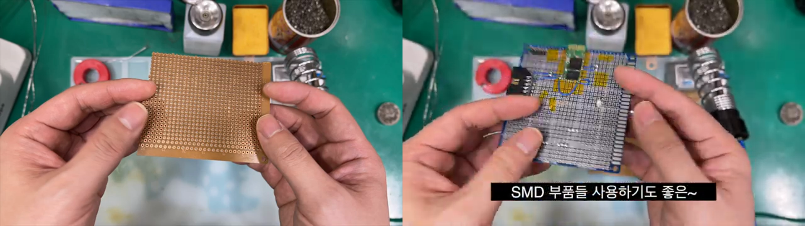
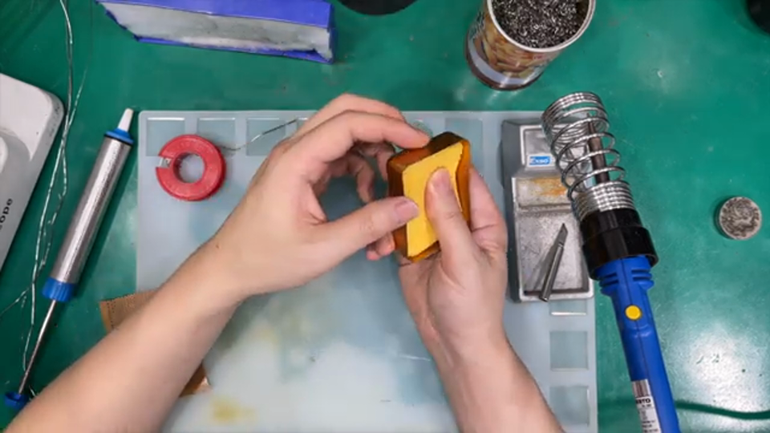

# 납땜 입문 1편 — 준비 도구와 만능기판

**원본 강의:** [[납땜 강좌] 1편 준비해야 할 도구 및 간단 설명 (YouTube)](https://www.youtube.com/watch?v=_HS58QTxeEM)

이 강의는 납땜을 처음 시작할 때 어떤 도구를 준비해야 하는지, 저가형 `Soldering Iron`으로도 실습이 가능한지, 단면과 양면 `Universal PCB`는 어떻게 다른지를 소개한다. 핵심은 **고가 장비보다 최소 구성으로 연습을 시작하는 것**이다.

---

## 1. 납땜은 연습으로 익히는 작업이다

강의자는 처음부터 납땜을 잘하는 사람은 없다고 강조한다. 숙달에 걸리는 시간은 다를 수 있지만, 결국은 반복 연습으로 손의 감각을 익혀야 한다.

- 기초 작업부터 시작해 점차 난이도를 높인다.
- 처음부터 비싼 장비를 갖추는 것이 선행 조건은 아니다.
- 강의 내용은 강의자의 개인적인 작업 스타일과 의견이 반영된 **취미용 참고 자료**로 본다.

> 납땜은 도구 구매로 완성되는 기술이 아니라, 열을 주는 시간과 `Solder`의 흐름을 반복해 관찰하며 익히는 작업이다.

---

## 2. Soldering Iron 선택 기준

영상에서는 입문용으로 `HAKKO 980` 세라믹 Soldering Iron을 사용한다. 강의 촬영 당시의 구입가는 대략 3만~4만 원대로 소개되며, 입문용 제품 중에서는 비교적 비싼 편이다.

이 제품을 선택한 이유는 두 가지다.

- 강의자가 예전에 직접 사용해 본 장비이다.
- 원형 Tip, Knife Tip 등 작업에 맞는 `Soldering Tip`으로 교체할 수 있다.

노란색 Turbo Switch를 잠깐 누르면 출력이 `130 W`까지 올라가는 기능도 소개된다. Switch는 계속 누르는 방식이 아니라 필요할 때만 잠깐 사용한다.

> **예외**
> 영상 설명란은 납땜을 한번만 해 볼 것이라면 20 W 정도의 저렴한 Soldering Iron도 가능하지만, 출력이 낮으면 열량이 부족해 만능기판이 아닌 기판—특히 Lead-free Solder가 사용된 기판—에서 작업하기 어려울 수 있다고 보충한다.

### 예열 시간

저가형 Soldering Iron은 전원을 연결해도 Tip의 온도가 즉시 오르지 않는다. Solder가 안정적으로 녹을 때까지 충분히 예열한 뒤 작업한다.

---

## 3. 최소 준비물과 선택 도구

강의에서 제시한 납땜의 최소 구성은 간단하다.

| 구분 | 도구 | 역할 |
| --- | --- | --- |
| 필수 | `Soldering Iron` + Stand | Pad와 Pin에 열을 전달한다. 사용 중이 아닐 때는 Stand에 거치한다. |
| 필수 | `Solder Wire`(실납) | 녹아서 Pad와 부품 다리를 연결한다. |
| 필수 | `Universal PCB`(만능기판) | 부품을 배치하고 Solder Joint를 만들 연습 대상이다. |
| 권장 | `Tip Cleaner` | Tip의 오염물과 잔류물을 정리한다. 금속 Wool 또는 물을 적셔 짠 Sponge를 사용한다. |
| 선택 | `Flux` / Soldering Paste | Solder가 작업부에 더 잘 흐르도록 돕는다. |
| 선택 | `Solder Sucker` | 녹인 Solder를 흡입해 제거한다. |
| 선택 | `Solder Wick` | 수정 작업에서 Solder를 흡수해 제거한다. 초기 실습에는 반드시 필요하지 않다. |
| 선택 | Tweezers, Nipper, Pliers | 부품을 잡거나 Lead를 자르고 구부린다. |

> **주의**
> 이 영상은 준비 도구에 집중하며 전체 안전 수칙은 다루지 않는다. 실습할 때는 환기를 확보하고, 가열된 Tip을 만지지 말며, Soldering Iron을 Stand에 안정적으로 거치해야 한다.

---

## 4. 단면과 양면 Universal PCB

*왼쪽은 저렴한 단면 기판, 오른쪽은 양면을 활용할 수 있는 에폭시 양면 기판의 예시다. 출처: 원본 강의 02:10~02:50.*

### 저가형 단면 기판

영상에서는 강의자가 “페놀 기판인 것 같다”고 소개한 저렴한 기판을 보여 준다. 금속 Pad가 있는 한쪽 면에서만 납땜을 해결해야 한다.

- 가격이 저렴해 초보자의 반복 연습용으로 접근하기 쉽다.
- 부품은 반대쪽에서 끼우고 Pad가 있는 면에서 Soldering한다.
- 두 면을 이용한 배선이나 작업에는 제약이 있다.

### 에폭시 양면 기판

양면에 모두 Pad가 있고 영상에서 보여 준 제품은 앞뒷면이 연결된 구조다. 한쪽에서 납땜한 뒤 반대면에서도 작업을 이어 나갈 수 있어 단면 기판보다 활용 범위가 넓다. 영상에서는 SMD 부품을 사용하기에도 좋은 기판으로 소개한다.

| 비교 항목 | 단면 Universal PCB | 양면 Universal PCB |
| --- | --- | --- |
| Soldering 가능 면 | 한쪽 | 양쪽 |
| 가격 | 비교적 저렴 | 비교적 고가 |
| 활용도 | 기초 연습에 적합 | 양면 작업과 다양한 부품 배치에 유리 |

---

## 5. Flux의 역할과 흔한 오해

Soldering 세트에 동그란 통으로 들어 있는 `Soldering Paste` 또는 `Flux`를 **Soldering Iron Tip을 담그는 용도**로 오해하기 쉽다. 강의자는 이것이 잘못된 사용법이라고 명확히 짚는다.

Flux는 Soldering 작업부에 사용하여 Solder가 더 잘 녹고 흐르도록 돕는 보조제다. 다만 일반적인 Solder Wire 안에도 소량의 Flux가 들어 있으므로, 초보 실습에서 외부 Flux가 없다고 납땜을 시작할 수 없는 것은 아니다.

> **주의**
> `Flux 통 = Tip 세척용 통`이 아니다. Flux는 작업부의 Solder 흐름을 돕는 용도로 사용한다.

---

## 6. Tip Cleaner와 Sponge 사용법

*영상의 금속 Wool Tip Cleaner와 Soldering Iron Stand의 Sponge. 출처: 원본 강의 03:50~04:15.*

Tip을 정리하는 방법으로 금속 Wool과 Sponge가 소개된다.

### 금속 Wool Tip Cleaner

영상의 원형 통에는 무게감을 주기 위해 동전을 넣고, 그 위에 금속 Wool을 넣어 Tip Cleaner로 사용한다. 작업 중 용기가 쉽게 밀리지 않게 하려는 구성이다.

### Sponge

Sponge는 물에 적신 뒤 반드시 짜서 사용한다. **손으로 짰을 때 물이 흘러나오지 않을 정도**로만 남겨 두고, Tip을 Sponge에 문질러 잔류물을 정리한다.

강의자는 Sponge를 생략할 수는 있지만 어떤 형태든 Tip을 정리할 도구 하나는 준비하는 편이 좋다고 설명한다. 또한 금속 Wool을 사용할 때는 Tip 표면 Coating을 손상시키지 않도록 과도하게 문지르지 않는다.

---

## 7. 입문 실습 준비 Checklist

1. 먼저 연습 목적을 정한다. 단순 Through-hole 연습이라면 저가형 단면 Universal PCB로도 충분하다.
2. `Soldering Iron`, Stand, `Solder Wire`, `Universal PCB`를 준비한다.
3. 금속 Wool 또는 적절히 짠 Sponge 중 하나를 Tip Cleaner로 준비한다.
4. 필요하면 Flux, Solder Sucker, Solder Wick, Tweezers, Nipper를 추가한다.
5. Soldering Iron을 Stand에 두고 전원을 연결한 뒤 충분히 예열한다.
6. Solder가 안정적으로 녹는지 확인한 후 실제 작업을 시작한다.

> **주의**
> 장비의 가격과 납땜 실력은 같은 개념이 아니다. 입문 단계에서는 사용 가능한 장비로 작은 Solder Joint를 반복해 만드는 것이 우선이다.

---

## 참고 자료

- [[납땜 강좌] 1편 준비해야 할 도구 및 간단 설명 (YouTube)](https://www.youtube.com/watch?v=_HS58QTxeEM)
- [HAKKO 980 Soldering Iron + Stand — 영상 설명란 장비](https://hakkomall.com/goods/view?no=1721)
- [Solder Wire — 영상 설명란 장비](https://hakkomall.com/goods/view?no=326)
- [Soldering Paste / Flux — 영상 설명란 장비](https://hakkomall.com/goods/view?no=1685)
- [Solder Sucker — 영상 설명란 장비](https://hakkomall.com/goods/view?no=739)
- [Solder Wick — 영상 설명란 장비](https://hakkomall.com/goods/view?no=132)
- [Tweezers — 영상 설명란 장비](https://hakkomall.com/goods/view?no=1048)
- [Universal PCB — 영상 설명란 장비](https://eleparts.co.kr/goods/view?no=181)

> 영상은 위 링크를 광고가 아닌 사용 장비 예시로 제공한다. 가격과 판매 여부는 강의 게시 시점과 달라질 수 있다.

---

## 면접 답변 (30초 분량)

> `/easy-quiz` 실행 시 이 섹션이 정답 카드로 사용됩니다.

- **한 줄 정의:** 납땜 입문 준비는 `Soldering Iron`, `Solder Wire`, `Universal PCB`를 기본으로 갖추고, Tip Cleaner와 필요한 보조 도구를 추가하는 것이다.
- **왜 필요:** 필수 도구와 선택 도구를 구분하면 불필요한 장비 구매를 줄이고 빠르게 연습을 시작할 수 있다.
- **동작:** Soldering Iron을 예열한 뒤 Pad와 Pin에 열을 전달하고 Solder를 녹여 Joint를 만든다. 작업 중에는 금속 Wool이나 짠 Sponge로 Tip을 정리하며, Flux는 Tip을 담그는 용도가 아니라 Solder의 흐름을 돕는 용도로 사용한다.
- **비교:** 단면 Universal PCB는 한쪽에서만 Soldering하는 저렴한 연습용 기판이고, 양면 Universal PCB는 양쪽을 활용할 수 있어 활용도가 높다.
- **30초 통합 답변:**
  > 납땜을 시작할 때는 Soldering Iron, Solder Wire, Universal PCB가 기본적으로 필요합니다. Iron을 충분히 예열해 Pad와 Pin에 열을 전달하고 Solder Joint를 만들며, 작업 중에는 Tip Cleaner로 Tip을 정리합니다. Flux는 Tip 세척용이 아니라 Solder의 흐름을 돕는 보조제입니다. 단면 기판은 저렴한 기초 연습에, 양면 기판은 보다 유연한 배선과 부품 배치에 적합합니다.
