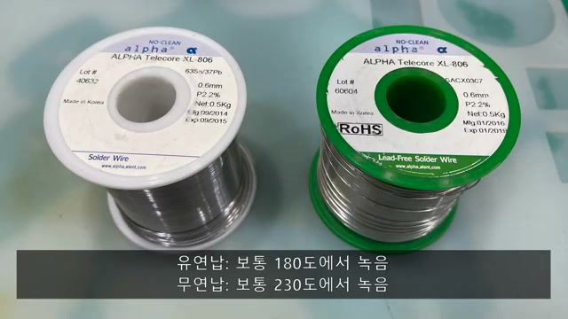
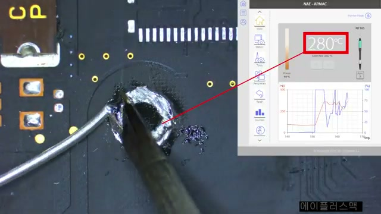
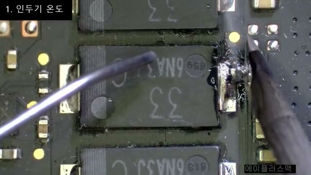
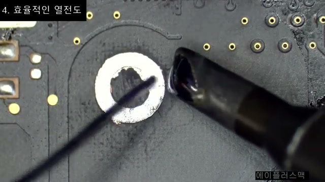
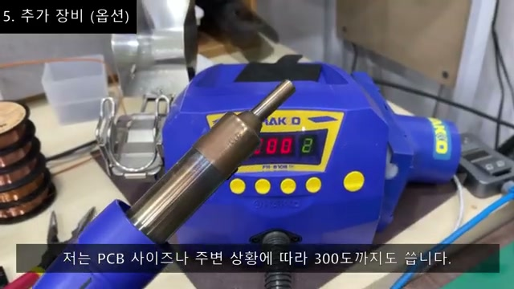

# 납땜이 잘 안 되는 이유 — 녹는점보다 열전달

**원본 강의:** [내가 납땜하면 잘 안되는 이유? #바로이것 #납땜강좌특별편 (YouTube)](https://www.youtube.com/watch?v=l4l1Y5xDZQI)

Solder가 잘 녹지 않는 가장 큰 이유는 Solder 자체가 이상해서가 아니라, **Iron의 열이 Joint에 도달하는 속도보다 PCB와 부품으로 빠져나가는 속도가 더 빠르기 때문**이다. Display에 표시된 Iron 온도가 높더라도 `Pad`, `Lead`, `Copper Plane`이 Solder의 녹는점까지 올라가지 못하면 납땜은 성공하지 않는다.

---

## 1. 핵심 문제는 설정 온도가 아니라 열전달이다

Iron의 설정 온도는 Heater와 Tip의 목표값이다. 실제 납땜 부위의 온도는 다음 요소에 의해 더 낮아진다.

- Tip과 Pad가 접촉하는 면적
- Tip이 저장하고 있는 열량과 Station의 회복 출력
- Pad에 연결된 Copper Trace나 `Ground Plane`의 넓이
- 부품 Lead와 Connector의 크기·재질
- Solder Wick, Tweezers 등 추가로 닿는 금속의 열용량

즉 `450 °C`로 설정했다는 사실만으로 무연 Solder가 즉시 녹아야 하는 것은 아니다. Joint에 Iron을 대는 순간 열이 PCB와 부품으로 빠져나가면 Tip 온도도 설정값 아래로 떨어질 수 있다.

> Iron 온도를 무조건 올리기 전에, **열이 어디로 빠져나가는지와 Tip이 열을 충분히 전달하는지**를 먼저 본다.

---

## 2. 유연 Solder와 무연 Solder의 녹는 온도

*강의는 유연 Solder를 약 `180 °C`, 무연 Solder를 약 `230 °C`로 비교한다. 정확한 녹는 범위는 합금 조성에 따라 달라진다. 출처: 원본 강의 01:46.*

| 구분 | 대표 합금 예 | 녹는 온도 | 작업 특성 |
| --- | --- | --- | --- |
| 유연 Solder | `Sn63Pb37` | `183 °C` | 비교적 낮은 온도에서 녹고 Wetting이 쉬운 편이다. |
| 유연 Solder | `Sn60Pb40` | `183~190 °C` | 단일점이 아닌 녹는 범위를 가진다. |
| 무연 Solder | `SAC305`(`Sn96.5Ag3.0Cu0.5`) | `217~220 °C` | 유연 Solder보다 녹는 온도가 높고 더 많은 열이 필요하다. |
| 무연 Solder | `Sn99.3Cu0.7` | 약 `227 °C` | 무연 합금이라도 조성에 따라 온도가 다르다. |

강의에서 언급한 순수 Lead의 녹는점은 약 `327 °C`이다. 전자 납땜에서는 Lead에 Tin 등을 섞어 녹는 온도를 낮춘 합금을 사용해 작업성을 확보한다. 무연 Solder는 Lead 사용을 제한하는 요구에 대응해 Tin, Silver, Copper 등으로 구성된 합금을 사용한다.

> **주의**
> `유연 = 180 °C`, `무연 = 230 °C`는 입문용 근사치다. 실제로는 Spool이나 제품 자료에 표시된 **합금 조성과 Melting Range**를 확인해야 한다.

---

## 3. PCB는 커다란 Heat Sink처럼 작용한다

PCB의 전기 경로는 얇은 Copper로 만들어진다. Iron이 Pad를 데우면 열은 Solder에만 머물지 않고 연결된 Copper Trace, Plane, Via, 부품 Lead로 퍼져 나간다.

강의는 이를 CPU와 Heat Sink의 관계를 거꾸로 생각하는 비유로 설명한다.

- CPU에 붙은 Heat Sink는 열을 빠르게 빼앗아 분산시킨다.
- 납땜 중에도 넓은 Copper Plane이 같은 역할을 하며 Pad의 온도 상승을 방해한다.
- 특히 `Ground Plane`과 Power 패턴은 연결된 Copper 면적이 넓어 열이 빠르게 분산된다.
- 다층 PCB, 넓은 Pad, 큰 Connector는 전체 열용량이 커서 작업이 더 어렵다.

*Station은 Tip 온도를 회복하려고 Power를 공급하지만, 넓은 패턴으로 열이 계속 빠져나가면 설정값에 도달하지 못할 수 있다. 출처: 원본 강의 04:05.*

---

## 4. 열이 부족할 때 생기는 악순환

Solder가 안 녹으면 작업자는 Iron을 더 세게 누르거나 PCB 표면을 긁기 쉽다. 그러나 누르는 힘은 부족한 열량을 근본적으로 해결하지 못하며, 대신 다음 손상을 일으킬 수 있다.

- Solder Mask와 PCB 표면 손상
- Pad가 PCB에서 떠오르는 `Lifted Pad`
- Copper Trace가 끊기거나 떨어지는 손상
- 과도한 장시간 가열로 인한 주변 부품의 열 Stress

`Solder Wick`도 열을 흡수하는 Copper 전도체다. Joint에 Wick을 추가하면 Iron이 데워야 할 금속의 양이 늘어나므로, 이미 열량이 부족한 상태에서는 Desoldering이 더 잘 안 될 수 있다.

> **주의**
> Solder가 녹지 않는다면 힘을 추가할 것이 아니라 작업을 멈추고, Tip의 크기·접촉면·상태, 설정 온도, PCB의 Thermal Mass를 다시 점검한다.

---

## 5. 해법 1 — 적절한 온도와 Tip 선택

Tip은 단순히 뜨거운 부분이 아니라, Heater의 열을 Joint로 전달하는 통로다. 가는 Tip은 작은 Pad에서 정밀하지만 접촉 면적과 저장 열량이 작다. 넓은 Ground Pad나 큰 Connector에서는 보다 넓은 `Chisel Tip`처럼 작업부와 맞는 Tip이 유리하다.

*같은 온도라도 Tip의 형상과 접촉 면적에 따라 전달되는 열량이 달라진다. 출처: 원본 강의 06:30.*

점검 순서는 다음과 같다.

1. Tip에 Oxide가 끼어 Solder가 잘 Wetting되지 않는지 확인한다.
2. Joint 크기에 맞는 Tip 형상과 너비를 선택한다.
3. Tip의 넓은 면이 Pad와 Lead에 동시에 닿도록 자세를 잡는다.
4. 합금과 PCB의 Thermal Mass에 맞게 온도를 조정한다.
5. 작업할 때 Station이 설정 온도를 빠르게 회복하는지 확인한다.

설정 온도만 높이면 작업부 주변이 필요 이상으로 데워질 수 있다. 반면 적절한 크기의 Tip으로 열을 빠르게 전달하면 더 낮은 설정 온도에서도 작업 시간을 줄일 수 있다.

---

## 6. 해법 2 — 유연 Solder와 Flux를 이용한 Rework

### 기존 무연 Joint에 유연 Solder 추가

무연 Solder로 실장된 부품을 제거할 때 유연 Solder를 소량 추가하면 두 합금이 섞이며 Joint를 녹이기 쉬워질 수 있다. 강의는 불량 부품을 제거한 뒤 최종 실장이 반드시 무연이어야 한다면, 잔여 Solder를 정리하고 무연 Solder로 새 부품을 실장하는 방법을 제시한다.

> **주의**
> 유연 Solder를 섞는 방법은 신뢰성·RoHS·제조 공정 요구를 따라야 하는 제품에는 임의로 적용하면 안 된다. 조직의 Rework 절차와 사용 합금 정책을 먼저 확인한다.

### Flux의 정확한 역할

강의는 Flux가 작업을 쉽게 한다는 맥락을 “Solder의 녹는 온도를 일시적으로 낮춘다”고 표현한다. 다만 기술적으로 Flux는 **합금 자체의 녹는점을 변경하는 재료가 아니다.** 실제 역할은 다음과 같다.

- 금속 표면의 Oxide와 오염을 제거해 Solder가 퍼질 수 있는 표면을 만든다.
- 가열 중 표면을 덮어 재산화를 줄인다.
- Solder의 Surface Tension을 낮춰 Wetting과 확산을 돕는다.
- 그 결과 더 짧은 시간에 Joint를 만들 수 있어, 작업자가 더 낮은 온도에서 Solder가 잘 녹는 것처럼 느낄 수 있다.

Flux-cored Solder Wire에도 Flux가 들어 있지만, 작업이 오래 걸리면 먼저 활성화된 Flux가 기화하거나 소모될 수 있다. 이때 작업부에 적합한 Flux를 추가하면 Rework가 쉬워진다.

> **주의**
> Flux 잔여물 세척 여부와 방법은 Flux 종류와 제조사 지침을 따른다. 강의는 `IPA` 또는 PCB 세정제로 작업부를 세척하는 방법을 권장한다.

---

## 7. 해법 3 — Tip Tinning으로 접촉면 메우기

*Tip과 Pad는 둘 다 완전히 밀착되지 않는다. 소량의 녹은 Solder가 사이의 빈틈을 메워 열전달을 돕는다. 출처: 원본 강의 08:20.*

건조한 Tip과 Pad는 표면이 완전히 맞닿지 않아 실제 접촉 면적이 작을 수 있다. 작업 직전 Tip에 소량의 Solder를 묻히면 녹은 Solder가 불규칙한 빈틈을 메워 Thermal Bridge를 만든다.

강의는 CPU와 Heat Sink 사이에 Thermal Paste를 바르는 것에 비유한다. Thermal Paste가 미세한 빈틈을 메워 열을 잘 전달하듯, Tip의 Solder도 Joint로 전달되는 초기 열량을 늘려 준다.

> **주의**
> Tip Tinning은 큰 Solder 방울을 Tip에 올려 작업부로 옮기는 것이 아니다. 열전달을 돕고 Tip을 산화로부터 보호할 정도의 얇은 Solder 막을 만든다.

---

## 8. 해법 4 — Preheater와 Hot Air로 PCB 전체 예열

넓은 Ground Plane이나 큰 부품에서 Iron 하나로 필요한 열량을 공급하기 어려울 때는 PCB를 미리 데워 주는 `Preheater`를 사용할 수 있다. PCB의 시작 온도를 높이면 Iron이 Joint를 녹는점까지 올리는 데 필요한 온도 차가 줄어든다.

Preheater가 없을 때 강의는 Hot Air Station을 보조 열원으로 사용한다.

1. Hot Air를 약 `200~220 °C`로 설정한다.
2. 풍량은 작은 부품이 날리지 않도록 낮게 조정한다.
3. 작업부 주변을 Hot Air로 예열하면서 Iron으로 Joint에 집중해 열을 공급한다.
4. Solder가 녹으면 필요 이상으로 가열을 지속하지 않는다.

*Hot Air를 낮은 풍량으로 사용해 PCB가 빼앗는 열을 보충하면 Iron의 부담을 줄일 수 있다. 출처: 원본 강의 10:05.*

> **주의**
> Hot Air는 주변의 Plastic Connector, Cable, 소형 SMD 부품, 열에 민감한 부품까지 함께 데울 수 있다. 노즐 거리와 방향, 풍량, 주변 부품의 내열성을 확인하고, 필요하면 열 차폐를 사용한다.

---

## 9. 납땜이 안 될 때의 진단 순서

온도를 즉시 높이기보다 다음 순서로 원인을 좁혀 간다.

1. **합금 확인:** 유연인지 무연인지, 알 수 있다면 정확한 합금 조성을 확인한다.
2. **Tip 상태 확인:** Solder가 Tip 표면에 고르게 Wetting되는지 본다. 산화된 Tip은 세척하고 다시 Tinning한다.
3. **Tip 크기 확인:** 넓은 Pad에 너무 가는 Tip을 쓰고 있지 않은지 본다.
4. **접촉 방법 확인:** Tip의 넓은 면이 Pad와 Lead 모두에 닿는지, 소량의 Solder가 접촉부를 메우는지 본다.
5. **Flux 확인:** 산화된 표면이거나 작업 시간이 길어졌다면 적합한 Flux를 소량 추가한다.
6. **Thermal Mass 확인:** Ground Plane, 다층 PCB, 큰 Connector, Solder Wick이 열을 빼앗고 있는지 본다.
7. **보조 가열 검토:** 여전히 열이 부족하면 Preheater나 제어된 Hot Air로 PCB를 예열한다.
8. **작업 중단 기준:** PCB를 눌러야 하거나 오랫동안 가열해도 Solder가 녹지 않으면, 손상이 생기기 전에 작업을 멈추고 설정을 바꾼다.

---

## 참고 자료

- [내가 납땜하면 잘 안되는 이유? — 납땜강좌 특별편 (YouTube)](https://www.youtube.com/watch?v=l4l1Y5xDZQI)
- [Kester Leaded Solid Solder Wire — 합금별 Melting Point](https://www.kester.com/downloads?Command=Core_Download&EntryId=61966)
- [Kester Ultrapure High-Reliability Extruded Solder — 유연·무연 합금 온도표](https://www.kester.com/downloads?Command=Core_Download&EntryId=61814)
- [HAKKO N2 System Effect — Flux의 세 가지 기능과 Preheating](https://www.hakko.com/english/n2system/effect.html)
- [납땜 입문 1편 — 준비 도구와 만능기판](./1_납땜_준비도구와_만능기판.md)
- [납땜 기본 방법과 연습법](../04_납땜_기본방법과_연습법.md)

---

## 면접 답변 (30초 분량)

> `/easy-quiz` 실행 시 이 섹션이 정답 카드로 사용됩니다.

- **한 줄 정의:** Solder가 잘 녹지 않는 문제는 대부분 Iron의 열이 Joint에 축적되기 전에 PCB와 부품으로 분산되는 열전달 문제다.
- **왜 필요:** 원인을 온도 부족으로만 판단하면 Iron을 과도하게 누르거나 오래 대어 Pad와 주변 부품을 손상시킬 수 있다.
- **동작:** 합금의 녹는 범위, Tip의 상태·크기·접촉면, Ground Plane의 Thermal Mass를 순서대로 확인한다. 필요하면 Flux와 Tip Tinning으로 Wetting과 열전달을 개선하고, Preheater나 Hot Air로 보조 가열한다.
- **비교:** 단순히 Iron 온도를 높이는 방법보다 적절한 크기의 Tip과 넓은 접촉면을 사용하면 열을 빠르게 전달해 작업 시간과 주변부의 열 Stress를 줄일 수 있다.
- **30초 통합 답변:**
  > Solder가 잘 녹지 않는 이유는 설정 온도보다 Joint의 실제 열전달과 Thermal Mass에 있는 경우가 많습니다. 저는 먼저 합금의 녹는 범위와 Tip 상태를 확인하고, Joint 크기에 맞는 Tip으로 Pad와 Lead의 접촉면을 확보합니다. Flux와 Tinning으로 Wetting과 열전달을 개선하고, 넓은 Ground Plane이 열을 많이 빼앗는다면 Preheater나 제어된 Hot Air를 사용해 보조 가열합니다.
