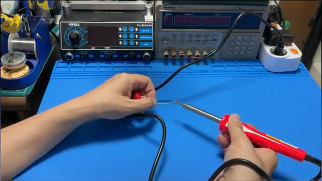
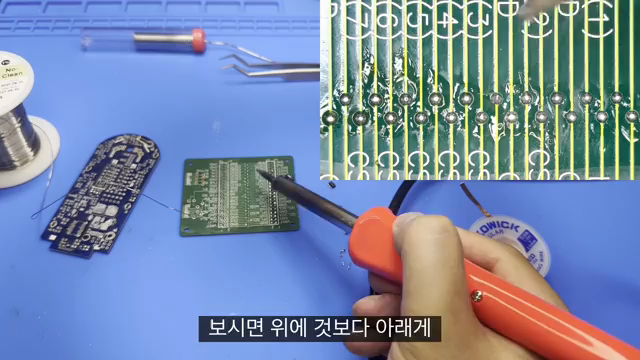
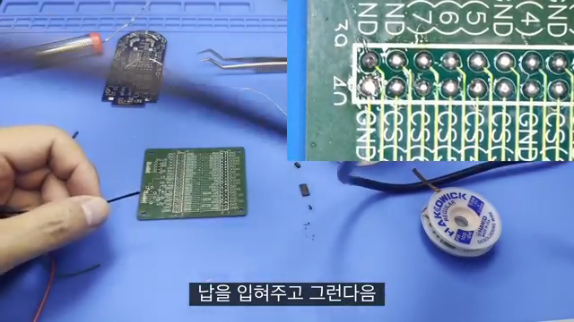
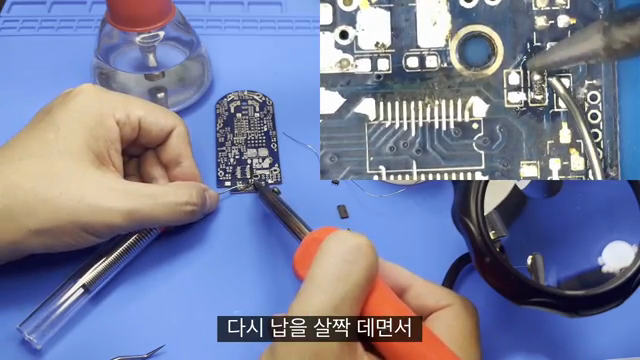

# 다이소 인두기 사용과 관리 — Tip Tinning, PCB, Cable, Component Soldering

**원본 강의:** [전문가가 알려주는 다이소 인두기 사용법 - 초보자를 위한 실무(실전) 노하우 강좌 (YouTube)](https://www.youtube.com/watch?v=ysPV4Lzz_DI)

이 강의는 온도 조절이 없는 저가형 Soldering Iron도 일반적인 PCB, Cable, Through-hole·소형 Component 납땜에 활용할 수 있음을 시연한다. 제품 가격보다 중요한 것은 **처음부터 Tip을 Tinning하고, 사용 중·종료 후에도 산화되지 않게 관리하는 습관**이다.

---

## 1. 저가형 Soldering Iron의 한계와 사용 전제

다이소 인두기와 같은 저가형 제품은 온도 조절이나 과열 방지 기능이 없을 수 있다. 전원을 계속 연결해 두면 Tip 온도가 필요 이상으로 올라가고 산화 속도가 빨라진다.

그렇지만 제품의 한계를 알고 다음 관리 원칙을 지키면 강의에서 보여 준 일반적인 작업은 수행할 수 있다.

- 처음 가열할 때 Tip을 바로 Tinning한다.
- 작업 중 Tip 표면에 어느 정도 Solder Coating이 유지되게 한다.
- 강의의 기준처럼 `5분` 이상 사용하지 않을 때는 전원을 빼거나, 조절기가 있다면 온도를 낮춘다.
- 작업을 끝낼 때 Tip을 세척한 뒤 새 Solder로 표면을 덮고 전원을 끈다.

> **주의**
> 전원을 빼은 뒤에도 Tip은 오랜 시간 뜨겁다. 완전히 식기 전에는 만지거나 보관하지 않는다.

---

## 2. 첫 사용 시 Tip Tinning

*전원을 연결한 직후 Solder Wire를 Tip에 대고, 녹기 시작하는 시점에 표면 전체를 코팅한다. 출처: 원본 강의 01:39.*

1. 차가운 새 Iron Tip에 Solder Wire를 미리 대고 전원을 연결한다.
2. Tip 온도가 Solder의 용융점에 도달해 Solder가 녹기 시작하면, Tip의 원뽔형 작업부 전체에 입힌다.
3. 표면이 은색 Solder로 고르게 덮였는지 확인한다.
4. 과도한 Solder는 습식 Sponge나 적절한 Tip Cleaner로 정리한 뒤, 얇은 Coating을 다시 남긴다.

새 Tip을 아무런 Coating 없이 높은 온도까지 먼저 올리면 표면 산화가 빠르게 진행할 수 있다. 검게 산화된 막은 열전달과 Solder Wetting을 방해해 “납이 Tip에 안 묻는다”는 증상을 만든다.

---

## 3. 사용 중과 종료 후 Tip 관리

### 작업 중

- 오래된 Flux 찌꺼기와 산화물을 습식 Sponge로 짧게 닦는다.
- 닦은 직후에는 소량의 새 Solder를 입혀 맨 Tip이 공기에 오래 노출되지 않게 한다.
- 사용하지 않는 동안은 Stand에 거치하고, 오래 비우면 전원을 차단한다.

### 작업 종료

1. Tip을 정리한다.
2. 새 Solder를 넓게 입혀 보관용 코팅을 만든다.
3. 전원을 빼고 Stand에서 완전히 냉각한다.

> Tip을 깨끗하게 닦은 상태로만 보관하는 것보다, Solder Coating을 남겨 산소와의 직접 접촉을 줄이는 것이 중요하다.

---

## 4. PCB Pad Soldering

*열을 받은 Pad와 Solder가 만나도록 Solder Wire를 Tip과 Pad 사이의 접합부에 공급한다. 출처: 원본 강의 06:18.*

기본 순서는 다음과 같다.

1. Tip에 적당한 양의 Solder가 있는 깨끗한 상태를 만든다.
2. Tip을 Pad와 Pin 둘 다에 닿게 대어 동시에 가열한다.
3. Solder Wire를 Tip 끝만이 아닌 **가열된 Pad·Pin과 Tip의 경계**에 대다.
4. Solder가 Pad와 Pin 주변에 흐르면 Wire를 먼저 떼고, 이어서 Tip을 떼다.
5. Joint가 완전히 응고는 동안 부품을 움직이지 않는다.

강의는 일렬로 배치된 Pad에서 작업할 때 Iron이 이미 완성된 Joint와 간섭하지 않도록 **왼쪽에서 오른쪽으로** 진행하는 예를 보여 준다. 이것은 항상 왼쪽부터 해야 한다는 규칙이 아니라, **자신의 손잡이와 작업 방향을 고려해 완성된 Joint를 건드리지 않는 방향**을 선택하라는 의미다.

### Solder Wire 품질에 따른 차이

강의에서는 다이소 Solder Wire와 더 가는 타사 Solder Wire를 비교한다. 더 가는 Wire는 소량을 정밀하게 공급하기 쉽고, Core Flux의 품질에 따라 Wetting과 작업 후 광택에 차이가 날 수 있다.

> **예외**
> 광택만으로 좋은 Joint를 판단하지 않는다. Solder Alloy와 냉각 조건에 따라 정상 Joint도 무광택일 수 있다. Pad와 Pin 모두에 Wetting되었는지, 과도한 덩어리·Bridge·Crack이 없는지를 함께 본다.

---

## 5. Cable Pre-tinning과 연결

*Cable을 바로 접합하기 전에 노출된 Strand에 Solder를 먼저 입힌다. 출처: 원본 강의 10:05.*

Cable을 다른 도체에 바로 붙이면 Strand 전체가 Solder에 적셔지지 않고 부분적으로만 붙을 수 있다. 먼저 Cable을 Pre-tinning하면 연결 시 이미 Solder로 적셔진 두 표면을 재가열하기 때문에 접합 시간이 줄고 전체 Strand를 포함하는 Joint를 만들기 쉬워진다.

1. Nipper나 Wire Stripper로 피복만 벗긴다.
2. Strand를 꼬아 풀림을 막는다.
3. 전선 아래에 Tip을 대 도체를 먼저 가열한다.
4. Strand와 Tip의 경계에 Solder를 공급해 전체에 스며들게 한다.
5. Cable을 연결 대상에 고정한 뒤 재가열해 접합한다.

> **주의**
> Cable을 현장에서 움직이는 상태로 사용할 경우, Solder가 스며든 끝부분이 딱딱한 응력 집중부가 될 수 있다. Joint 바로 뒤에 Strain Relief를 두어 반복 굴곡을 줄인다.

---

## 6. Through-hole와 소형 Component Soldering

*저항과 가는 Lead를 가진 소형 Component도 저가형 Iron으로 시연한다. 출처: 원본 강의 11:20.*

저항과 같은 Through-hole Component는 Pad와 Lead를 동시에 가열한 뒤 Solder를 공급한다. 인접한 Joint를 오래 가열해 표면이 거칠어졌다면, 소량의 새 Solder와 Flux를 공급해 잠깐 Reflow하면 흐름을 회복할 수 있다.

강의 후반은 가는 Lead와 소형 Component까지 시연한다. 여기서 알 수 있는 것은 저가형 Iron도 작은 접합에 반응할 수 있다는 점이지, 모든 미세 SMD 작업에 적합하다는 의미는 아니다. 미세 작업에서는 온도 안정성, Tip 모양, Magnification, PCB 고정, Flux가 더 중요해진다.

---

## 7. 저가형 Iron 실습 Workflow

1. **준비:** 환기를 확보하고 Stand, Sponge, Solder, Flux, 보호안경을 준비한다.
2. **첫 가열:** Solder가 녹기 시작하는 즉시 Tip 작업부 전체를 Tinning한다.
3. **작업물 고정:** PCB나 Cable이 움직이지 않게 고정한다.
4. **동시 가열:** Tip을 Pad와 Pin, 또는 Cable와 Terminal 모두에 대어 열을 준다.
5. **Solder 공급:** 가열된 접합부에 Solder를 공급하고 Wetting을 확인한다.
6. **냉각:** Solder Wire, Iron Tip 순서로 떼고 Joint가 응고는 동안 움직이지 않는다.
7. **검사:** 미접합, 과다 Solder, Bridge, 들뜸 Pad, 피복 손상을 보고 Continuity를 확인한다.
8. **종료:** Tip을 정리하고 두껍게 Tinning한 뒤 전원을 빼어 냉각한다.

---

## 참고 자료

- [전문가가 알려주는 다이소 인두기 사용법 - 초보자를 위한 실무(실전) 노하우 강좌 (YouTube)](https://www.youtube.com/watch?v=ysPV4Lzz_DI)
- [전자제품 전원 Short 수리 시연 — 영상 설명란 연관 영상](https://youtu.be/R15DBzIK91M)

---

## 면접 답변 (30초 분량)

> `/easy-quiz` 실행 시 이 섹션이 정답 카드로 사용됩니다.

- **한 줄 정의:** 저가형 Soldering Iron 운용의 핵심은 Tip을 Tinning해 산화를 줄이고, Pad와 Pin을 동시에 가열해 Solder Wetting을 만드는 것이다.
- **왜 필요:** 온도 조절이 없는 Iron은 방치할수록 Tip 온도와 산화 속도가 올라가므로 사용·대기·종료 단계별 관리가 필요하다.
- **동작:** 첫 가열 시 Solder가 녹는 최소 온도에서 Tip을 코팅한다. 작업할 때는 Tip으로 두 접합 대상을 먼저 가열하고, 가열된 경계에 Solder를 공급한다.
- **비교:** 온도 조절형 Iron은 Setpoint를 유지하기 쉬운 반면, 무조절 Iron은 오랜 대기 시 전원을 끄고 Tip Coating을 유지하는 운용 습관이 더 중요하다.
- **30초 통합 답변:**
  > 저가형 Soldering Iron은 온도 조절이 없을 수 있어 Tip 관리가 핵심입니다. 첫 가열 시 Solder가 녹기 시작하면 Tip 전체를 Tinning하고, 작업 중에도 Coating을 유지해 산화를 줄입니다. PCB를 납땜할 때는 Pad와 Pin을 동시에 가열한 뒤 경계에 Solder를 공급하고, Cable은 Pre-tinning해 접합 시간을 줄입니다. 작업 종료 후에는 Tip에 Solder Coating을 남기고 전원을 뺍니다.
