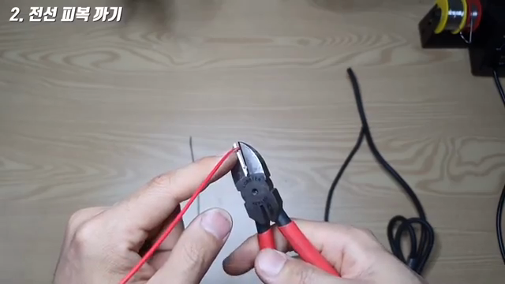
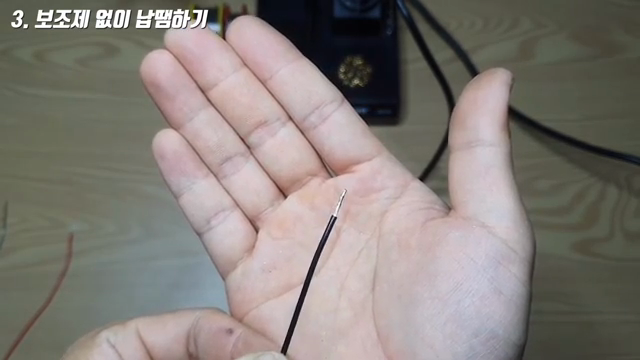
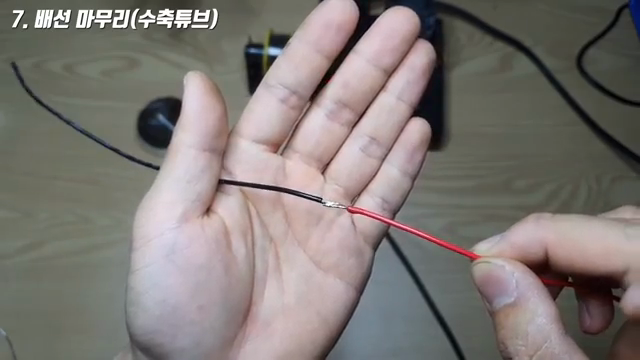
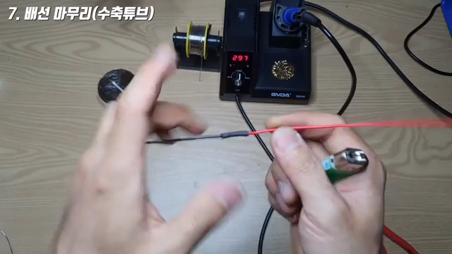

# 왕초보 납땜 실습 — 전선 피복부터 Heat Shrink Tube 마감까지

**원본 강의:** [생에 첫 납땜을 하시는 분들을 위한 영상 — 납땜하는 방법 왕초보편 (YouTube)](https://www.youtube.com/watch?v=Sz95tDszT7o)

이 강의는 전선 피복을 벗기는 법부터 열을 먼저 가해 Solder를 스며들게 하는 법, Flux와 Solder Sucker의 용도, 두 가닥의 전선을 연결하고 Heat Shrink Tube로 마감하는 과정을 실습한다. 핵심은 **Solder를 Iron Tip에 먼저 녹이는 것이 아니라, 연결할 도체를 먼저 데우는 것**이다.

---

## 1. 납땜 도구의 최소 구성과 보조 도구

강의에서는 Solder Wire와 Soldering Iron을 최소 도구로, 작업 품질과 편의를 높이는 도구를 보조 도구로 구분한다.

| 구분 | 도구 | 역할 |
| --- | --- | --- |
| 필수 | `Soldering Iron` | 전선·Pad·Pin에 열을 전달한다. |
| 필수 | `Solder Wire` | 녹아 연결부를 적시고 응고되며 전기적·기계적 연결을 만든다. |
| 권장 | `Flux` / Soldering Paste | 산화물을 제거하고 Solder의 `Wetting`을 도와 작업 시간을 줄인다. |
| 권장 | Fume Extractor | 작업자 쪽으로 올라오는 Flux Fume을 필터 쪽으로 유도한다. |
| 선택 | `Solder Sucker` | 잘못 붙인 위치의 녹은 Solder를 압력으로 흡입한다. |
| 선택 | `Heat Shrink Tube` | 배선 연결부를 절연하고 기계적 스트레스를 줄인다. |
| 선택 | `Wire Stripper` | 도체를 손상시키지 않고 정해진 굵기의 피복을 빠르게 벗긴다. |

> **주의**
> 실제 작업에서는 Iron Stand, 보호안경, 환기도 기본 안전 구성에 포함한다. Flux Fume이 바로 얼굴로 올라오지 않게 하고, 가열된 Tip은 반드시 Stand에 거치한다.

---

## 2. 도체를 살리면서 전선 피복 벗기기

*얇은 전선은 Nipper의 깊은 부분까지 넣지 않고 날의 끝쪽을 사용한다. 출처: 원본 강의 02:30.*

전선 피복을 벗길 때의 목표는 **피복만 절개하고 안쪽 Copper Strand는 끊지 않는 것**이다.

1. 노출할 길이를 약 `1 cm`로 정한다.
2. 얇은 전선은 Nipper 날의 끝쪽에 놓고, 손가락을 Stopper처럼 대 너무 깊게 닫히지 않도록 한다.
3. 피복이 잘릴 정도로만 약하게 누른 뒤, 전선을 한 바퀴 돌려 둘레에 절개선을 낸다.
4. 전선 방향과 일직선으로 피복을 당겨 벗긴다.
5. 노출된 Strand가 잘렸거나 팬 곳이 없는지 확인한다.

굵은 Cable은 얇은 전선보다 날을 조금 깊게 대어야 하지만, 한 번에 깊게 자르기보다 둘레를 여러 번 조금씩 절개하는 편이 안전하다. 반복 작업이라면 전선 굵기에 맞는 Hole을 고를 수 있는 Wire Stripper가 훨씬 빠르고 재현성이 높다.

> **주의**
> Strand 몇 가닥이 끊긴 전선은 예정된 전류 용량과 기계적 강도가 줄어든다. 손상된 구간을 잘라낸 뒤 다시 벗긴다.

---

## 3. 기본 납땜 순서: 열을 먼저, Solder는 나중에

연선을 Tinning할 때는 풀린 Strand를 먼저 꼬아 한 다발로 만든다. 이후 다음 순서를 따른다.

1. Iron Tip을 노출된 Copper Strand에 접촉시켜 열을 준다.
2. 전선이 충분히 데워지면 Solder Wire를 **Tip만이 아닌 Tip과 전선이 만나는 지점**에 공급한다.
3. 녹은 Solder가 Strand 사이로 고르게 스며드는지 본다.
4. Solder Wire를 먼저 떼고, 흐름이 안정되면 Iron Tip을 떼어 자연스럽게 응고시킨다.

*올바른 Tinning은 한쪽 표면에만 Solder 덩어리를 얹는 것이 아니라 Strand 사이로 Solder가 스며든 상태다. 출처: 원본 강의 07:46.*

강의는 사용한 Iron과 전선에서 `5~10초` 정도 먼저 가열하는 예를 보여 준다. 다만 이 시간은 고정 규칙이 아니다. Iron의 출력, Tip 모양, 전선 굵기, Solder 종류에 따라 달라지므로 **피복이 녹기 전에 Solder가 흐를 정도의 최소 가열**만 한다.

| 실수 | 결과 | 교정 |
| --- | --- | --- |
| Tip을 대자마자 Solder를 밀어 넣음 | 표면 한쪽에만 덩어리가 생김 | 전선을 먼저 가열한다. |
| Solder를 Tip에만 대서 녹임 | 연결부 내부로 잘 스며들지 않음 | Solder를 가열된 전선과 Tip의 경계에 대다. |
| 너무 오래 가열함 | 피복이 녹거나 도체가 과열됨 | Solder가 흐르면 즉시 열을 제거한다. |

---

## 4. Flux와 Fume Extractor가 하는 일

Flux는 가열 중 생기는 산화물을 제거·억제하고, 녹은 Solder가 금속 표면을 잘 적시도록 돕는다. 강의의 PCB Pad 비교에서는 Flux를 바른 쪽이 더 빨리 흐르고 Hole 안쪽까지 잘 스며든다.

- 새 Solder Wire의 Core에도 Flux가 들어 있을 수 있다.
- 산화된 표면, 넓은 Pad, Rework처럼 열이 잘 퍼지지 않는 상황에서 외부 Flux가 특히 유용하다.
- Flux를 많이 쓰는 것이 부적절한 온도나 나쁜 접촉을 대신해 주는 것은 아니다.

Fume Extractor는 연기의 흐름을 작업자의 호흡기에서 멀어지게 만든다. 강의 시연처럼 필터 앞쪽으로 Fume이 흐르도록 장비 위치를 조정한다.

---

## 5. 잘못된 납땜 제거하기

Solder Sucker는 스프링과 공기 압력을 이용해 녹은 Solder를 빨아들인다.

1. Sucker의 Plunger를 눌러 장전한다.
2. 제거할 Solder Joint를 Iron으로 다시 녹인다.
3. Nozzle을 녹은 Solder 가까이 대고 Trigger를 누른다.
4. 한 번에 제거되지 않으면 Flux와 소량의 새 Solder를 추가해 열전달을 회복한 뒤 반복한다.

> **주의**
> 영상에는 녹은 Solder를 튜겨 내는 간편법도 나오지만 화상, 눈 손상, 주변 부품의 Short를 유발할 수 있으므로 실습에서는 사용하지 않는다. Solder Sucker나 Solder Wick을 사용한다.

---

## 6. 두 전선 연결하기

*두 전선에 Solder를 먼저 입힌 뒤 Flux를 더해 재가열하면 연결 시간을 줄일 수 있다. 출처: 원본 강의 14:57.*

1. 연결 전 Heat Shrink Tube를 한쪽 전선에 미리 넣어 열에서 멀리 밀어 둔다.
2. 두 전선의 피복을 적절한 길이로 벗긴다.
3. 각각의 Strand를 꼬아 풀림을 막고, 두 끝을 먼저 Tinning한다.
4. 연결부에 Flux를 소량 바른 뒤 두 끝을 맞대고 재가열해 하나의 Joint로 만든다.
5. Joint를 완전히 식힌 뒤 가벼운 Pull Test로 접합을 확인한다.
6. Heat Shrink Tube를 Joint 중앙으로 옮기고 주변에서 고르게 가열한다.

*영상에서는 Lighter로 Tube를 수축시킨다. 출처: 원본 강의 16:32.*

> **주의**
> Lighter의 불꽃을 Tube나 전선 피복에 직접 오래 대면 그을림·용융·발화가 생길 수 있다. 가능하면 Heat Gun을 낮은 세기로 사용하고, 열원을 계속 움직여 고르게 수축시킨다.

---

## 7. 실습 Checklist

- [ ] 환기, 보호안경, Iron Stand를 준비했다.
- [ ] 피복만 벗겨내고 Copper Strand는 손상시키지 않았다.
- [ ] 연선은 풀리지 않게 꼬았다.
- [ ] Solder를 넣기 전에 전선이나 Pad를 먼저 가열했다.
- [ ] Solder가 표면에만 덩어리지지 않고 연결부에 고르게 스며들었다.
- [ ] Joint가 응고는 동안 전선을 움직이지 않았다.
- [ ] Heat Shrink Tube가 노출된 금속부를 전체로 덮었다.
- [ ] 완성 후 외관 검사, Pull Test, Continuity Test를 했다.

---

## 참고 자료

- [생에 첫 납땜을 하시는 분들을 위한 영상 — 납땜하는 방법 왕초보편 (YouTube)](https://www.youtube.com/watch?v=Sz95tDszT7o)
- [영상 설명란의 납땜 도구 구매 링크](http://naver.me/5HUR3vbu)
- [네이버 '공대뚝딱이' DIY 전문 카페](https://cafe.naver.com/gongddukcafe.cafe)

---

## 면접 답변 (30초 분량)

> `/easy-quiz` 실행 시 이 섹션이 정답 카드로 사용됩니다.

- **한 줄 정의:** 전선 납땜은 피복을 벗긴 도체를 먼저 가열하고 Solder를 스며들게 해 전기적·기계적 Joint를 만드는 작업이다.
- **왜 필요:** 도체에 충분한 열을 먼저 전달해야 Solder가 표면에만 뭉치지 않고 Strand 사이로 고르게 스며든다.
- **동작:** 피복을 벗기고 Strand를 꼬은 뒤, Iron으로 도체를 먼저 가열하고 접촉부에 Solder를 공급한다. Flux는 산화물을 제거하고 Wetting을 돕는다.
- **비교:** Tip에 Solder를 먼저 녹여 묻히는 방법은 표면에만 덩어리를 남기기 쉽지만, 도체를 먼저 가열하면 Joint 내부까지 Solder가 스며든다.
- **30초 통합 답변:**
  > 전선을 납땜할 때는 피복만 벗기고 연선을 꼬은 뒤, Iron으로 Copper Strand를 먼저 가열합니다. 그런 다음 Tip과 전선이 만나는 지점에 Solder를 공급해 Strand 사이로 스며들게 합니다. Flux는 산화물을 제거하고 Wetting을 돕으며, 완성된 연결부는 Heat Shrink Tube로 절연하고 Pull Test와 Continuity Test로 확인합니다.
